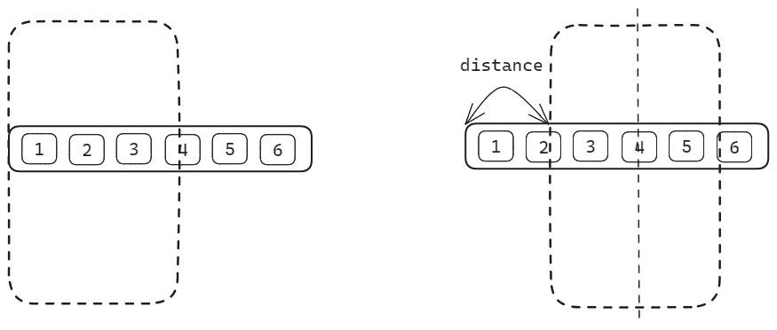
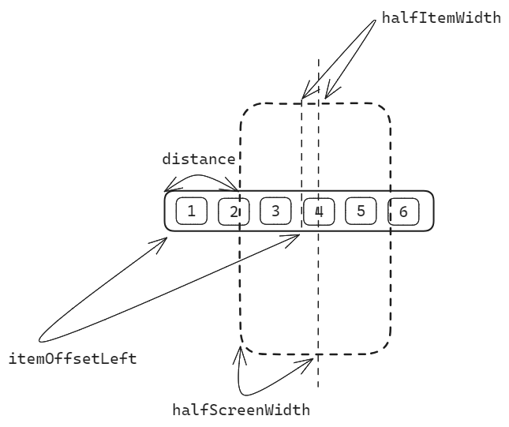

# 移动端 H5 Tab 如何滚动居中

Tab 在 PC 端、移动端应用都上很常见，不过 Tab 在移动端 比 PC 端更复杂。为什么呢？移动端设备屏幕较窄，一般仅能展示 4 ~ 7 个 Item。考虑到用户体验，UI 往往要求程序员实现一个功能——点击 Item 后，Item 滚动到屏幕中央，拼多多的 Tab 就实现了这个功能。


如果你也想实现这个功能，看了这篇文章，你一定会有所收获。我会先说明 Tab 滚动的本质，分析出滚动距离的计算公式，接着给出伪代码，最后再给出 Vue、React 和微信小程序的示例代码。

## Tab 滚动的本质

Tab 滚动，本质是包裹着 Item 的容器在滚动。

如下图，竖着的虚线长方形代表手机屏幕，横着的长方形代表 Tab 的容器，标着数字的小正方形代表一个个 Tab Item。

左半部分中，Tab 容器紧贴手机屏幕左侧。右半部分中，Item 4 位于屏幕中央，两部分表示 Item 4 从屏幕右边滚动到屏幕中央。



不难看出，Item 4 滚动居中，其实就是容器向左移动 distance。此时容器滚动条到容器左边缘的距离也是 distance。

换句话说，**让容器向左移动 distance，Item 4 就能居中。** 因此只要你能找出计算 distance 的公式，就能控制某个 Item 居中。

## 计算 distance 的公式

该如何计算 distance 呢？你看下方这张更细致的示意图。

屏幕中央有一条线，它把 Item 4 分成了左右等宽的两部分，也把手机屏幕分成了左右等宽的两部分。你可以把 Item 4 一半的宽度记为 `halfItemWidth`，把手机屏幕一半的宽度记为 `halfScreenWidth`。再把 Item 4 左侧到容器左侧的距离记为 `itemOffsetLeft`。



不难看出，这四个值满足如下等式：

```
distance + halfScreenWidth = itemOffsetLeft + halfItemWidth
```

简单推导一下，就得到了计算 distance 的公式。

```
distance = itemOffsetLeft + halfItemWidth - halfScreenWidth
```

## 公式的伪代码实现

现在开始解释公式的代码实现。

先看下 `itemOffsetLeft`、`halfItemWidth` 和 `halfScreenWidth` 如何获取。

- `itemOffsetLeft` 是 Item 元素到容器左侧的距离，你可以用 [HTMLElement.offsetLeft](https://developer.mozilla.org/zh-CN/docs/Web/API/HTMLElement/offsetLeft) 作它的值。

- `halfItemWidth` 是 Item 元素一半的宽度。[HTMLElement.offsetWidth](https://developer.mozilla.org/zh-CN/docs/Web/API/HTMLElement/offsetWidth) 是元素的整体宽度，你可以用 `offsetWidth / 2` 作它的值，也可以先用 [Element.getBoundingClientRect()](https://developer.mozilla.org/zh-CN/docs/Web/API/Element/getBoundingClientRect) 获取一个 `itemRect` 对象，再用 `itemRect.width / 2` 作它的值。 

- `halfScreenWidth` 是手机屏幕一半的宽度。 [window.innerWidth](https://developer.mozilla.org/zh-CN/docs/Web/API/Window/innerWidth) 是手机屏幕的整体宽度，你可以用 `innerWidth / 2` 作它的值。

再看下如何把 distance 设置到容器上。

在 HTML 中，你可以使用 [Element.scrollLeft](https://developer.mozilla.org/zh-CN/docs/Web/API/Element/scrollLeft) 来读取和设置元素滚动条到元素左边的位置。因此，你只需要容器的 `scrollLeft` 赋值为 distance，就可以实现 Item 元素滚动居中。

现在给出点击 tab 的函数的伪代码：

```js
const onClick = () => {
  const itemOffsetLeft = item.offsetLeft;
  const halfItemWidth = item.offsetWidth / 2;
  const halfScreenWidth = window.innerWidth / 2;
  tabContainer.scrollLeft = itemOffsetLeft + halfItemWidth - halfScreenWidth
}
```

## 代码示例

### Vue

[Tab 滚动居中 | Vue](https://codesandbox.io/p/sandbox/vue-tab-scroll-to-center-qxw4vc)

### React

[Tab 滚动居中 | React](https://codesandbox.io/p/sandbox/react-tab-scroll-to-center-22939z)

### 微信小程序

[Tab 滚动居中 | 微信小程序](https://developers.weixin.qq.com/s/npBjVpmj7XKc)

:::info
小程序的 API 和浏览器的 API 有差异。

- `itemOffsetLeft` ，你需要从点击事件的 `event.currentTarget` 中获取。
- `halfItemWidth`，你需要先用 `wx.createSelectorQuery()` 选取到 Item 后，从 `exec()` 的执行结果中获取到 Item 整体宽度，然后再除以 2。
- `halfScreenWidth`，你需要先用 `wx.getSystemInfoSync()` 获取屏幕整体宽度，然后再除以 2。

至于把 `distance` 设置到容器上，微信小程序 `scroll-view` 组件中，有 `scroll-left` 这个属性，你可以把 `distance` 赋值给 `scroll-left`。
