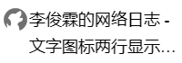
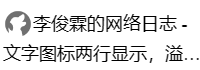
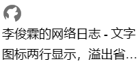

# 文字图标两行显示，溢出省略号

大家好，我俊霖。

日常开发中，我们常常需要实现一个 UI 效果。文字紧跟在一个图标后面，且文字和图标最多展示两行，溢出部分用省略号表示。以多点 App 的商品截图为例：

一些朋友可能会尝试用 flex 布局实现。遗憾的是，使用 flex 布局的话，图片下方的文字会被全部挤到右侧，无法实现 App 截图的效果。

今天我们先介绍两种实现目标 UI 效果的方法，然后再对两种方法做一下优缺点对比。

## 文本缩进和绝对定位。

第一种方法，先给文字设置文本缩进属性 `text-indent`，空出一定的位置，然后再给图标设置绝对定位属性，将图标移动到刚才空出的位置上。

具体写法可以看例子：

[文本缩进和绝对定位 | codepen](https://codepen.io/lijunlin2022/pen/abQewmE)。

这种方法优点是简单易懂，缺点是，**需要先实现知道图标的宽度，才能为图片空出准确的位置。**因此一旦下发的图标宽度有变化，就需要重新修改代码。

为了弥补这个缺陷，一些程序员的做法是，后端既要下发图标的链接、也要下发图标的宽度。这样即使图标改变了，前端代码也不需要改变。

## 浮动和文字环绕图片

第二种方法，利用浮动 `float` 的基础性质。浮动的最初用途，并不是做各种各样的布局，而是用来实现文字环绕图片。

具体写法可以看例子：

[浮动和文字环绕图片 | codepen](https://codepen.io/lijunlin2022/pen/abQewmE)。

这种方法的优点是可以实现图标的自适应，完全由图标撑开文字。缺点是里面用了一些 CSS 不常见的用法。

这种方法有两点需要注意：

其一，控制文本溢出的 css 类（例子中是 `ellipsis`），一定要放在图片和文字的父元素上。这是因为 `ellipsis` 自带 `display: -webkit-box;` 布局，如果此不放置在父元素上，会导致文字直接另起一行。

其二，为了兼容 Safari，需要给图片和文字的父元素，再增加一层父元素，且把控制文本溢出的 css 类放到新增的元素上。这是因为 `display: -webkit-box;`，在 Safari 上会影响图片和文本的布局。[^1]

[^1]: [-Webkit-Box 在 Safari 中出现的兼容性问题](https://www.51cto.com/article/686659.html)
