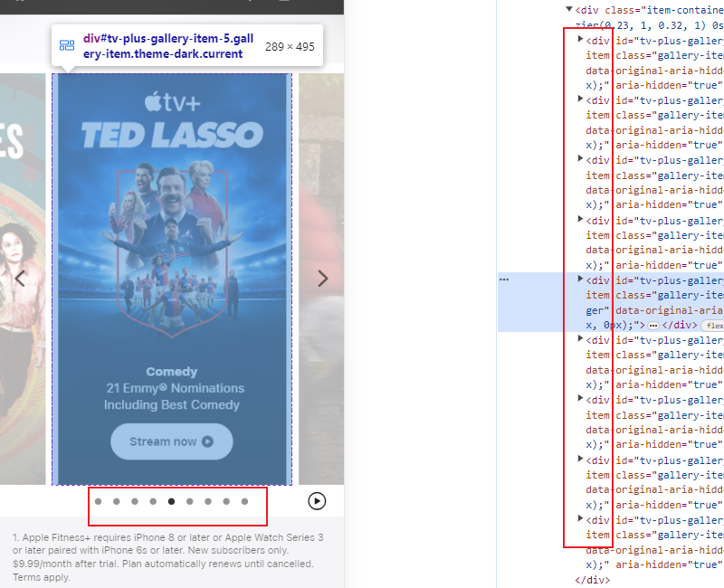
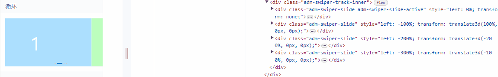
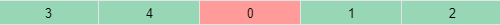
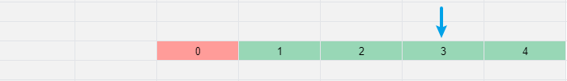
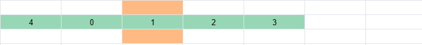
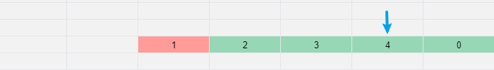

# 移动端 H5 如何实现循环轮播（无需复制元素）

循环轮播在 PC 端、移动端应用上很常见，不过循环轮播在移动端比 PC 端更复杂。因为 PC 端可以点击切换轮播图，移动端轮播图通常需要手指滑动切换，手指移动时，轮播图也要跟着移动。苹果的循环轮播就实现了这个功能。

更让我惊讶的是，苹果的循环轮播并没有通过复制元素来实现。一般要实现循环轮播，都会在轮播头部复制最后一个元素，在轮播尾部复制第一个元素。也就是说，如果实现 9 个元素的循环轮播，需要 11 个元素，但我苹果网页的控制台，发现它只用了 9 个元素。它是如何做到的呢？

如果你也想实现

## Ant Design Mobile Swiper

[Ant Design Mobile Swiper](https://mobile.ant.design/components/swiper) 的循环轮播，就是一种无复制元素的循环轮播。如下图，可以在控制台看到元素个数始终是 4 个，没有多余的元素。

它的原理是什么呢？

## 约定

为方便读者理解下文，我需要和读者们做一些约定。

- 轮播组件是整屏的轮播，轮播时只会向左切换一个元素，或者向右切换一个元素。
- 轮播容器称为 List，轮播元素称为 Item。
- List 有 5 个 Item，分别是 Item0 到 Item4。之所以选择 5 个 Item，是因为奇数个 Item 更容易找到 List 的中心。
- currentIndex 代表 List 中心 Item 的下标。轮播到 Item0 时，currentIndex 是 0。轮播到 Item5 时，currentIndex 是 5。

## 轮播原理

**初始化**

下图是初始化时，List 中 Item 的排列。它是怎么得到的呢？

可以这样理解，初始化时，我们希望 Item0 处于 List 中心时，两边的元素尽可能相等。

我们的做法是，Item0，Item1 和 Item2 位置保持不变。将 Item3 和 Item4 往前挪动 5 个位置。

**Item1 为中心**

下图是 List 从 Item0 轮播到 Item1 时的排列，此时 Item1 处于 List 的中心。

和初始化时理解方式一致，我们希望 Item1 处于 List 中心时，两边元素尽可能相等。

我们的做法是：Item1，Item2 和 Item3 位置保持不变。将 item4 和 Item1 往前挪动 5 个位置。

**循环**

按照上述步骤，分别列出 List 中心是 Item0 到 Item4 的情况，可以得到下图：

一个循环轮播就实现了。

## 代码实现
