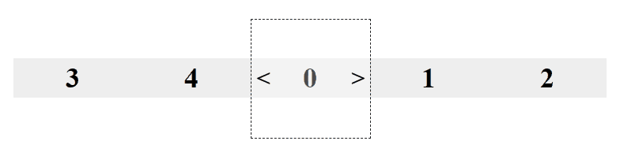
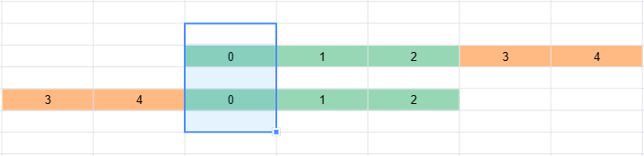
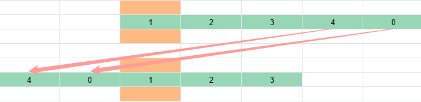
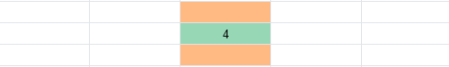
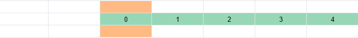
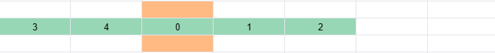

# H5 不复制元素的循环轮播图如何实现——求模

循环轮播图，你肯定并不陌生。不过让你手写它，你可能感觉有些麻烦。因为大部分方案都得考虑好几种边界情况。

最常见的实现方案——复制头部和尾部元素（如下图，绿色的是原始元素，浅蓝色的是复制元素），就需要考虑 3 种边界情况：


1. 初始化轮播图。你需要注意初始下标不是 0，而是 1，因为轮播列表头部多了一个 Item 4 的复制元素。
2. 轮播图向右滑到达右边界。你需要设置滚动条的 scrollLeft，让视口内 Item 0 的复制元素变为原始元素。
3. 轮播图向左滑到达左边界。你需要设置滚动条的 scrollLeft，让视口内 Item 4 的复制元素变为原始元素。

有没有一种实现轮播图的方案，边界情况非常少，一旦理解后就能快速手写呢？有的，Ant Design Mobile Swiper [^1] 使用的是一种求模的方案，效果如下：


可以看到，Ant Design Mobile Swiper 不需要复制元素，也不需要添加和移除元素，只需要控制 css 的 translate3d。如果你也想知道它是如何做到的，看了这篇文章，你一定有所收获。

我会说明求模实现轮播的原理，接着代码，最后解释原理的示例代码，示例代码的运行效果如下：



这种方法需要用到取模，如果你不了解取模和取余的差别，可以先看我的另一篇文章 [取余和取模如何区分和应用](https://lijunlin2022.github.io/blog/2024/01/18/remainder-and-modulo)。

## 轮播的原理

先设想一下 5 个元素轮播时，初始顺序应该是什么样的呢？首先，Item 0 应该占满容器可见部分（橘黄色背景），且不能位于边缘，因为往左滑或者往右滑都需要看到新的元素。干脆让 Item 0 位于中央吧，也就是 Item 0 左右两边都有 2 个元素。


你可以这样做，按照 01234 的顺序往 Item 0 的右侧放置元素，放完 Item 1 和 Item 2 后，右侧已经有 2 个元素了。接下来你把 Item 3 和 Item 4 放置在 Item 0 左边。



接下来，你再考虑下轮播播放到 Item 1 时的情况，位于中央的元素便从 Item 0 变成了 Item 1，可以继续延续之前的思路。Item 1 左右两边都有 2 个元素。


按照 12340 的顺序往 Item 1 的右侧放置元素，放完 Item 2 和 Item 3 后，右侧已经有 2 个元素了。接下来你把 Item 4 和 Item 0 防止在 Item 1 左边。



如此循环往复，连续 5 次后，你就可以获得一个轮播的循环。


## 计算轮播位置的代码

上面的描述，你只是大概理解了思路，还不知道该如何写代码，跟我一步步来吧。

### 布局代码

为了保证代码足够精简，我只保留了布局中最关键的部分。

所有 Item 再轮播容器中排成一行，**且定位均为相对定位**。此时 Item 0 到 Item 4 都重叠在中央位置。

```html
<ul>
  <li style="left: 0%;">0</li>
  <li style="left: -100%">1</li>
  <li style="left: -200%">2</li>
  <li style="left: -300%">3</li>
  <li style="left: -400%">4</li>
</ul>
```



你可以给每个 Item 都加上 translateX。Item 0 是 0%，Item 1 是 100%，依次类推，就可以得到 01234 排列的效果。

```html
<ul>
  <li style="transform: translateX(0%); left: 0%;">0</li>
  <li style="transform: translateX(100%); left: -100%">1</li>
  <li style="transform: translateX(200%); left: -200%">2</li>
  <li style="transform: translateX(300%); left: -300%">3</li>
  <li style="transform: translateX(400%); left: -400%">4</li>
</ul>
```



想必你已经猜到，下一步就是想办法把 Item 3 和 Item 4 挪到 Item 0 左边。怎么做呢？可以给 Item 3 和 Item 4 的 translateX 都减去 500%（轮播的整体长度）。

```html
<ul>
  <li style="transform: translateX(0%); left: 0%;">0</li>
  <li style="transform: translateX(100%); left: -100%">1</li>
  <li style="transform: translateX(200%); left: -200%">2</li>
  <li style="transform: translateX(-200%); left: -300%">3</li>
  <li style="transform: translateX(-100%); left: -400%">4</li>
</ul>
```



### 逻辑代码

关键代码如下，

```js
const onBtnClick = () => {
  position = (index - currentIndex) * 100
  finalPosition = mod(position + halfTotalWidth, totalWidth) - halfTotalWidth
  item.style.transform = `translateX(${finalPosition}%)`
}
```

遵循着之前说到的思路，来理解上述代码：

首先是 position = (index - currentIndex) * 100, position 就是 Item 尝试往右放置的位置。

- Item 0 位于中央，那么它的 translateX 应该为 0。
- Item 1 和 Item 2 位于 Item 0 的右侧，它们的 translateX 可以设置为 100% 和 200%。
- Item 3 和 Item 4 位于 Item 0 的左侧，他们的 translateX 应该是 300% 和 400%。

你已经知道 Item 3 和 Item 4 之后要往左移动 500%，应该要往左减去 500%。

不妨把初始值带入 finalPosition 的计算公式中，你会发现 Item 0、Item 1 和 Item 2 的 `position + halfTotalWidth` 的值分别为 250%、350% 和 450%，都比 500% 小，所以此时 `mod(position + halfTotalWidth, totalWidth) - halfTotalWidth` 实际就是 `position`，也就是位置根本没有变。

而对于 Item 3 和 Item 4，`position + halfTotalWidth` 的值为 550% 和 650%，都比 500% 大，所以此时 `mod(position + halfTotalWidth, totalWidth) - halfTotalWidth` 实际就是 `position - totalWidth`。


你可以这样理解，代码其实想做的，是把 position 限定在 -250% 到 250% 之间，而限制范围正好是取模的作用，所以可以用 mod。

但 mod 有一个性质，我在 [取余和取模如何区分和应用](https://lijunlin2022.github.io/blog/2024/01/18/remainder-and-modulo) 中提到过，那就是 mod 的符号其实是和除数符号一致。可以看到，translateX 的值是有正有负的。

因此，可以先把所有位置，都往右先挪动 250%，这样所有的值就都是正数。取模完成后，范围已经限定好，再把所有位置往左挪动 250%。


## 代码示例

[无复制元素的循环轮播图 | codepen](https://codepen.io/lijunlin2022/pen/ZEaXKMM)

[^1]: [Ant Design Mobile Swiper](https://mobile.ant.design/components/swiper)
