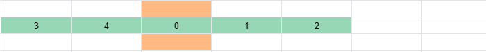
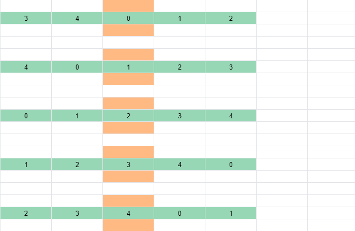

# H5 不复制元素的循环轮播图如何实现——模运算

过去我一直以为，循环轮播图必须拷贝元素，欺骗用户视觉才能实现。比如实现 Item 0 ~ Item 4 循环播放，我必须用 7 个元素。

如下图所示，Item 的原品是绿色，复制品是浅蓝色，复制品被我放在队尾或队头。视口是深蓝色框，当视口右侧或左侧没有元素的时候，我会调整滑动距离，让视口内的复制品变成原品。


确实，复制元素简单直观，我过去认为复制元素才是最优做法。直到我看到了 [Ant Design Mobile Swiper](https://mobile.ant.design/components/swiper)。

如图所示，在循环轮播时，**[Ant Design Mobile Swiper](https://mobile.ant.design/components/swiper) 的元素始终保持四个**。而且它的 Dom 结构没有变化，这说明它采用的不是删除头部元素，塞到尾部元素的做法。


那么它是如何做到的呢？如果你也想知道答案，看了这篇文章，你一定有所收获。我会先解释原理，然后给出计算轮播元素位置的公式，最后再给出原生的 JS 代码。

## 轮播原理


取余运算和取模运算的区别。

10 除以 3 等于 3 余 1，其中 1 就是取余运算的结果。取模运算的结果也是 1。

-10 除以 3 等于 -3 余 -1。其中 -1 是取余运算的结果。取模运算的结果是 2。

取余运算和取模运算的区别，在处理负数的时候有区别。

取余运算的结果，与被除数的符号相同；取模运算的结果，与除数的符号相同。

```js
function modulus (num1, num2) {
  const result = num1 % num2
  return result >= 0 ? result : result + Math.abs(num2)
}
```

首先，你观察一下开始时各个轮播元素的位置。Item 0 位于正中，占据了视口，它的左侧是 Item 3 和 Item 4，右侧是 Item 1 和 Item 2。不管你向左滑动，还是向右滑动，都可以看到元素。



这个初始位置，是怎么从 Item 0 ~ Item 4 的顺序转换来的呢？它实际上是 Item 0、Item 1 和 Item 2 位置保持不变，而 Item 3 和 Item 4 往左移动了 5 个自身距离。


接着你向右滑动轮播图，Item 1 位于正中，占据了视口。


这个位置，其实也是从 Item 0 ~ Item 4 的顺序转换来的。它实际上是 Item 1、Item 2 和 Item 3 位置保持不变，而 Item 4 和 Item 0 往左移动了 5 个自身距离。


你再向右滑动轮播图，Item 2 位于正中，占据了视口。轮播图的表现是 Item 0、Item 1、Item 2 和 Item 3 又往左移动了一段自身宽度，而 Item 4 从队头移动到了队尾。


如何循环往复，你可以看到**不复制元素的循环轮播，实质是维护了一个循环队列。**



## 计算轮播位置的公式