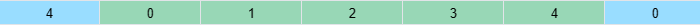

# 不复制元素的循环轮播图如何实现——求模

循环轮播图，你肯定并不陌生，实现方案太多了。不过大多数实现方案需要复制元素（如下图，绿色的是原始元素，浅蓝色的是复制元素）。



有没有不复制元素的方案呢？有的，Ant Design Mobile Swiper [^1] 的方案不需要复制元素，只需要改变 translate3d：


如果你也想知道 Ant Design Mobile Swiper 是如何做到的，看了这篇文章，你一定有所收获。我会先解释循环轮播的原理，再用 HTML + JavaScript 实现循环轮播，效果如下：


## 轮播的原理

**初始顺序**

先设想一下 5 个元素轮播时，初始顺序应该是什么样的呢？

首先，Item 0 不能位于边缘，因为往左滑、往右滑都需要能看到元素。干脆让 Item 0 位于中央、宽度占满容器可见区域（橘黄色）。换句话说，就是 Item 0 左右两边各有 2 个元素。


34012 的顺序是怎么来的呢？你可以这样做，按 01234 的顺序从可见区域开始，向右放置元素，放完 Item0、Item 1 和 Item 2 后，Item 0 右边已经有 2 个元素了。接下来你把 Item 3 和 Item 4 放置在 Item 0 左边。


**向右滑动**

接下来，考虑轮播向右滑动一个 Item 的情况，也就是说中央元素从 Item 0 变成了 Item 1。


按 12340 的顺序从可见区域开始，向右放置元素，放完 Item 1、Item 2 和 Item 3 后，Item 1 右边已经有 2 个元素了。接下来你把 Item 4 和 Item 0 放置在 Item 1 左边。


**轮播循环**

遵循之前的思路，考虑中央元素从 Item 0 一直变到 Item 4，循环往复，你就可以获得一个轮播的循环。


## 计算轮播位置的代码

听完上述描述，想必你已经有一个模糊的思路，现在一起把思路转变为清晰的代码吧，先看 HTML 布局代码。为了让代码足够精简，我只保留布局中的关键部分。

### 布局代码

HTML 初始布局代码和效果如下，**所有的 `<li>` 定位为相对定位**。

```html
<ul>
  <li style="transform: translateX(0%); left: 0%;">0</li>
  <li style="transform: translateX(100%); left: -100%">1</li>
  <li style="transform: translateX(200%); left: -200%">2</li>
  <li style="transform: translateX(-200%); left: -300%">3</li>
  <li style="transform: translateX(-100%); left: -400%">4</li>
</ul>
```


这个布局是如何得到的呢？

先看仅设置 left 是布局是怎样的，Item 的 left 分别被设置为 0% 到 -400% 时，Item 重叠在中央位置。

```html
<ul>
  <li style="left: 0%;">0</li>
  <li style="left: -100%">1</li>
  <li style="left: -200%">2</li>
  <li style="left: -300%">3</li>
  <li style="left: -400%">4</li>
</ul>
```


接着，你可以给每个 Item 都加上 translateX，translateX 为正数时，元素会向右移动。可以认为是「按 01234 的顺序从可见区域开始，向右放置元素」。

```html
<ul>
  <li style="transform: translateX(0%); left: 0%;">0</li>
  <li style="transform: translateX(100%); left: -100%">1</li>
  <li style="transform: translateX(200%); left: -200%">2</li>
  <li style="transform: translateX(300%); left: -300%">3</li>
  <li style="transform: translateX(400%); left: -400%">4</li>
</ul>
```


想必你已经猜到，下一步就是想办法把 Item 3 和 Item 4 挪到 Item 0 左边。怎么做呢？可以给 Item 3 和 Item 4 的 translateX 都减去 500%（轮播的整体长度）。

这样便得到了初始布局的代码。

```html
<ul>
  <li style="transform: translateX(0%); left: 0%;">0</li>
  <li style="transform: translateX(100%); left: -100%">1</li>
  <li style="transform: translateX(200%); left: -200%">2</li>
  <li style="transform: translateX(-200%); left: -300%">3</li>
  <li style="transform: translateX(-100%); left: -400%">4</li>
</ul>
```

### 逻辑代码

JavaScript 关键逻辑代码如下：

```js
prevBtn.addEventListener("click", (event) => {
  onBtnClick(currentIndex - 1)
});

nextBtn.addEventListener("click", () => {
  onBtnClick(currentIndex + 1)
});

function onBtnClick (activeIndex) {
  currentIndex = mod(activeIndex, items.children.length)
  Array.from(items.children).forEach((ch, index) => {
    const position = (index - currentIndex) * 100
    const finalPosition = mod(position + halfWidth, totalWidth) - halfWidth
    ch.style.transform = `translateX(${finalPosition}%)`
  })
}
```

可以看到，上一张、下一张轮播按钮调用了同一个函数 onBtnClick。

- currentIndex 是点击按钮后轮播图的下标。
- mod 是取模函数，用它可以保证 5 元素的轮播图下标不会越界，永远处于 0 ~ 4。如果你不理解取模和取余，可以先看我的另一篇文章 [取余和取模如何区分和应用](https://lijunlin2022.github.io/blog/2024/01/18/remainder-and-modulo)。

接下来详细说说 forEach 内的操作，它的目的是给每一个 Item 设置 translateX。

首先是 position = (index - currentIndex) * 100, position 就是 Item 尝试往右放置的位置。

- Item 0 位于中央，那么它的 translateX 应该为 0。
- Item 1 和 Item 2 位于 Item 0 的右侧，它们的 translateX 可以设置为 100% 和 200%。
- Item 3 和 Item 4 位于 Item 0 的左侧，他们的 translateX 应该是 300% 和 400%。

你已经知道 Item 3 和 Item 4 之后要往左移动 500%，应该要往左减去 500%。

不妨把初始值带入 finalPosition 的计算公式中，你会发现 Item 0、Item 1 和 Item 2 的 `position + halfTotalWidth` 的值分别为 250%、350% 和 450%，都比 500% 小，所以此时 `mod(position + halfTotalWidth, totalWidth) - halfTotalWidth` 实际就是 `position`，也就是位置根本没有变。

而对于 Item 3 和 Item 4，`position + halfTotalWidth` 的值为 550% 和 650%，都比 500% 大，所以此时 `mod(position + halfTotalWidth, totalWidth) - halfTotalWidth` 实际就是 `position - totalWidth`。


你可以这样理解，代码其实想做的，是把 position 限定在 -250% 到 250% 之间，而限制范围正好是取模的作用，所以可以用 mod。

但 mod 有一个性质，我在 [取余和取模如何区分和应用](https://lijunlin2022.github.io/blog/2024/01/18/remainder-and-modulo) 中提到过，那就是 mod 的符号其实是和除数符号一致。可以看到，translateX 的值是有正有负的。

因此，可以先把所有位置，都往右先挪动 250%，这样所有的值就都是正数。取模完成后，范围已经限定好，再把所有位置往左挪动 250%。


## 代码示例

[无复制元素的循环轮播图 | codepen](https://codepen.io/lijunlin2022/pen/ZEaXKMM)

[^1]: [Ant Design Mobile Swiper](https://mobile.ant.design/components/swiper)
