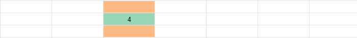

# 不复制元素的循环轮播图如何实现——求模

循环轮播图，你肯定并不陌生，实现方案非常多。大多数实现方案需要复制元素，比如实现 5 个元素的轮播需要用 7 个元素。多出的 2 个元素一个是头部元素，另一个是尾部元素。


能不复制元素吗？可以的，Ant Design Mobile Swiper [^1] 就做到了。它不需要复制元素，只需要改变 translate3d，就能循环播放。


如果你也想知道它是怎么做到的，看了这篇文章，你一定有所收获。我会先解释循环轮播的原理，再用 HTML + JavaScript 实现循环轮播，效果如下：


## 轮播的原理

**初始顺序**

我们先思考一个问题。5 个元素、轮播初始顺序应该怎么排？答案是 34012。


首先，Item 0 必须放在放到视口中央（橘黄色），我们要保证用户往左滑、往右滑都能看到元素。

其次，Item 0 前一个元素必须是 Item 4，后一个元素必须是 Item 1。因为我们要欺骗用户视觉，让用户觉得自己看到的是 01234 循环播放。

同理，为了欺骗用户视觉，Item 4 的前一个元素必须是 Item 3，Item 1 的后一个元素必须是 Item 2。

经过推理我们得到答案 34012。但推理过程太麻烦了，有没有办法可以简化思考呢？

我们可以这样想，把 Item 按 01234 的顺序，从中央区域开始向右放置。放完 Item 0、Item 1 和 Item 2，Item 0 右边已经有 2 个元素。接下来我们只需要把 Item 3 和 Item 4 平移到 Item 0 左边，就可以得到答案 34012。


**向右滑动**

接下来思考第二个问题。5 个元素的轮播向右播放一张后，应该怎么排？答案是 40123。


我们可以延续之前的思路，把 Item 1 放在中央，再按 12340 的顺序向右放置。放完 Item 1、Item 2 和 Item 3 后，Item 1 右边已经有 2 个元素，接下来我们只需要把 Item 4 和 Item 0 平移到 Item 1 左边，就得到了 40123。


**轮播循环**

沿着之前的思路，我们这样把 Item 2、Item 3 和 Item 4 轮流放在中央看看情况：

- 2 放在中央，按 23401 的顺序，需要把 3、4 放到 2 右边，再把 0、1 平移到 2 左边；
- 3 放在中央，按 34012 的顺序，需要把 4、0 放到 3 右边，再把 1、2 平移到 3 左边；
- 4 放在中央，按 40123 的顺序，需要把 0、1 放到 4 右边，再把 2、3 平移到 4 左边。

这样就得到循环轮播，示意图如下：


## 计算轮播位置的代码

现在我们一起把上述思路转变为代码。先看 HTML 布局代码，我只保留布局关键部分，这样代码更精简。

### 布局代码

HTML 初始布局代码如下（**所有的 `<li>` 定位为相对定位**）：

```html
<ul>
  <li style="transform: translateX(0%); left: 0%;">0</li>
  <li style="transform: translateX(100%); left: -100%;">1</li>
  <li style="transform: translateX(200%); left: -200%;">2</li>
  <li style="transform: translateX(-200%); left: -300%;">3</li>
  <li style="transform: translateX(-100%); left: -400%;">4</li>
</ul>
```

它的效果示意图如下，正是我们在「轮播的原理」一节提到的「初始顺序」：


这个布局是如何得到的呢？

首先我们把每个元素的 translateX 设置为 0%、再把 Item 0 ~ Item 4 的 left 设置成 0% ~ -400%。

```html
<ul>
  <li style="transform: translateX(0%); left: 0%;">0</li>
  <li style="transform: translateX(0%); left: -100%">1</li>
  <li style="transform: translateX(0%); left: -200%">2</li>
  <li style="transform: translateX(0%); left: -300%">3</li>
  <li style="transform: translateX(0%); left: -400%">4</li>
</ul>
```

效果图如下，所有 Item 都重叠在中央：



接着，我们把 Item 0 ~ Item 4 的 translateX 设置成 0% ~ 400%。

```html
<ul>
  <li style="transform: translateX(0%); left: 0%;">0</li>
  <li style="transform: translateX(100%); left: -100%">1</li>
  <li style="transform: translateX(200%); left: -200%">2</li>
  <li style="transform: translateX(300%); left: -300%">3</li>
  <li style="transform: translateX(400%); left: -400%">4</li>
</ul>
```

效果图如下，正是我们在「轮播的原理」一节提到的「把 Item 按 01234 的顺序，从中央区域开始向右放置」：


下一步我们要把 Item 3 和 Item 4 平移到 Item 0 左边，也就是把 Item 3、Item 4 的 translateX 减去 500%（轮播的整体长度）。

```html
<ul>
  <li style="transform: translateX(0%); left: 0%;">0</li>
  <li style="transform: translateX(100%); left: -100%">1</li>
  <li style="transform: translateX(200%); left: -200%">2</li>
  <li style="transform: translateX(-200%); left: -300%">3</li>
  <li style="transform: translateX(-100%); left: -400%">4</li>
</ul>
```

效果图如下，这样就实现了 Item 3 和 Item 4 向左平移：


到这里，如何得到 HTML 初始布局我们已经解答完毕。

### 逻辑代码

接下来，我们看看 JavaScript 代码。HTML 代码，只是实现轮播图的初始顺序，而 JavaScript 代码，则是实现播放前一个元素、播放后一个元素。

```js
prevBtn.addEventListener("click", (event) => {
  onBtnClick(currentIndex - 1)
});

nextBtn.addEventListener("click", () => {
  onBtnClick(currentIndex + 1)
});

function onBtnClick (activeIndex) {
  currentIndex = mod(activeIndex, len)
  Array.from(items.children).forEach((ch, index) => {
    const position = (index - currentIndex) * 100
    const finalPosition = mod(position + halfWidth, totalWidth) - halfWidth
    ch.style.transform = `translateX(${finalPosition}%)`
  })
}
```

我们来逐句解读代码。可以看到，我们监听了 prevBtn 和 nextBtn 的点击事件。当 prevBtn 被点击时，currentIndex 被更新为 `currentIndex - 1`，意思是播放前一个元素；当 nextBtn 被点击时，currentIndex 被更新为 `currentIndex + 1`，意思是播放后一个元素。

接下来，`mod(activeIndex, len)` 是求 activeIndex 除以 len 的模，作用是把 currentIndex 取值限定在 0 ~ 4，如果 activeIndex 等于 5，currentIndex 就变为 0。如果 activeIndex 等于 -1，currentIndex 就变为 4。如果你不理解取模函数，可以先看我的另一篇文章 [取余和取模如何区分和应用](https://lijunlin2022.github.io/blog/2024/01/18/remainder-and-modulo)。

然后，forEach 给每一个元素设置了 translateX，作用是——把元素往中央元素的右边放置，发现中央 Item 右侧有 2 个元素后，再把剩余元素放到 Item 左边。我们以 01234 变为 34012 为例：

把 Item 0 ~ Item 4 的下标代入代码中计算 position，不难发现，currentIndex 为 0 时：

- Item 0 的 position 为 0
- Item 1 的 position 为 100%
- Item 2 的 position 为 200%
- Item 3 的 position 为 300%
- Item 4 的 position 为 400%

如果直接以 position 为 translateX，效果如下，和之前提到的「把 Item 按 01234 的顺序，从中央区域开始向右放置」效果一致：


然后我们再把 Item0 ~ Item 4 的 position 代入代码中计算 finalPosition，不难发现：

- Item 0、Item 1 和 Item2 的 finalPosition 等于 position，也就是说 3 者的位置没有变动。这是因为它们的 `position + halfTotalWidth` 是 250%、350% 和 450%，都比 totalWidth 小；
- Item 3 和 Item 4 的 finalPosition 等于 position - totalWidth，也就是说 2 者的位置都往左平移了 totalWidth（500%）。这是因为它们的 `position + halfTotalWidth` 是 550% 和 650%，都比 totalWidth 大。


这么说你可能还是难以理解，我再换另一种说法。

我们已经知道两个条件：

- **要实现不复制元素的循环轮播，需要保证中央元素左右元素数量尽量相等**。这样用户往左滑、往右滑都能看到元素。
- 当元素的 translateX 为 0% 时，所有元素会重叠在中央。

不难想到，把元素的 translateX 设置为正数，元素就会在中央元素右侧；把元素的 translateX 设置为负数，元素就会在中央元素左侧。

一个合理的想法就是，把 Item 的 translateX 范围限定在 -X 到 X 之间，这样就能保证中央元素左右的元素数量尽量相等。5 元素的轮播图，X 可以取值 halfTotalWidth（也就是 250%）。

什么方法可以限定取值范围呢？答案是取模，不过当除数是正数时，求出的模也必定是正数[^2]。如果直接用 `mod(position, totalWidth)` 限定取值范围，会把 translateX 限定在 0% ~ 500% 之间。

我们可以这样做，先把 `position + halfTotalWidth` 除以 totalWidth 求模，`mod(position + halfTotalWidth, totalWidth)` 取值范围为 0% ~ 500%，然后把 `mod(position + halfTotalWidth, totalWidth)` 整体减去 halfTotalWidth，取值范围就是 -250% 到 250% 了。

## 代码示例

下面给出代码示例：

[无复制元素的循环轮播图 | codepen](https://codepen.io/lijunlin2022/pen/ZEaXKMM)

## 总结

本文说明了不复制元素的循环轮播如何实现。

首先，我们通过 01234 转变为 34012 的例子，解释循环轮播的初始顺序如何设置。然后，我们用 HTML 代码，实现了 34012 顺序的轮播。

接着，我们用两种思路解释 JavaScript 代码：第一种思路是先找到中央元素，然后往中央元素的右边放剩余元素，放完一半的剩余元素后，再把另外一半放到中央元素左边。第二种思路是，先找到 translateX 为 0% 的元素，它就是中央元素。然后用求模的方式，把其他元素的 translateX 限定在 -halfTotalWidth 和 halfTotalWidth 之间。

最后，我们给出了 JavaScript 不复制元素实现循环轮播的代码。

[^1]: [Ant Design Mobile Swiper](https://mobile.ant.design/components/swiper)
[^2]: [取余和取模如何区分和应用](https://lijunlin2022.github.io/blog/2024/01/18/remainder-and-modulo)
