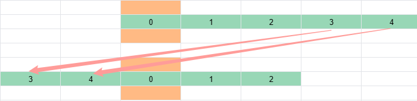

# 不复制元素的循环轮播图如何实现——求模

循环轮播图，你肯定并不陌生，实现方案非常多。不过大多数实现方案需要复制元素，实现 5 个元素的轮播需要 7 个元素，多出的两个元素一个是头部元素，一个是尾部元素。


能不复制元素吗？可以的，Ant Design Mobile Swiper [^1] 不复制元素，仅改变 translate3d，就实现了循环轮播，它是如何做到的呢？


如果你也想知道答案，看了这篇文章，你一定有所收获。我会先解释循环轮播的原理，再用 HTML + JavaScript 实现循环轮播，效果如下：


## 轮播的原理

**初始顺序**

先设想一下 5 个元素轮播时，初始顺序应该是什么样？

首先，Item 0 不能放在边缘，因为往左滑、往右滑都需要能看到元素。你可以把 Item 0 放到中央（橘黄色），换句话说，你在 Item 0 左右两边各放了 2 个元素。


为什么是 34012 这个顺序呢？你可以这样想，把 Item 按 012345 的顺序，从中央区域开始向右放置。放完 Item 0、Item 1 和 Item 2 后，Item 0 右边已经有 2 个元素了。接下来就需要你把 Item 3 和 Item 4 放在 Item 0 左边。



**向右滑动**

接下来再考虑轮播向右滑动的情况，也就是说你把 Item 1 放到了中央。


为什么是 40123 这个顺序呢？你可以延续之前的思路。把 Item 按 12340 的顺序，从中央区域开始向右放置，放完 Item 1、Item 2 和 Item 3 后，Item 1 右边已经有 2 个元素了。接下来就需要你把 Item 4 和 Item 0 放在 Item 1 左边。


**轮播循环**

遵循之前的思路，你把位于中央的元素从 Item 0 一直换成 Item 4，就可以获得一个轮播的循环。


## 计算轮播位置的代码

听完上述描述，想必你已经有一个模糊的思路，现在一起把思路转变为清晰的代码吧，先看 HTML 布局代码。为了让代码足够精简，我只保留布局中的关键部分。

### 布局代码

HTML 初始布局代码和效果如下，**所有的 `<li>` 定位为相对定位**。

```html
<ul>
  <li style="transform: translateX(0%); left: 0%;">0</li>
  <li style="transform: translateX(100%); left: -100%">1</li>
  <li style="transform: translateX(200%); left: -200%">2</li>
  <li style="transform: translateX(-200%); left: -300%">3</li>
  <li style="transform: translateX(-100%); left: -400%">4</li>
</ul>
```


这个布局是如何得到的呢？

先看仅设置 left 是布局是怎样的，Item 的 left 分别被设置为 0% 到 -400% 时，Item 重叠在中央位置。

```html
<ul>
  <li style="left: 0%;">0</li>
  <li style="left: -100%">1</li>
  <li style="left: -200%">2</li>
  <li style="left: -300%">3</li>
  <li style="left: -400%">4</li>
</ul>
```


接着，你可以给每个 Item 添加 translateX，translateX 为正数时，元素会向右移动。给 Item 0 ~ Item 4 设置 translateX(0%) ~ translateX(400%) 的过程，就是模拟「Item 按 012345 的顺序，从中央区域开始向右放置」。

```html
<ul>
  <li style="transform: translateX(0%); left: 0%;">0</li>
  <li style="transform: translateX(100%); left: -100%">1</li>
  <li style="transform: translateX(200%); left: -200%">2</li>
  <li style="transform: translateX(300%); left: -300%">3</li>
  <li style="transform: translateX(400%); left: -400%">4</li>
</ul>
```


想必你已经猜到，下一步就是想办法把 Item 3 和 Item 4 放到 Item 0 左边。怎么做呢？可以给 Item 3 和 Item 4 的 translateX 都减去 500%（轮播的整体长度）。这样便得到了初始布局的代码。

```html
<ul>
  <li style="transform: translateX(0%); left: 0%;">0</li>
  <li style="transform: translateX(100%); left: -100%">1</li>
  <li style="transform: translateX(200%); left: -200%">2</li>
  <li style="transform: translateX(-200%); left: -300%">3</li>
  <li style="transform: translateX(-100%); left: -400%">4</li>
</ul>
```

### 逻辑代码

再看 JavaScript 代码。之前的 HTML 代码，只是模拟了轮播图的初始顺序，而 JavaScript 代码，则是要模拟中央元素从 Item 0 变为 Item 4 的所有过程。

```js
prevBtn.addEventListener("click", (event) => {
  onBtnClick(currentIndex - 1)
});

nextBtn.addEventListener("click", () => {
  onBtnClick(currentIndex + 1)
});

function onBtnClick (activeIndex) {
  currentIndex = mod(activeIndex, len)
  Array.from(items.children).forEach((ch, index) => {
    const position = (index - currentIndex) * 100
    const finalPosition = mod(position + halfWidth, totalWidth) - halfWidth
    ch.style.transform = `translateX(${finalPosition}%)`
  })
}
```

首先，更新 currentIndex 是在模拟轮播左滑或者右滑，`currentIndex - 1` 是左滑，`currentIndex + 1` 是右滑。

然后，`mod(activeIndex, len)` 能让轮播的下标始终处于 0 ~ 4，如果 activeIndex 等于 5，currentIndex 就会是 0。如果 activeIndex 等于 -1，currentIndex 就会是 4。如果你不理解取模函数，可以先看我的另一篇文章 [取余和取模如何区分和应用](https://lijunlin2022.github.io/blog/2024/01/18/remainder-and-modulo)。

接下来 forEach 内给元素设置 transform 的代码，是在模拟之前提过的——把元素从中间往右侧放置，发现中央 Item 右侧有 2 个元素后，又把剩余元素放到 Item 左侧。为了不显得啰嗦，我这里仅说明如何模拟 01234 变成 34012。

不妨把 Item 0 到 Item 4 的下标都代入计算 position 的代码中，不难发现，currentIndex 为 0 时：

- Item 0 的 position 为 0
- Item 1 的 position 为 100%
- Item 2 的 position 为 200%
- Item 3 的 position 为 300%
- Item 4 的 position 为 400%

正是按照 01234 的顺序，从中央往右侧放置。


再把 Item0 到 Item 4 的 position 代入计算 finalPosition 的代码中，不难发现：

- Item 0、Item 1 和 Item2 的 finalPosition = position，也就是说 3 者的位置没有变动。这是因为它们的 `position + halfTotalWidth` 是 250%、350% 和 450%，都比 totalWidth 小；
- Item 3 和 Item 4 的 finalPosition = position - totalWidth，也就是说 2 者的位置都往左移动了 totalWidth（500%）。这是因为它们的 `position + halfTotalWidth` 是 550% 和 650%，都比 totalWidth 大。


这么说你可能还是难以理解，我再换另一种说法。

你已经知道两个条件：

- 要实现循环轮播图，需要保证位于中央的 Item 0 左右元素数量尽量相等。
- translateX 为正数时，元素会往右边移动；translateX 为负数时，元素会往左边移动。

不难想到，只要将 translateX 限定在 -X ~ X 范围内，由于 -X 到 0 的距离和 X 到 0 的距离相等，那么 Item 0 左右的元素数量应该也相等。

对于 5 元素的轮播图，X 的取值就是 halfTotalWidth（250%），也就是要把 translateX 的取值限定在 -250% ~ 250% 之间。

什么方法可以限定取值范围呢？取模！不过如果直接用 `mod(position, totalWidth)` 限定取值范围，你会把 translateX 限定在 0% ~ 500% 之间。

所以你可以这样做，先把 position + halfWidth 再除以 totalWidth 取模，这样 position + halfWidth 范围被限定在 0% ~ 500% 之间，然后给 mod(position + halfTotalWidth, totalWidth) 再整体减一个 halfTotalWidth，取值范围便被限制为 -250% 到 250% 了。

## 代码示例

[无复制元素的循环轮播图 | codepen](https://codepen.io/lijunlin2022/pen/ZEaXKMM)

[^1]: [Ant Design Mobile Swiper](https://mobile.ant.design/components/swiper)
