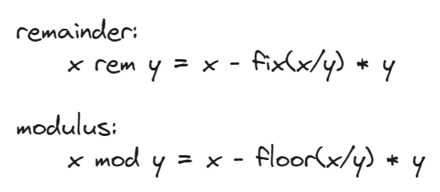
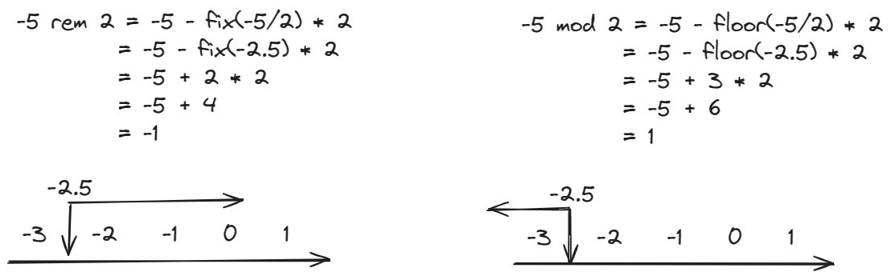
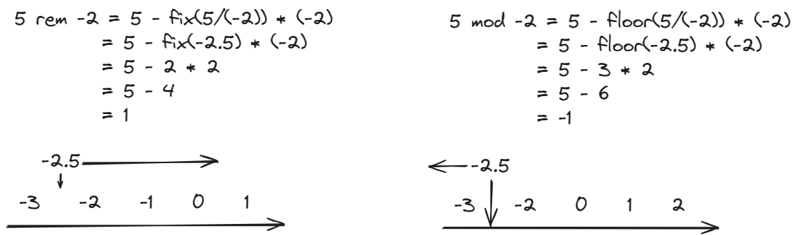
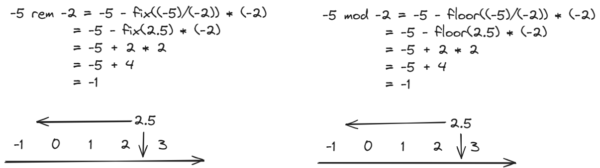
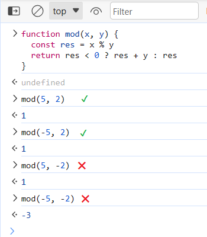
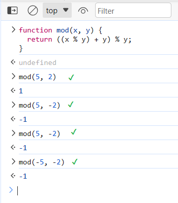

# 取余和取模如何区分与应用

取余（remainer）和取模（modulo），很多书籍没有说明它们的区别、也没有说明它们的应用场景。比如《JavaScript 高级程序设计（第 4 版）》直接说：

> 取模（余数）操作符由一个百分比符号（%）表示。

但实际上，两个概念并不完全一致。严格来说，JavaScript 中的 % 是取余，而不是取模。

有读者可能认为，没必要区分取余和取模。但我想说，区分取余和取模，能帮助你写出更优雅的代码。

以掘金的创作话题轮播为例，它带有灰色进度条，当你左滑或右滑时，话题对应的圆点会变长。


假如让你来实现灰色进度条，需要计算左滑后的下标（prevIndex）和右滑后的下标（nextIndex），你会怎么做呢？

- 要是你完全不理解取余和取模，为了兼顾左滑、右滑的边界情况，你可能会这样写：

```js
const prevIndex = currentIndex - 1 < 0 ?
                  len - 1 :
                  currentIndex - 1

const nextIndex = currentIndex + 1 > len - 1 ?
                  0 :
                  currentIndex + 1
```

- 要是你只理解取余，不理解取模，你可能会这样写：

```js
const prevIndex = (currentIndex - 1) % len < 0 ?
                  (currentIndex - 1) + len :
                  currentIndex - 1

const nextIndex = (currentIndex + 1) % len
```

- 要是你既理解取余，又理解取模，你可以写出更优雅的代码：（mod 不是 JavaScript 原生函数，需要额外实现）

```js
const prevIndex = mod(currentIndex - 1, len)
const nextIndex = mod(currentIndex + 1, len)
```

如果你想知道取余和取模的区别和应用、以及 mod 函数如何实现，看完这篇文章，你一定有所收获。

我会先给出取余和取模的计算方式，再用四个例子解释计算方式，接着我会谈一谈什么时候该取余，什么时候该取模，最后我会介绍 JavaScript 中 2 种实现 mod 函数的方法。

## 计算方式

余数和模的计算方式如下图：



其中 fix 代表向 0 取整，而 floor 代表向负无穷取整。你可能并不理解什么叫作「向 0 取整」，什么叫作「向负无穷取整」，先不要着急，在例子中我会详细讲解。

## 例子

### 5 除以 2

把 x = 5，y = 2 代入公式后，你需要计算的是 `fix(2.5)` 和 `floor(2.5)`。


你可以画出一个右箭头，代表从负无穷指向正无穷的数轴。

找到 2.5 的位置，可以发现 0 和负无穷都在 2.5 的左边。对 2.5 来说，向 0 取整和向负无穷取整，都是往左边取。

所以 `fix(2.5) = 2`， `floor(2.5) = 2`，把它们代入公式，得到余数和模都是 1。

### -5 除以 2

再看 -5 除以 2，继续代入公式画数轴，你需要计算的是 `fix(-2.5)` 和 `floor(-2.5)`。



找到 -2.5 的位置，可以看到 0 在 -2.5 的右边，而负无穷在 -2.5 的左边。此时向 0 取整就是取 -2.5 右边的整数，向负无穷取整就是取 -2.5 左边的整数。

所以 `fix(-2.5) = -2`，`floor(-2.5) = -3`。把它们代入公式，得到余数为 -1，模为 1。

### 5 除以 -2

继续看 5 除以 -2，你需要计算的是 `fix(-2.5)` 和 `floor(-2.5)`。



之前已经知道 `fix(-2.5) = -2`，`floor(-2.5) = -3`，把它们代入公式，得到余数为 1，模为 -1。

### -5 除以 -2

最后看 -5 除以 -2，你需要计算的是 `fix(2.5)` 和 `floor(2.5)`。



之前已经知道 `fix(2.5) = 2`，`floor(2.5) = 2`，把它们代入公示后得到余数和模都是 -1。

## 余数和模的区别

观察上面的 4 个例子，不难发现，取余和取模的结果，和 x 和 y 的正负号有关。

- 当 x 和 y 同为正数、或者同为负数时，x rem y 和 x mod y 的结果一样。
- 当 x 和 y 符号不一致时，x rem y 和 x mod y 的结果不一样。rem 计算结果符号和 x 一样，mod 计算结果和 y 一样。

实际应用中，y 一般都是正数，因此只需要考虑 x 符号的正负。

- 当 x 为正数时，此时取余数和取模结果一致，因此最好使用 JavaScript 的 % 运算符。

  例如你想访问数组中的某个元素，又担心下标超出数组的范围，你可以先求下标除以数组长度的余数，把余数作为新下标。

- 当 x 可能为正数也可能为负数时，此时可以实现一个 mod 函数。

  例如我在文章开头举的例子，prevIndex 可能是一个负数，你可以直接求 prevIndex 除以轮播长度的模。

## 实现取模函数

取模函数，我知道的有两种实现方法，一种是偏重工程，另一种偏重学术。两者有什么区别呢？

之前提到过，实际应用中，x mod y 时，y 一般是正数。

- **工程方法追求简单实用，只考虑 y 为正数的情况。**

它的写法简单易懂，先求 x 除以 y 的余数，如果结果为负数，就给结果再加上一个 y，保证结果始终为正数。

```js
function mod(x, y) {
  const res = x % y
  return res < 0 ? res + y : res
}
```



Ant Design Mobile Swiper [^1] 源码用的就是这种方法。

- **学术方法追求逻辑严密，既会考虑 y 为正数，也会考虑 y 为负数。**
  
它的写法如下，我不清楚怎么证明，但代入数字计算，可以验证结果正确。

```js
function mod(x, y) {
  return ((x % y) + y) % y;
}
```



MDN [^2] 和 stackoverflow [^3] 推荐的就是这种方法。

[^1]: [ant-design-mobile | github](https://github.com/ant-design/ant-design-mobile/blob/master/src/components/swiper/swiper.tsx) 
[^2]: [remainder | mdn](https://developer.mozilla.org/zh-CN/docs/Web/JavaScript/Reference/Operators/Remainder)
[^3]: [JavaScript % (modulo) gives a negative result for negative numbers | stackoverflow](https://stackoverflow.com/questions/4467539/javascript-modulo-gives-a-negative-result-for-negative-numbers/17323608#17323608)
