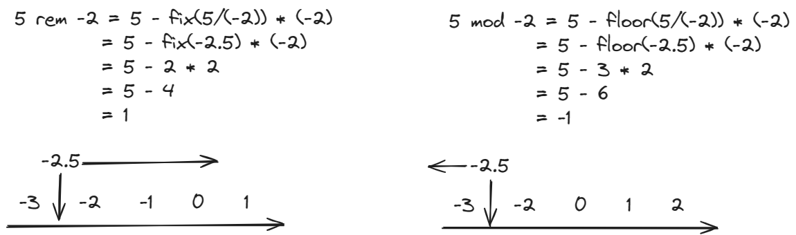

# 取余运算和取模运算如何区分

取余运算（remainer operation）和取模运算（modulo operation），很多书籍都没有详细区分。比如《JavaScript 高级程序设计（第 4 版）》就直接说：

> 取模（余数）操作符由一个百分比符号（%）表示。

但实际上，这两个概念并不完全一致。

有读者可能认为，区分取余和取模是无用功。但其实区分好两个概念，能帮助你写出更优雅的代码。

举个例子，我们看掘金推荐模块，它既可以向左滑，又可以向右滑。如果让你实现它的蓝色进度条，你就得计算左滑和右滑后蓝色指示点的下标。不妨假设进度条长度为 len，目前蓝色指示点下标为 currentIndex，左滑和右滑后下标为 prevIndex 和 nextIndex。


如果你完全不理解取余和取模，你会写出这样的代码：

```js
const prevIndex = currentIndex - 1 < 0 ? len - 1 : currentIndex - 1
const nextIndex = currentIndex + 1 > len - 1 ? 0 : currentIndex + 1
```

如果你只理解取余，不理解取模，你会写出好一些的代码：

```js
const prevIndex = (currentIndex - 1) % len < 0 ? (currentIndex - 1) + len : currentIndex - 1
const nextIndex = (currentIndex + 1) % len
```

而如果你既理解取余，又理解取模，你就能写出优雅的代码。其中 mod 是求模函数，需要你自行实现。

```js
const prevIndex = mod(currentIndex - 1, len)
const nextIndex = mod(currentIndex + 1, len)
```

如果你也想知道取余运算和取模运算的区别，也想知道 mod 函数如何实现，看完这篇文章，你一定有所收获。我会先给出取余运算和取模运算的定义，再用四个例子解释定义，最后我会用 JavaScript 实现一个取模函数。

## 定义

现在给出取余运算和取模运算的定义：


其中 fix 代表向 0 取整，而 floor 代表向负无穷取整。这样说可能有些抽象，我举四个例子，看完你就明白了。

**例子 1：取 5 除以 2 的余数和模**


代入公式后，由于 0 和负无穷都是在 2.5 的左侧，所以 `fix(2.5) = 2`， `floor(2.5) = 2`，最后求出余数和模都为 1。

**例子 2，取 -5 除以 2 的余数和模**


代入公式后，因为 0 位于 -2.5 的右侧，所以 `fix(-2.5) = -2`；因为负无穷在 -2.5 的左侧，所以 `floor(-2.5) = -3`。最后求出余数为 -1，模为 1。

**例子 3，取 5 除以 -2 的余数和模**



**例子 4，取 -5 除以 -2 的余数和模**


## JavaScript 实现取模函数

js 中，% 其实是求余，因此如果要用到求模，我们得自己实现一个求模函数，如下所示：

```js
function mod(a, b) {
  const res = a % b
  return res >= 0 ? res : res + b
}

function mod(n, m) {
  return ((n % m) + m) % m;
}
```

## 参考资料

https://stackoverflow.com/questions/4467539/javascript-modulo-gives-a-negative-result-for-negative-numbers/17323608#17323608