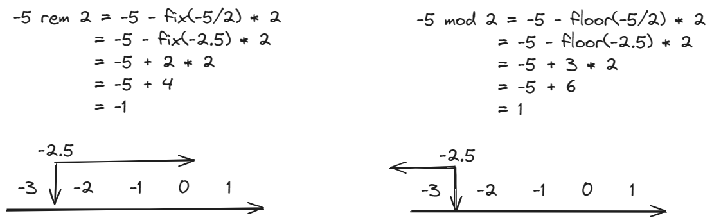

# 求余与求模

余数（remainer）是小学时四则运算的概念，模（modulus）是计算机离散数学的概念，它们两个有相同点也有不同点。我常常把它们混淆，于是最近决定写篇文章加以区分。

如果你也对求余和求模感到困惑，看完这篇文章，你一定有所收获。

## 定义

现在给出余数和模的定义：


其中 fix 代表向 0 取整，而 floor 代表向负无穷取整。这样说可能有些抽象，我举两个例子，看完你就明白了。

**例子 1**

第一个例子是，求 5 除以 2 的余数、求 5 除以 2 的模：


代入公式后，由于 0 和负无穷都是在 2.5 的左侧，所以 `fix(2.5) = 2`， `floor(2.5) = 2`，最后求出余数和模都为 1。

**例子 2**

第二个例子是，求 -5 除以 2 的余数，求 -5 除以 2 的模：



代入公式后，因为 0 位于 -2.5 的右侧，所以 `fix(-2.5) = -2`；因为负无穷在 -2.5 的左侧，所以 `floor(-2.5) = -3`。最后求出余数为 -1，模为 1。

## 模的应用

从第二个例子中，我们也可以得出一个结论，**x 为负数，y 为正数时，x mod y 可以得到一个正数。** 这个性质我们经常用到。

比如一个 5 元素的循环轮播图：

- 播放到 Item 0 时，再往左滑动，我们希望可以看到 Item 4，我们可以用 `(0 - 1) mod 5 = 4`，算出应该播放 Item 4。
- 播放到 Item 4 时，再往右滑动，我们希望可以看到 Item 0，我们可以用 `(4 + 1) mod 5 = 0`，算出应该播放 Item 0。


## JavaScript 实现求模函数

js 中，% 其实是求余，因此如果要用到求模，我们得自己实现一个求模函数，如下所示：

```js
function mod(a, b) {
  const res = a % b
  return res >= 0 ? res : res + b
}
```
