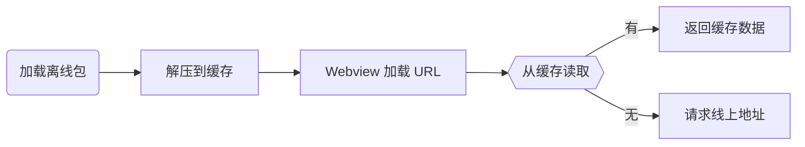
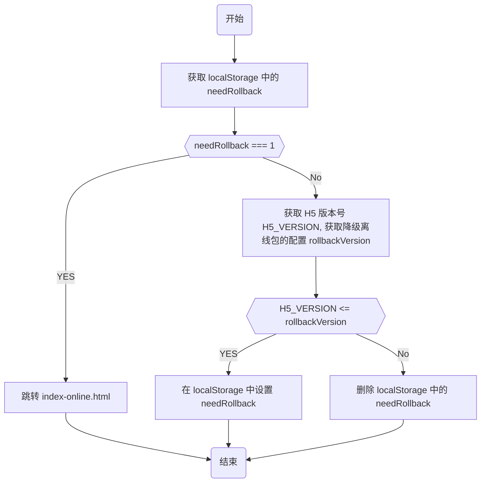

# 移动端 H5 离线包放入 HTML 后降级方案如何设计

离线包是移动端 H5 常见的性能优化方案。开发者们或多或少都接触过离线包、撰写过博客。francecil 大佬还总结了离线包是否要放入 HTML 的两种决策，以及决策的优缺点： [^1]：

- 放入 HTML（缓存优先）：更好的性能，但更新不及时。
- 不放入 HTML（网络优先）：实时更新，但性能较差，可能会加载失败。

我选择把离线包放入 HTML，这意味着 H5 出现线上故障时，没有办法及时修复。因此，我必须额外设计一套降级方案，保证离线包发生故障时能够快速降级。

如果你为离线包的降级而烦恼，看了这篇文章，你一定有所收获。我会先分析离线包放入 HTML 后更新不及时的原因，然后介绍自己设计的降级方案，接着给出方案的关键模块的代码，最后总结这种方案的优点和缺点。

## 离线包的生效机制

为什么离线包放入 HTML 后更新不及时？为了回答这个问题，我们必须先知道离线包是如何生效的。

离线包首先会把 HTML、CSS 和 JS 等资源文件打包成一个压缩包，并预先下载到 App 本地，解压到缓存中。当用户访问 H5 时，Webview 开始加载资源的 URL 并发出资源请求。App 会拦截这些请求，如果缓存中有资源满足请求，App 会使用缓存资源；如果缓存中没有资源满足请求，App 会使用线上资源。

离线包一般会对比请求文件名和缓存文件名是否一致，借此判断资源是否满足请求。所以如果我们在离线包里放入 HTML（HTML 文件名不会轻易改变），即使线上资源有更新，App 也会优先使用缓存资源。

离线包不放入 HTML，情形又会如何呢？线上无更新时，H5 的 HTML 资源用线上资源、CSS 和 JS 资源用缓存资源；线上有更新时，H5 的 HTML、CSS 和 JS 资源都用线上资源。这是因为 CSS 和 JS 文件名一般都有哈希值，一旦线上有更新，HTML 引入的 CSS 和 JS 资源文件名都会改变，App 缓存文件名和请求文件名就不再一致。

## 我设计的降级方案

上一节我们已经知道，只要 HTML 文件名没有变化，那么离线包就不会失效。在此机制上，我们可以利用文件名的改变，设计离线包的降级方案。怎么做呢？

### 概要设计

首先，我们需要准备两个内容基本一致的 HTML，一个是 index.html，另一个是 index-online.html。index.html 会被放入离线包，而 index-online.html 则不会。

其次，我们会设计一个开关，利用跳转间接改变文件名。开关开启时，index.html 会直接跳转到 index-online.html；开关关闭时，index.html 继续走原始逻辑。

跳转时间也有讲究，不能一拿到开关配置就立即跳转，这会中断用户正常的操作。我们可以延后开关的作用时间，拿到开关配置后，在 localStorage 中存储一下开关标识，等到用户下次进入页面时，发现有开关标识就跳转到 index-online.html。

发生线上出现故障时，我们先回滚线上的 H5 页面，此时 index-online.html 回滚成正常功能的页面，而缓存在用户 App 本地的 index.html 还有问题。我们再开启开关，本地的 index.html 直接跳转到 index-online.html。这样无论用户是否命中离线包，都不会出现问题。

### 详细设计

## 总结

[^1]: [HTML 放入离线包？你需要了解的离线策略](https://juejin.cn/post/7254549436625256506)
