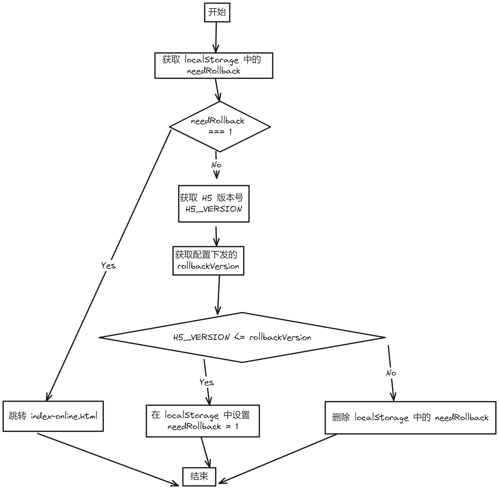

# 移动端 H5 离线包降级方案如何设计

离线包是移动端 H5 常见的性能优化方案。打包压缩包时，开发者通常有两种选择：

- 把主入口 HTML 打包到压缩包内，这样性能会更好，但是 H5 不能及时更新。
- 不把主入口 HTML 打包到压缩包内，这样更新速度会更快，但性能会更差。

我选择了第一种做法，这会导致如果 H5 出现线上 Bug 时，没有办法及时修复，因此，我必须额外设计一套离线包的降级方案，目标是发生线上问题时能够快速止损。

如果你恰好为离线包的降级而烦恼，看了这篇文章，你一定有所收获。我会先简单分析离线包的生效机制，再介绍自己设计的降级方案，最后总结这种方案的优劣。

## 离线包的生效机制

## 我设计的降级方案

## 总结

