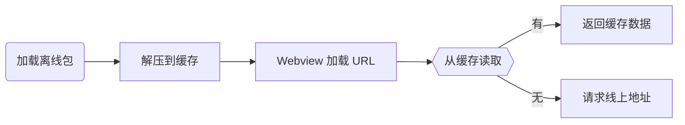
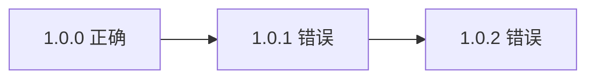
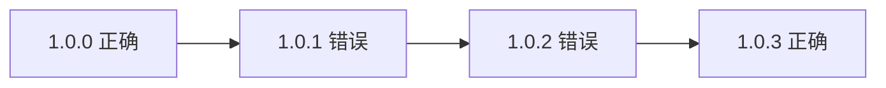
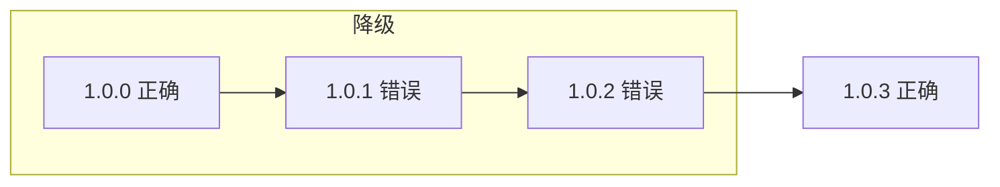
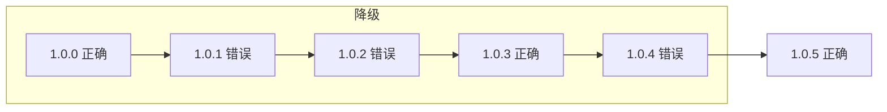

# H5 离线包放入 HTML 后降级方案如何设计

离线包是移动端 H5 常见的性能优化方案。开发者们或多或少都接触过离线包。francecil 大佬还总结了离线包是否要放入 HTML 的两种决策，以及决策的优缺点： [^1]：

- 放入 HTML（缓存优先）：更好的性能，但更新不及时。
- 不放入 HTML（网络优先）：实时更新，但性能较差，可能会加载失败。

我选择把 HTML 放入离线包，这意味着 H5 出现线上故障时，没有办法及时修复。因此，我必须额外设计一套降级方案，保证离线包发生故障时能够快速降级。

如果你也为离线包的降级而烦恼，看了这篇文章，你一定有所收获。我会从离线包的机制说起，解释离线包放入 HTML 后为什么更新不及时，然后我会介绍自己设计的降级方案，最后我会对这个方案做一个总结。

## 离线包的生效机制

为什么离线包放入 HTML 后更新不及时？为了回答这个问题，我们必须先知道它是如何生效的。

离线包首先会把 HTML、CSS 和 JS 等资源文件打包成一个压缩包，并预先下载到 App 本地，解压到缓存中。当用户访问 H5 时，Webview 开始加载资源的 URL 并发出资源请求，App 会拦截这些请求。

- 如果缓存中有满足请求的资源，App 会使用缓存资源；
- 如果缓存中没有满足请求的资源，App 会使用线上资源。

什么时候叫缓存资源满足请求呢？就是缓存文件名字和请求文件名字一致。

- 如果我们在离线包里放入 HTML，由于 HTML 文件不会轻易改变，即使线上资源有更新，App 也会优先使用缓存资源；
- 如果我们不放入 HTML，由于 CSS 和 JS 文件名的哈希会改变，所以线上资源有更新时，App 内 HTML、CSS 和 JS 都会使用线上资源。

## 我设计的降级方案

上一节我们已经知道，HTML 文件名没有变化，离线包就不会失效。我们可以利用跳转间接改变文件名。

### 利用跳转降级离线包

首先，我们需要准备两个内容一样的 HTML，一个是 index.html，另一个是 index-online.html。

- index.html 会放入离线包；
- index-online.html 不会放入离线包。

然后，我们会设计一个开关，控制 index.html 是否要跳转。

- 开关开启时，index.html 会跳转到 index-online.html；
- 开关关闭时，index.html 保持原始逻辑。

这样发生线上故障时，我们可以回滚线上的 H5 页面，此时 index-online.html 恢复正常，而缓存在用户 App 本地的 index.html 还有问题。

我们开启开关后，离线的 index.html 直接跳转到已经恢复正常的 index-online.html，就实现了离线包的降级。

### 利用版本大小设计开关

上一小节，我们提到降级方案需要一个开关，设计这个开关，我们需要考虑两个问题：

- 离线包有 n 个版本，有时多个版本均存在问题。比如 1.0.0 离线包没有问题，1.0.1 和 1.0.2 都有问题，我们需要保证开关能够降级多个版本。

- 我们会发布修复的离线包，比如我们会在 1.0.3 修复问题。开关打开后，不能把修复版本降级。

怎么设计呢？我这里采取最简单粗暴的思路，把离线包本身的版本 H5_VERSION 和要降级的版本 rollbackVersion 做一个比较。

- `H5_VERSION <= rollbackVersion`，相当于打开降级开关。
- `H5_VERSION > rollbackVersion`，相当于关闭降级开关。

继续使用之前的例子，1.0.2 是出现问题的最高版本，我们可以把 rollbackVersion 设置为 1.0.2，`<= 1.0.2` 全部降级。这样虽然会误伤 1.0.0 版本，但能既满足降级多个有问题的版本，又满足不降级修复版本。

发生下一次故障时，我们再更新 rollbackVersion，比如 1.0.4 发生了故障，我们把 rollbackVersion 设置为 1.0.4，`<= 1.0.4` 全部降级。

### 利用 localStorage 延迟开关生效时间

上一节我们介绍了如何设计开关。需要注意的是，我们不能一发现开关打开、就立即跳转，这会中断用户正常的操作。（比如用户正在浏览页面，突然页面跳转）

我们等开关打开后，在 localStorage 中存储一下代表打开的标识，等到用户下次进入页面时，发现有打开标识再跳转到 index-online.html。

### 流程图

考虑完上面三个问题后，我们就可以设计一个比较完善的降级方案了，它的流程图如下：

1. 用户一进入页面，会先获取 localStorage 中的 needRollback 开关标识。
2. 如果 needRollback 标识打开，则跳转 index-online.html 实现降级。（注：**index-online.html 中不能继续判断 needRollback，否则会无限跳转**）
3. 如果 needRollback 标识没有打开，则继续获取 H5 本身的版本号，以及接口下发的 rollbackVersion。
4. 如果 `H5_VERSION <= rollbackVersion`，则在 localStorage 把 needRollback 设置为 1。
5. 如果 `H5_VERSION > rollbackVersion`，则删除 localStorage 中的 needRollback 标识。

## 总结

本文介绍了一种离线包放入 HTML 的降级方案，它主要有三个特点：

1. 利用从离线化的 index.html 跳转到线上的 index-online.html 实现降级。
2. 利用离线包版本 `H5_VERSION <= rollbackVersion` 做开关，判断是否需要降级。
3. 利用 localStorage 中设置 needRollback 标识，延迟开关作用时间。

这种方案是离线包放入 HTML 后，一种成本较低的降级方案。它会在降级时误伤低版本的离线包，以损耗性能为代价，保障质量。

[^1]: [HTML 放入离线包？你需要了解的离线策略](https://juejin.cn/post/7254549436625256506)
