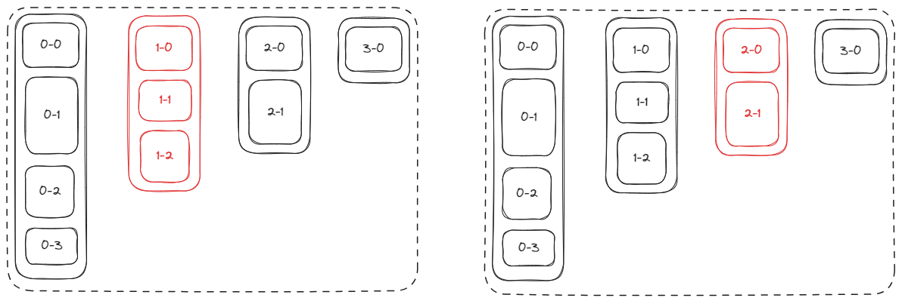
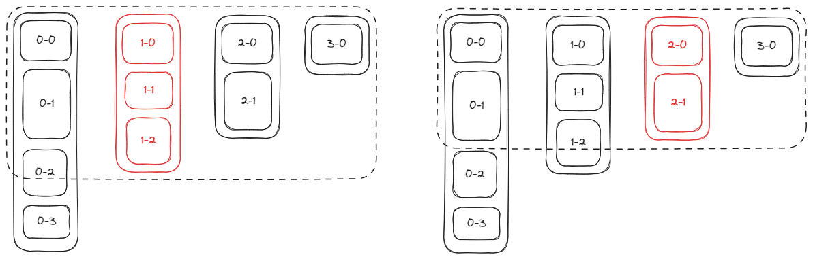

# H5、小程序自适应高度的轮播图如何实现

前端同学经常看到固定高度的轮播，偶尔也能看到自适应高度的轮播，比如拼多多的商品轮播：当第 1 个列表加载多页商品，第 2 个列表加载 1 页商品的时候，两个列表高度就不等。


如果你也想实现自适应高度的轮播，看完这篇文章，你一定有所收获。我会先解释自适应高度的原理，然后解释关键实现，最后再给出原生 H5 和小程序的示例代码。效果如下：


## 自适应高度的原理

正常来说，如果我们使用 flex 布局实现轮播图 Swiper，那么轮播图的整体高度，将会是最高的 List 的高度。当轮播播放到较矮的 List 时，会在 List 的下方留下大量空白。如下图，红色代表正处于屏幕视口的 List，虚线框代表整体的 Swiper。



要想实现自适应高度的轮播，就必须在轮播切换时，先获取处于屏幕视口高度的 List 的高度，再把它的高度强行设置给整体的 Swiper。溢出 Swiper 盒子的则需要隐藏。



## 关键代码实现

```js
function updateSwiperHeight (currentIndex) {
  const height = document.querySelector(`#item-box-${currentIndex}`).offsetHeight
  swiper.style.height = height + 'px'
  swiper.style.overflow = 'hidden'
}
```

## 代码示例

### H5

[高度自适应的轮播图 | codepen](https://codepen.io/lijunlin2022/pen/qBLxNzQ)

### 微信小程序

[高度自适应的轮播图 | 微信小程序](https://developers.weixin.qq.com/s/sHNk6HmY79Ob)

:::info
小程序有原生的 swiper 组件，但是 swiper 组件是不支持自适应轮播。因此需要手动改变 swiper 的 height 属性。
:::
