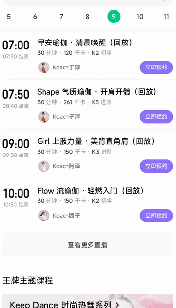
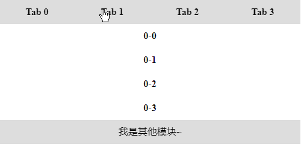
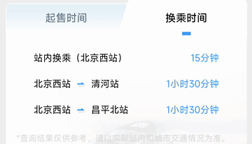

# H5、小程序高度变化的轮播图如何实现

高度固定的轮播图，你肯定经常看到、并知道怎么实现，但高度变化的轮播图呢？

下面是 Keep 的课程轮播，可以看到 9 号的视频数量是少于 10 号和 11 号的，所以 9 号的视频列表的高度比 10、11 号低。当播放到 9 号课程时，下方的主题课程模块会往上移动，填充 9 号视频列表下方的空白。



如果你也想实现高度变化的轮播，看完这篇文章，你一定有所收获。我会先解释高度变化的原理，然后说明关键实现，最后再给出原生 H5 和小程序的示例代码。代码效果如下：



## 高度变化的原理

如果我们使用 flex 布局实现轮播图 Swiper，那么轮播图的整体高度，将会是最高一项的高度。

如下图，虚线框代表 Swiper，Swiper 的每项都是 List。如果播放到某个 List，这个 List 就是红色。可以看到，只要轮播图播放到较矮项，就会在较矮项底部留下大量空白。


要想实现高度变化、且不留下空白的轮播图，原理很简单。我们只需要在轮播切换时，先获取即将播放的 List 高度，再把它的高度设置给 Swiper。

如下图，播放到某个 List，Swiper 的高度就变为这个 List 的高度。我们还可以给 Swiper 设置 `overflow: hidden;`，把找出 Swiper 范围的元素都给隐藏掉。


## 关键代码实现

聊完原理，我们来看代码，代码非常简单粗暴。

我们为每个 List 都设置了一个 id，利用 id 获取 List 的高度再设置到 Swiper 元素的 style 上。

```js
function updateSwiperHeight (currentIndex) {
  const height = document.querySelector(`#item-box-${currentIndex}`).offsetHeight
  swiper.style.height = height + 'px'
  swiper.style.overflow = 'hidden'
}
```

## 代码示例

现在来看 H5 和小程序的代码示例：

### H5

[高度变化的轮播图 | codepen](https://codepen.io/lijunlin2022/pen/qBLxNzQ)

### 小程序

[高度变化的轮播图 | 小程序](https://developers.weixin.qq.com/s/ct5irIm37eOg)

:::info
- 小程序有原生的 swiper 组件，我们可以给 swiper 直接增加一个 style，在 style 中改变 swiper 的高度。
- 小程序没有 `querySelector()`，可以用 `createSelectorQuery()` 替代。
:::

## 额外提醒

高度变化的轮播图非常少见，你需要仔细斟酌什么时候用到它。

如果你不需要左右滑动，那么选择 Tab 下方包裹一个选项卡更适合。比如 12306 的选项卡，高度也是不等的：



如果轮播每一项轮播都是长列表，且随着用户上拉屏幕，列表加载的数据还会变多。**这种轮播通常还是固定高度（100vh）的轮播**，只是它们每一项都有自己单独的滚动条。

它在拼多多、淘宝、京东上很常见。你需要注意，**这种轮播每一项需要自带滚动条，否则处理列表滚动条会变得非常麻烦**。这种情况下，往往要求记住用户之前滚动的位置。如果轮播共用滚动条，且你记录了每个 Tab 滚动的位置，左右切换轮播时，滚动条位置需要改变，轮播会有一个很明显的闪烁。


## 总结

本文我们介绍了高度变化的轮播图实现原理——先获取对应轮播项的高度，再改变轮播图的整体高度，并给出了 H5 和小程序的代码示例。
