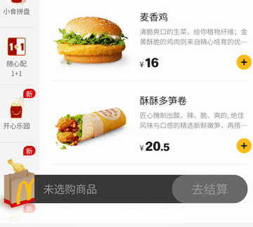
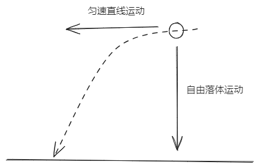

# H5、小程序商品加入购物车的抛物线动画如何实现

电商类 H5、小程序把商品加入到购物车时，常常有一个抛物线动画。比如麦当劳小程序，当你点击加购按钮时，会看到有一个小汉堡从卡片汉堡上抛出，然后掉落到购物袋里。



这种动画该怎么做呢？如果你也想实现它，看完这篇文章，你一定有所收获。我会先说明抛物线动画的原理，再解释实现它的关键代码，最后给出完整的代码示例。代码效果如下：


## 抛物线动画的原理

高中物理告诉我们，平抛运动、斜抛运动可以分解为水平方向的匀速直线运动、竖直方向自由落体运动（匀加速直线运动）。



同理，我们可以把抛物线动画分解为水平的匀速动画、竖直的匀加速动画。

水平匀速动画很容易实现，直接 `animation-timing-function` 取值 `linear` 就行。

竖直的匀加速直线运动，严格实现非常困难，我们可以近似实现。因为匀加速直线运动，速度是越来越快的，所以我们可以用一个先慢后快的动画替代，你可能立刻就想到给 `animation-timing-function` 设置 `ease-in`。不过 `ease-in` 先慢后快的效果不是很明显。针对这个问题，张鑫旭大佬提供了一个贝塞尔曲线 `cubic-bezier(0.55, 0, 0.85, 0.36);`[^1]。当然，你也可以用 [cubic-bezier](https://cubic-bezier.com/) 自己调一个先慢后快的贝塞尔曲线。

## 关键代码实现

我们把代码分为两部分，第一部分是布局代码、第二部分是动画代码。

### 布局代码

首先是 HTML 代码，代码非常简单。下图中小球代表商品、长方形代表购物车。


```html
<div class="ball-box">
  <div class="ball"></div>
</div>
<div class="cart"></div>
```

你可能比较好奇，小球用一个 ball 元素就可以实现，为什么我要用 ball 和 ball-box 两个元素呢？因为 animation **只能给一个元素定义一个动画效果**，而我们需要给小球添加两个动画效果。于是我们将动画分解，给 ball-box 添加水平运动的动画，给 ball 添加竖直运动的动画。

### 动画代码

再看动画代码，moveX 是水平运动动画，moveY 是竖直动画，动画时间均为 1s。为了让效果更加明显，我还特意将动画设置成无限循环的动画。

```css
.ball-box {
  /* ... */
  animation: moveX 1s linear infinite;
}

.ball {
  /* ... */
  animation: moveY 1s cubic-bezier(0.55, 0, 0.85, 0.36) infinite;
}

@keyframes moveX {
  to {
    transform: translateX(-250px);
  }
}

@keyframes moveY {
  to {
    transform: translateY(250px);
  }
}
```

## 代码示例

[抛物线动画 | codepen](https://codepen.io/lijunlin2022/pen/NWoLgyV)

## 总结

本文我们介绍了抛物线动画的实现方法，我们可以将抛物线动画拆分为水平匀速直线动画和竖直从慢变快的动画，水平动画我们可以使用 linear 来实现，竖直动画我们可以使用一个先慢后快的贝塞尔曲线替代。设置动画时，我们还需要注意，一个元素只能设置一个动画。

[^1]: [这回试试使用CSS实现抛物线运动效果 | 张鑫旭](https://www.zhangxinxu.com/wordpress/2018/08/css-css3-%e6%8a%9b%e7%89%a9%e7%ba%bf%e5%8a%a8%e7%94%bb/)
