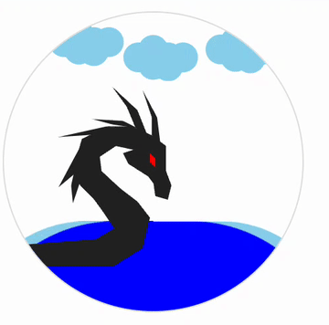

# H5 蛟龙闹海动画如何实现（不引用图片）

龙年要到了，祝大家在新的一年里，如龙腾飞、事业有成；如龙入海、财源广进。

我使用 HTML 和 CSS 实现了一个蛟龙闹海效果。



它很简略，但是代码中我没有引用图片，我是怎么做的呢？

下面我会从下往上、依次解释如何实现海浪、龙和云朵，接着我会给出整体代码，最后，我会做一个简单总结。

## 海浪如何实现

我使用 2 个不同 border-radius 圆角的正方形实现了海浪效果。首先，我实现了一个圆形和两个圆角正方形，然后把两个圆角正方形移动到圆形的底部。


然后，我给圆角正方形添加旋转动画，


之后给圆形添加 `overflow: hidden;`，就可以得到海浪效果。


## 龙如何实现

再看下龙如何实现，我使用 `clip-path` 实现了龙的效果。

`clip-path` 是 CSS 一个属性，可以裁剪元素。裁剪区域内的显示，区域外的隐藏。可以利用 `ploygon()` 定义多个顶点，连接好后就成为了多边形。

我裁剪了 10 个多边形，组合成了龙。其中 1 个 8 边形是龙头、1 个 4 边形是眼睛、2 个 5 边形是龙角、4 个 4 边形是鬃毛，还有 1 个 12 边形是脖子、1 个 12 边形是肚子。

不过，以我的设计经验，肯定是没办法轻松裁剪出这些多边形的，我使用了 [clippy](https://www.jiangweishan.com/tool/clippy/) 这个工具，这个工具可以像描图一样把多边形裁剪出来。


理论上裁剪得越精细，多边形数量越多，描边的龙就越像。这是纯粹的体力活，我这里偷个懒，只裁剪出大概的形状。

## 云朵如何实现

实现了龙，我们再看下云朵如何实现，我使用 6 个圆重叠形成了云朵。

简单画 6 个圆，如下所示：


只要将这些圆的边框全部变透明，再填充上颜色，就可以得到一朵云。


我没有创建 6 个 div 元素然后叠加，而是使用了 box-shadow 来实现。box-shadow 最多有五个参数。

```css
/* x 偏移量 | y 偏移量 | 阴影模糊半径 | 阴影扩散半径 | 阴影颜色 */
box-shadow: 2px 2px 2px 1px rgba(0, 0, 0, 0.2);
```

不需要阴影模糊半径和阴影扩散半径，只需要设置 x 偏移量和 y 偏移量，就可以实现圆形的偏移：

```css
box-shadow:
  10px 5px 0 0 #ddd,
  10px -5px 0 0 #ddd,
  20px 6px 0 0 #ddd,
  20px 0 0 0 #ddd,
  30px 0px 0 0 #ddd;
```

## 示例代码

现在，我们看完整代码：

[蛟龙闹海 | codepen](https://codepen.io/lijunlin2022/pen/abQewmE)

## 总结

本文我们利用 HTML 和 CSS 实现了一个蛟龙闹海效果。其中：

1.  海浪，可以使用两个旋转的圆角正方形实现。
2.  龙，可以使用 clip-path 裁剪多边形，再拼接多边形实现。
3.  云朵，不需要创建多个元素，可以使用 box-shadow 并设置多组值实现。
