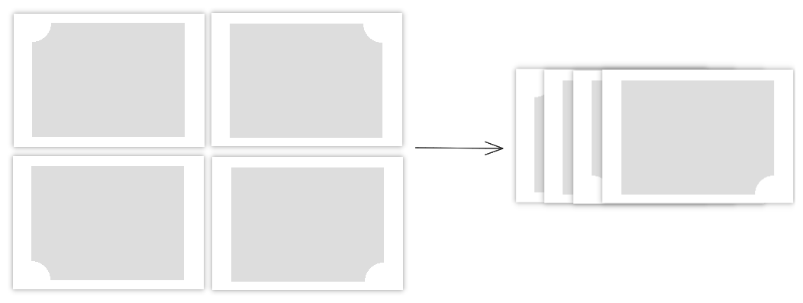

# H5、小程序反向圆角、反向圆角的边框如何实现

H5、小程序中正向圆角很常见，但偶尔也能看到新颖的反向圆角。

比如热风小程序（一个卖鞋的小程序）中，为了宣传新鞋，鞋子图片就不是正向圆角，而是反向圆角。


这种反向圆角、阴影应该如何实现呢？下面我会介绍反向圆角、阴影的实现原理，并给出示例代码。最后，我会给做一个简单的总结。

## 反向圆角的原理

不难想到，反向圆角可以看作一个矩形被圆形遮挡了四个边角。


至于反向圆角的边框，可以看作整个是反向圆角图形的投影。


## 关键代码实现

按之前所说的原理，我们可以给 div 设置 50% 的 border-radius 得到圆形，再改变圆形的定位去遮挡矩形。但这种方法并不优雅，我们这里会介绍一种更巧妙的办法。

我们需要先了解一个 CSS 函数 —— [radial-gradient](https://developer.mozilla.org/zh-CN/docs/Web/CSS/gradient/radial-gradient)。radial-gradient 中文名称是径向渐变，它可以指定渐变的中心、形状、颜色和结束位置。

```css
/* 形状 at 位置 | 渐变开始颜色 渐变颜色停止位置 | ... | 渐变开始颜色 渐变停止位置 */
background-image: radial-gradient(circle at center, #fff 0, #fff 20px, #ddd 0);
```

### 长方形中央画一个圆

光看语法有些抽象，我们举一个实际的例子。如图所示，这是一个长方形，中央有一个白色的圆。


它的关键代码如下：

```html
<div class="circle-in-rect"></div>
```

```css
.circle-in-rect {
  width: 200px;
  height: 150px;
  margin: 25px;
  background: 
    radial-gradient(
      circle at center,
      #fff 0,
      #fff 20px,
      #ddd 20px
    );
}
```

其中：

- `radial-gradient()` 函数用于创建渐变效果。
- `circle at center` 指定了圆形渐变，并且渐变的中心在元素的中心。
- `#fff 0` 指定了第一个渐变颜色为白色，位置是从中心开始。
- `#fff 20px` 指定了第二个渐变颜色也为白色，位置距离中心 20 像素。
- `#ddd 20px` 指定了第三个渐变颜色为淡灰色，位置距离中心 20 像素，第三个渐变颜色之后的颜色都是淡灰色。

### 长方形左上角画一个圆

只要我们想办法，把圆从长方形中央移动到左上角，就可以得到一个反向圆角。


移动的关键代码如下，我们可以设置 `circle at left top`，让渐变的中心转移到左上角：

```css
.single {
  background:
    radial-gradient(
      circle at left top,
      transparent 25px,
      #ddd 0
    );
}
```

### 长方形四个角画四个圆

CSS 可以给 background 设置多个渐变（包括线性渐变和径向渐变），多个渐变之间可以用逗号分隔、且它们会按照声明的顺序依次堆叠。

不过如果你只是单纯堆叠了四个渐变，那么你看到的是一个矩形。


```css
  background: 
    radial-gradient(circle at left top, transparent 25px, #ddd 25px),
    radial-gradient(circle at right top, transparent 25px, #ddd 25px),
    radial-gradient(circle at left bottom, transparent 25px, #ddd 25px),
    radial-gradient(circle at right bottom, transparent 25px, #ddd 25px);
```

这是因为四个矩形互相堆叠，反而把反向圆角给遮住了。



我们可以改造上述代码得到目标效果，这里为了方便讲解知识点，我给四个渐变反向圆角区域设置了不同颜色：

```css
background-repeat: no-repeat;
background-size: 50% 50%;
background: 
  radial-gradient(circle at left top, transparent 25px, red 25px)
  left top,
  radial-gradient(circle at right top, transparent 25px, green 25px)
  right top,
  radial-gradient(circle at left bottom, transparent 25px, blue 25px)
  left bottom,
  radial-gradient(circle at right bottom, transparent 25px, yellow 25px)
  right bottom;
```

- `background-size: 50% 50%;` 设置背景图像的大小为容器的宽度和高度的 50%，以确保每个渐变都覆盖了容器的一半区域。
- `background-repeat: no-repeat;` 让背景不重复。
- `background: ...;` 定义了背景，其中包含四个径向渐变，分别放置在容器的四个角落，分别是红、绿、蓝、黄四种颜色。


你只需要给红、绿、蓝、黄都换成灰色，就可以看到长方形四个角画了四个圆，也就是完成的反向圆角。

### 反向圆角的边框


接下来我们看如何给反向圆角设置边框，我们可以利用 [drop-shadow](https://developer.mozilla.org/zh-CN/docs/Web/CSS/filter-function/drop-shadow) 函数。

drop-shadow 可以创建一个符合元素形状的投影，它的语法如下：

```css
/* x 偏移量 | y 偏移量 | 阴影模糊半径 | 阴影颜色 */
filter: drop-shadow(0 0 2px red);
```

我们只需要简单设置一下模糊半径和颜色，就可以实现边框效果。


## 代码示例

[反向圆角、阴影 | codepen](https://codepen.io/lijunlin2022/pen/GReBjEO)

## 总结

本文我们介绍了如何实现反向圆角、以及反向圆角的边框。

反向圆角可以用圆遮挡长方形实现。至于圆形，我们可以利用 radial-gradient（径向渐变）指定圆的圆心位置、渐变颜色位置实现。

要实现多个反向圆角，我们可以设置多个径向渐变。只是我们需要注意设置 background-size 和 background-repeat，不要让径向渐变互相遮挡。

最后，我们可以利用 drop-shadow 实现反向圆角的边框。
