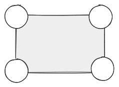
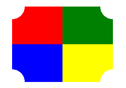

# H5、小程序中四个反向圆角的图片如何实现？

最近我逛热风小程序（一个卖鞋的小程序）时，发现了一个奇特的图片样式。图片的四个圆角是反向的，和常规图片不一样。


思索一番后，我发现想实现这个效果，需要的 CSS 知识还挺多，于是整理这篇文章。

下面我会先介绍如何实现四个反向圆角的矩形，再介绍如何把特殊矩形作为遮罩、得到和热风小程序的图片效果。接着，我会给出完整的代码，最后，我会给做一个简单的总结。

## 如何实现四个反向圆角的矩形

不难想到，四个反向圆角的矩形，就是四个边角都被圆遮挡的矩形。



### 径向渐变

知道圆遮挡矩形的原理后，我们最容易想到的办法是 —— 先用 50% 的 border-radius 得到圆，再改变圆形的定位去遮挡矩形。

不过这种方法需要多个元素，并不优雅，我将介绍另一种更巧妙的办法。

我们需要先了解一个 CSS 函数 —— [radial-gradient](https://developer.mozilla.org/zh-CN/docs/Web/CSS/gradient/radial-gradient)。`radial-gradient` 中文名称是径向渐变，它可以指定渐变的中心、形状、颜色和结束位置。语法如下：

```css
/*
 * 形状 at 位置
 * 渐变颜色 渐变位置
 * ...
 * 渐变颜色 渐变位置
 */
background-image:
  radial-gradient(
    circle at center,
    transparent 0,
    transparent 20px,
    #ddd 20px
  );
```

### 利用径向渐变在矩形中心画圆

光看语法比较抽象，我们用代码写一个实际的例子。如图所示，我们要在矩形中心画圆：


下面是关键代码：

```css
background: radial-gradient(
  circle at center,
  transparent 0,
  transparent 20px,
  #ddd 20px
);
```

其中：

- `radial-gradient` 函数用于创建渐变效果。
- `circle at center` 指定了圆形渐变，并且渐变的中心在矩形的中心。
- `transparent 0` 指定了第一个渐变颜色为透明，位置是从中心开始。
- `transparent 20px` 指定了第二个渐变颜色也为透明，位置距离中心 20px。
- `#ddd 20px` 指定了第三个渐变颜色为淡灰色，位置距离中心 20px，第三个渐变颜色之后的颜色都是淡灰色。

通过 `radial-gradient`，我们成功让矩形中心、半径为 20px 的圆变透明，超过半径 20px 的地方颜色都变为灰色，这样看起来就是矩形中心有一个圆。

### 矩形左上角画圆

不难想到，只要我们把圆的中心从矩形中心移动到矩形的左上角，就可以让圆挡住矩形左上角，得到一个反向圆角。


关键代码如下，我们可以把 `circle at center` 改写为 `circle at left top`：

```css
background: radial-gradient(
  circle at left top,
  transparent 0,
  transparent 20px,
  #ddd 20px
);
```

### 矩形四个角画圆

我们已经知道 `radial-gradient` 如何实现 1 个反向圆角，接下来再看如何实现 4 个反向圆角。继续之前的思路，我们很容易想到给 `background` 设置多个反向渐变。

多个渐变之间可以用逗号分隔、且它们会按照声明的顺序依次堆叠。于是我们会写出如下关键代码：

```css
background: radial-gradient(
  circle at left top,
  transparent 0,
  transparent 20px,
  #ddd 20px
),
/* ... */
radial-gradient(
  circle at right bottom,
  transparent 0,
  transparent 20px,
  #ddd 20px
);
```

遗憾的是，上述代码运行后我们看不到四个反向圆角，而是看到一个矩形。


这是因为四个矩形互相堆叠，反而把反向圆角给遮住了。


遮挡怎么解决呢？我们可以分四步来解决。

#### 设置背景宽度和高度

我们先单独看一个径向渐变。

第一步是设置 `background-size: 50% 50%;`，它设置了背景图像的大小是容器宽度和高度的 50%。代码运行后效果如下：


可以看到左上角有反向圆角的矩形重复出现了四次。

#### 设置不允许重复

第二步是设置 `background-repeat: no-repeat;`。我们需要去除第一步中出现的重复。代码运行后效果如下：


#### 给每个径向渐变设置位置
第三步是设置不允许重复时，应该保留的背景图像位置。

第一步中左上角是反向圆角的矩形出现了四次，第二步不允许重复时默认保留了左上角的矩形。事实上我们可以选择保留四个矩形中的任何一个，比如我们可以选择保留右下角的矩形。

```css
background: 
  radial-gradient(
    circle at left top,
    transparent 0,
    transparent 20px,
    #ddd 20px
  )
  right bottom;
```

代码运行后效果如下：


#### 组合前三个步骤

第四步是组合前三个步骤的语法。

看完第三步后，一个很自然的想法，就是用四个渐变分别形成四个特殊矩形，然后把四个特殊矩形分别放在左上、右上、左下和右下角，最后得到有四个反向圆角的矩形。

关键代码如下,为了区分四个径向渐变，我给左上、右上、左下、右下分别设置了红、绿、蓝、黄四种颜色：

```css
background: radial-gradient(
      circle at left top,
      transparent 0,
      transparent 20px,
      red 20px
    )
    left top,
  radial-gradient(
      circle at right top,
      transparent 0,
      transparent 20px,
      green 20px
    )
    right top,
  radial-gradient(
      circle at left bottom,
      transparent 0,
      transparent 20px,
      blue 20px
    )
    left bottom,
  radial-gradient(
      circle at right bottom,
      transparent 0,
      transparent 20px,
      yellow 20px
    )
    right bottom;
background-repeat: no-repeat;
background-size: 50% 50%;
```

代码运行效果如下：



不难想到，只要把红、绿、蓝、黄都换为灰色，就可以得到一个全灰、有四个反向圆角的矩形。


### 把背景改写为遮罩

知道四个反向圆角的矩形如何实现后，我们可以：

- 把 `background-size` 改写为 `mask-size`；
- 把 `background-repeat` 改写为 `mask-repeat`;
- 把 `background` 改写为 `mask`；

这样就可以得到四个反向圆角的矩形遮罩。

```css
mask: radial-gradient(
      circle at left top,
      transparent 0,
      transparent 20px,
      #ddd 20px
    )
    left top,
  radial-gradient(
      circle at right top,
      transparent 0,
      transparent 20px,
      red 20px
    )
    right top,
  radial-gradient(
      circle at left bottom,
      transparent 0,
      transparent 20px,
      red 20px
    )
    left bottom,
  radial-gradient(
      circle at right bottom,
      transparent 0,
      transparent 20px,
      red 20px
    )
    right bottom;
mask-size: 50% 50%;
mask-repeat: no-repeat;
```

我们可以把四个反向圆角的矩形覆盖在一张背景图片上，就得到了和热风小程序一样的效果：


需要注意的是，部分手机浏览器不支持 mask 语法，所以我们有必要再设置一份 `-webkit-mask`、`-webkit-mask-size` 和 `-webkit-mask-repeat`。

## 代码示例

[四个反向圆角的图片 | codepen](https://codepen.io/lijunlin2022/pen/GReBjEO)

## 总结

本文我们介绍了如何实现四个反向圆角的图片。

我们可以利用径向渐变，实现四个反向圆角的矩形。然后我们把这个矩形作为遮罩，覆盖在背景图片上，这样就实现了四个反向圆角的图片。
