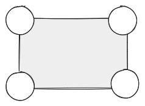
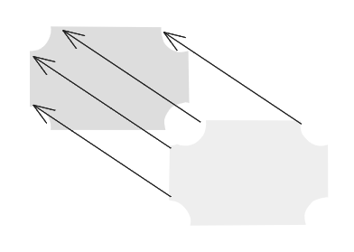
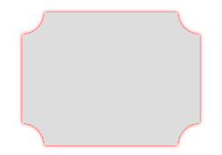

# H5、小程序反向圆角、反向圆角的边框如何实现

H5、小程序中正向圆角很常见，偶尔为了些新效果，需要设置反向圆角。

比如热风小程序（一个卖鞋的小程序）中，为了宣传新鞋，鞋子图片就不是正向圆角，而是反向圆角。


这种反向圆角、阴影应该如何实现呢？下面我会介绍反向的实现原理、实现方法，并给出示例代码。最后，我会给做一个简单的总结。

## 反向圆角的原理

不嫩看出，反向圆角、其实是可以看作一个矩形，被圆形遮挡了四个边角。



而它的边框，其实可以看作整个形状的投影。



## 关键代码实现

之前我们已经提到，反向圆角是矩形被圆形遮挡了四个边角。我们可以给四个 div 设置 50% 的 border-radius，得到四个圆，再改变这四个圆的定位，去遮挡矩形。

这种方法所需元素很多、非常粗暴，我们这里介绍的是另一种更为巧妙的方法。

[radial-gradient](https://developer.mozilla.org/zh-CN/docs/Web/CSS/gradient/radial-gradient) 是一个 CSS 渐变函数，它可以指定渐变的形状（圆形和椭圆形）、位置和颜色。


我们可以先看如何用镜像渐变设置一个反向圆角：


```html
<div class="single"></div>
```

```css
.single {
  width: 200px;
  height: 150px;
  margin: 25px;
  background-color: #ddd;
  background:
    radial-gradient(
      circle at left top,
      transparent 25px,
      #ddd 0
    );
}
```

接下来我们再看如何设置四个反向圆角：


接下来我们看如何给反向圆角设置边框。



## 代码示例

[反向圆角、阴影 | codepen](https://codepen.io/lijunlin2022/pen/GReBjEO)
