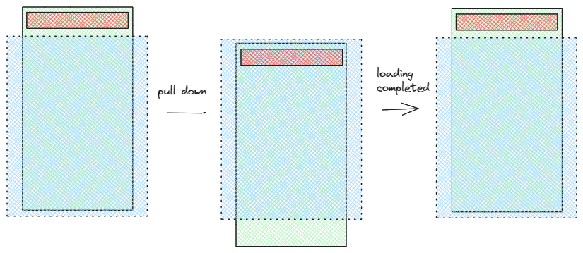
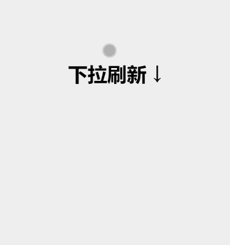
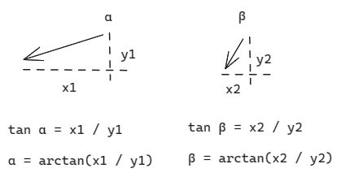

# H5 下拉加载如何实现？

下拉加载是移动端常见的一个功能，原生 H5 并不支持下拉。为了理解下拉手势原理、更好地维护、扩展下拉功能，我们有必要手写一个下拉手势。

下图是我实现的一个下拉加载效果，它分为三步：开始下拉时，屏幕顶部会出现加载动画；加载过程中，屏幕顶部高度保持不变；加载完成后，加载动画隐藏。


本文我会先讲解下拉的原理、然后根据原理写出初始代码。之后我会逐一介绍初始代码的缺陷，在解决这些缺陷的同时逐步改写代码。最后我会给出下拉手势的整体代码，并做一个总结。

## 下拉的原理



如图所示，蓝色框代表视口，绿色框代表容器，橙色框代表加载动画。最开始时，容器处于视口中，用户无法看到视口外的加载动画；用户开始下拉之后，容器向下移动，用户逐渐看到加载动画；用户结束下拉后，容器又开始向上移动，用户看到一个页面回弹的效果。

## 下拉基础代码

我们看下最简单的下拉布局代码。

### 布局代码

```html
<div id="box">
  <div class="loader-box">
  </div>
  <h1>下拉刷新 ↓</h1>
</div>
```

```css
#box {
  position: relative;
  width: 100vw;
  height: 100vh;
  background-color: #eee;
}

.loader-box {
  position: relative;
  top: -80px;
  height: 80px;
}
```

布局中，box 对应容器，loader-box 是包裹加载动画的盒子，至于 h1 只是一个提示。

loader-box 高度是 80px，且本就处于视口最顶部，我们再给它设置相对布局，把它的位置往上挪动 80px，于是加载动画的盒子就处于视口之外。

### 逻辑代码

监听移动端的下拉，我们需要用到三个事件：[touchstart](https://developer.mozilla.org/zh-CN/docs/Web/API/Element/touchstart_event)、[touchmove](https://developer.mozilla.org/zh-CN/docs/Web/API/Element/touchmove_event) 和 [touchend](https://developer.mozilla.org/zh-CN/docs/Web/API/Element/touchend_event)。

我们可以从 `touchstart` 和 `touchmove` 事件的 event 中获取手指的坐标。其中 `event.touches[0].clientX` 是手指相对视口左边缘的 X 坐标，`event.touches[0].clientY` 是手指相对视口上边缘的 Y 坐标。

需要注意的是，我们无法从 `touchend` 事件中获得 `clientX` 和 `clientY`。

基于此，我们可以记录用户手指开始触摸屏幕（touchstart）的 clientY，当作开始坐标，记录用户手指离开屏幕（最后一次触发 touchmove）的 clientY，二者相减，我们就得到了手指移动的距离。

我们可以设置手指移动向下移动多少距离，容器就向下移动多少距离，这样我们就得到了最基础的逻辑代码：

```js
const box = document.getElementById("box")
let startY = 0, endY = 0, distanceY = 0

function start(e) {
  startY = e.touches[0].clientY
}

function move(e) {
  endY =  e.touches[0].clientY
  distanceY = endY - startY
  box.style = `transform: translateY(${distanceY}px); transition: all 0.3s linear;`
}

function end() {
  setTimeout(() => {
    box.style = `transform: translateY(0); transition: all 0.3s linear;`
  }, 1000)
}

box.addEventListener("touchstart", start)
box.addEventListener("touchmove", move)
box.addEventListener("touchend", end)
```

它的效果如下：



## 基础代码的六个问题

查看基础代码的效果，可以发现三个问题：

### 最大、最小距离限制

1. 没有最大滑动距离的限制。通常来说，我们下拉屏幕时，应该下拉到一定位置，就无法往下滑动了。因此我们需要设定一个限制。这里我们假设最多能够向下滑动 150px

没有最小滑动距离的限制

```js
const DISTANCE_Y_MAX_LIMIT = 150
  DISTANCE_Y_MIN_LIMIT = 80

function move(e) {
  endY =  e.touches[0].clientY
  distanceY = endY - startY
  if (distanceY > DISTANCE_Y_LIMIT) {
    distanceY = DISTANCE_Y_LIMIT
  }
  box.style = `transform: translateY(${distanceY}px); transition: all 0.3s linear;`
}

function end() {
  if (distanceY < DISTANCE_Y_MIN_LIMIT) {
    box.style = `transform: translateY(0px); transition: all 0.3s linear;`
    return
  }
  ...
}
```

### 动画盒子应该停留在视口顶部

2. 当松开手、且数据正在加载中时，动画盒子应该停留在视口顶部，而不应该直接消失。我们可以把 end 函数加以改造：

```js
function end() {
  ...
  box.style = `transform: translateY(80px); transition: all 0.3s linear;`
  setTimeout(() => {
    box.style = `transform: translateY(0px); transition: all 0.3s linear;`
  }, 1000)
}
```

### 已下拉的容器不能继续下拉

3. 当已经处于下拉时，不能继续下拉，为此我们需要添加一个加载的锁 loadLock。当加载锁开启时，start，move 和 end 事件应该都不会触发。

```js
let loadLock = false

function start(e) {
  if (loadLock) { return }
  ...
}

function move(e) {
  if (loadLock) { return }
  ...
}

function end(e) {
  if (loadLock) { return }
  ...
}
```

### 只能够下拉，不能够上拉

4. 我们应该只能够下拉，不能够上拉，所以如果判断 endY - startY 小于 0 时，我们也应该阻止相关逻辑。

```js
function move(e) {
  endY =  e.touches[0].clientY;
  if (loadLock) { return }
  if (endY - startY < 0) { return }
  ...
}

function end() {
  if (loadLock) { return }
  if (endY - startY < 0) { return }
  loadLock = true
  ...
}
```

你可能会疑惑，为什么我情愿写这么多判断拦截事件，也不取消监听事件呢？这是因为一旦取消监听事件，为了能继续实现下拉事件，我们又不得不考虑在一个合适的时间，再把监听事件加回来，这会让问题变得复杂。

### 加载时阻止原生滚动

5. 当下拉时，虽然我们已经拦截了触摸事件，但是 H5 原生滚动时间还能用，因此加载数据时页面还能够滚动。我们可以给 body 设置一个 `overflow-y: hidden;` 的属性。

```css
body.overflowHidden {
  overflow: hidden;
}
```

```js
const body = document.body
function end() {
  ...
  box.style = `transform: translateY(80px); transition: all 0.3s linear;`
  body.className = "overflowHidden"
  setTimeout(() => {
    loadLock = false
    box.style = `transform: translateY(0px); transition: all 0.3s linear;`
    body.className = ""
  }, 1000)
}
```

### 处理 iOS 橡皮筋效果

因为 iOS 默认滑动时有一个橡皮筋效果，所以我们需要阻止它。

```js
function addTouchEvent() {
  box.addEventListener("touchstart", start, { passive: false })
  box.addEventListener("touchmove", move, { passive: false })
  box.addEventListener("touchend", end, { passive: false })
}

addTouchEvent()
```

解决完 5 个问题之后，我们其实已经得到一个基本无 Bug 的下拉加载功能。


## 优化体验的两步

接下来我们需要做两步来优化体验：

### 阻尼效果

1. 增加阻尼效果。

我们在移动端下拉时，除了有一个限制之外，应该会有一种越来越难下拉的感觉。具体来说，我们可以设置一个百分比，随着用户下拉得越来越远，偏移的距离越来越短。

```js
function move(e) {
  endY =  e.touches[0].clientY;
  ...
  distanceY = endY - startY
  percent = (100 - distanceY * 0.5) / 100
  percent = Math.max(0.5, percent)
  distanceY = distanceY * percent
  if (distanceY > DISTANCE_Y_MAX_LIMIT) {
    distanceY = DISTANCE_Y_MAX_LIMIT
  }
  ...
}
```

### 反三角函数判断用户真实意图

2. 反三角函数判断用户真实下拉意图



很明显可以看出，右侧用户下拉时，用户的意图比较明显。因为 β 的角度比 α 角度更大。

我们可以利用反三角函数求出角度。因为 js 的反三角函数 `Math.atan()` 单位是弧度，所以我们还需要对弧度做一个角度的转换。

```js

```

## 额外补充，加载动画的实现

```css
#loader {
  width: 25px;
  height: 25px;
  border: 3px solid #ddd;
  border-radius: 50%;
  border-bottom: 3px solid #1e80ff;
  transform: rotate(0deg);
}
```


我们再添加一个旋转动画：

```css
#loader.loading {
  animation: loading 1s linear infinite;
}

@keyframes loading {
  from {
    transform: rotate(0deg);
  }
  to {
    transform: rotate(360deg);
  }
}
```

效果如下：


## 代码示例

## 总结

初始代码的基础上，解决了 6 个问题和 2 个优化方案。
