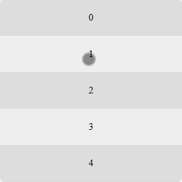
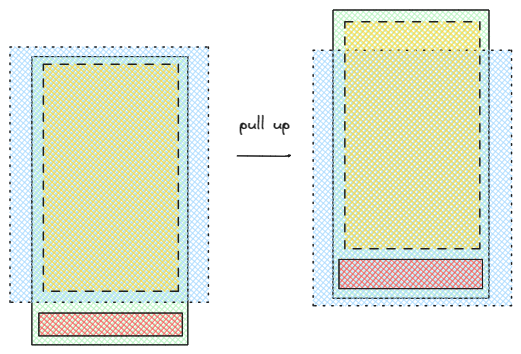

# H5 上拉加载（触底加载）如何实现

上拉加载（触底加载）是 H5 常见的功能，今天我们来看下如何实现。

我实现的效果如下：列表滚动到底部立即请求数据，列表底部能看到加载动画；请求完成后，底部会插入加载好的数据。如此循环往复，直到无法请求更多数据，列表底部显示「没有更多了」。



首先我会讲解上拉的原理，并简单说明 IntersectionObserver 的用法；然后我会给出功能的关键布局代码和逻辑代码，接着我会介绍需要注意的两个问题、解决方案，最后我会做个简单的总结。

## 上滑的原理



如图所示，蓝色矩形代表视口，绿色矩形代表包裹列表和动画的容器，金黄色矩形代表列表，橙色则代表加载动画。

最开始时，加载动画处于视口下方；当用户下滑列表到达底部时，加载动画就进入了视口，此时可以请求列表下一页数据，请求成功后新数据插入到列表底部，就把动画挤出了视口。

也就是说，想实现加载更多，关键就是监听加载动画有没有进入视口内部。我们可以使用 [IntersectionObserver](https://developer.mozilla.org/zh-CN/docs/Web/API/IntersectionObserver) 这个 API 监听动画有没有进入视口。

`IntersectionObserver` 使用方法如下，我们首先创建了一个监听器 observer，再用这个监听器去监视元素 element。当 [entry.isIntersecting](https://developer.mozilla.org/en-US/docs/Web/API/IntersectionObserverEntry/isIntersecting) 为 true 时，说明 element 已经进入视口。

```js
// 创建监听器
const observer = new IntersectionObserver(([entry]) => {
  if (entry.isIntersecting) {
    console.log('进入视口')
  }
})
// 开始监听
observer.observe(element)
```

## 上拉加载关键代码

知道原理后，现在我们来看实现上拉加载的关键代码，首先是布局代码：

### 布局代码

布局代码和原理一节的图相互对应，box 是包裹列表和加载动画的容器、list 有 5 个子元素、list 下方则是加载动画的容器。

```html
<div class="box">
  <div id="list">
    <div class="item">0</div>
    <div class="item">1</div>
    <div class="item">2</div>
    <div class="item">3</div>
    <div class="item">4</div>
  </div>
  <div class="loader-box">
    <div id="loader"></div>
    <div id="nothing" class="hidden">没有更多了~</div>
  </div>
</div>
```

列表布局很基础，我们主要看动画。loader-box 中的 loader 是纯 CSS 的加载动画。我们利用 border 画出的一个圆形边框，左、上、右边框是浅灰色，下边框是深灰色：


```css
#loader {
  width: 25px;
  height: 25px;
  border: 3px solid #ddd;
  border-radius: 50%;
  border-bottom: 3px solid #717171;
  transform: rotate(0deg);
}
```

我们给 loader 元素增加一个动画，让它从 0 度到 360 度无限旋转，就实现了加载动画：


```css
#loader {
  ...
  animation: loading 1s linear infinite;
}

@keyframes loading {
  from { transform: rotate(0deg); }
  to { transform: rotate(360deg); }
}
```

**loader 也是我们真正需要监听是否进入视口的元素。**

### 逻辑代码

关键逻辑代码非常简单，和原理中一致，我们只需要动画 loader ，就直接调用 pullUp 函数。

```js
const loader = document.getElementById('loader')
const observer = new IntersectionObserver(([entry]) => {
  if (entry.isIntersecting) {
    pullUp()
  }
}, {
  root: null,
  rootMargin: '0px',
  threshold: 0
})

observer.observe(loader)
```

## 上拉加载的两个注意点

除了关键完布局代码、逻辑代码外，我们还有三个点需要注意：

### 加载锁

第一点是，前一次上拉加载未完成之前，不应该再次触发数据加载。

为此我们需要创建一个变量 loadLock 作为加载锁，数据加载前先把 loadLock 赋值为 true，数据加载完成后再把 loadLock 赋值为 false。如果 loadLock 一直为 true，就说明前一次加载未完成，直接 return 结束上拉函数。

代码如下：

```js
let loadLock = false

function pullUp() {
  ...
  if (loadLock) { return }
  loadData()
}

function loadData() {
  ...
  loadLock = true
  setTimeout(() => {
    ...
    loadLock = false
  }, LOADING_TIME)
}
```

### 没有更多数据

第二点是，需要考虑没有更多数据的情况。上拉加载请求的数据都是分页的，一定有请求结束的情况。当请求结束时，我们需要给用户一些提示。

我们可以设置一个 hasMore 变量表示时候有更多数据，当没有更多数据时（代码中限制了数据最多只有 LIST_LIMIT_CNT 条），应该隐藏加载动画，展示「没有更多了」提示。

代码如下：

```js
let hasMore = true

function pullUp() {
  if (!hasMore) { return }
  ...
  loadData()
}

function loadData() {
  ...
  setTimeout(() => {
    if (len >= LIST_LIMIT_CNT) {
      loader.className = 'hidden'
      nothing.className = ''
      hasMore = false
      return
    }
    ...
  }, LOADING_TIME);
}
```

### 请求失败

第三点是，需要考虑请求失败的情况。因为无法保证服务器一直运转正常，很可能请求下一页数据时，直接就失败了。

这种情况有两种常见交互：

- 直接展示「请求出错了」，让用户点击重试。
- 继续展示加载动画，重新请求服务器数据。

因为请求失败不好模拟，所以 Demo 中只实现了加载锁和没有更多数据的情况，你可以根据自己的需要改写 Demo。

## 示例代码

[上拉加载、触底加载 | codepen](https://codepen.io/lijunlin2022/pen/OJrJePE)

## 总结

本文讲解了上拉加载的原理——利用 IntersectionObserver 监听加载动画是否进入视口，如果动画进入则请求下一页数据。此外，本文还说明了上拉加载需要注意的三个点：加载锁、没有更多数据和请求失败。
