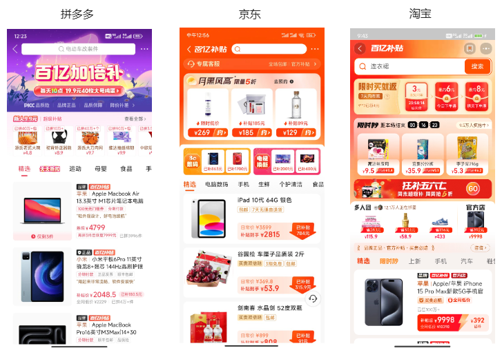
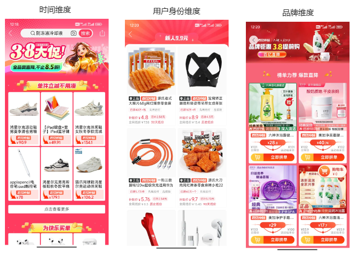

# 百亿补贴为什么用 H5？H5 未来会如何发展？

23 年 11 月末，拼多多市值超过了阿里。我想蹭热度写一篇文章《百亿补贴为什么用 H5》，没有动笔；24 年新年，我想趁热度写一篇《H5 未来会如何发展》，没有动笔。

眼看着灵感就要烂在手里，我决定把两篇文章合为一篇，赶紧完工发布。

因为是分析、预测类文章，文章只是我的个人观点。如果有不同的意见，欢迎读者在评论区讨论交流。

## 百亿补贴为什么用 H5?

我们首先看一张 F12 的控制台图，铁证如山，百亿补贴拼多多技术栈是 H5，大概率是 React 写的 H5。

不只是拼多多，京东、淘宝的百亿补贴技术栈也是 H5。

这和刻板印象中的 H5（营销活动、年度总结）有很大差距。电商巨头们的 H5，不再是即用即弃的 H5，它已经是一个可以供用户多次使用的产品。

那么，为什么这些电商巨头都倾向于选择 H5 呢？选择 H5 后，他们能获得什么样的好处。

### H5 已经成熟稳定

第一点，也是最基础的一点，H5 已经成熟并且稳定，能够完整地实现功能。具体来看：

1. 浏览器兼容性不断提高。

2008 年 HTML5 草案发布；2010 年乔布斯宣称 HTML5 将成为 Flash 的替代品；2022 年，微软 IE 宣布浏览器正式退役……主流浏览器对 HTML5、CSS3 和 JavaScript 的标准语法兼容性持续改进，开发者能够使用的较新的 Web 技术开发。虽然 Safari（iOS 浏览器）的兼容性问题还是让人诟病，但总体来说兼容成本已经处于开发者可接受范围内。

2. 主流框架已经成熟。

截止 2024 年，React 已经发布 11 年，Vue 已经发布 10 年。业界以及基本认可了两大框架。(Angular 默默退出战场)

且自从 React16.8 发布 Hooks，Vue3 发布 Composition API 后，两大框架语法基本稳定，短时间内不会再有大的变化。

再看 React 和 Vue 未来的发展方向。React 目前主攻 React Server Component，Vue 未来主要尝试无 VDom 和 Rust 重写 Vite，这已经在旧战场卷无可卷，正在开辟新战场的体现。

3. 混合开发的成熟。

混合开发的优化手段，已经基本完善。目前大家对 HTML5 如何实现 App 的 UI 布局，产品业务逻辑有了一个清晰的认知。对 H5 适合什么样的产品也有了清晰认知。对一些 H5 本身不支持的功能，也可以通过 H5 和 Native 通信来解决。

对于原生 H5 性能不好的缺陷，目前也有离线化、服务端渲染等手段解决。

### H5 适合到处投放，打破 App 壁垒

另一个原因是各大APP为了留住用户，会对引流采取各种措施。而H5作为一种通用的技术方案，能够轻松嵌入到各大APP中，并通过唤起APP的方式实现用户的留存和引流。

### H5 开发成本低，适合快速迭代

## H5 未来会如何发展

我认为 H5 未来发展有 6 个趋势

### 趋势一：电商活动 H5 占比会越来越大

随着大家都开始占山为王的趋势，现阶段就是，你不做活动，你的用户就会被其他用户挖走。因此电商活动占比会变多

未来会有更多业务，采取拼多多百亿补贴的方式，有一个常住的 H5，多个流动的 H5。常住和流动是我自己模仿常住人口、流动人口造的词。

### 趋势二：H5 SSR 的比例会提高，但 CSR 依旧是主流

SSR 有两个作用，一个是提高 SEO，另外一个则是提升性能。

但第一个作用在国内基本已经死了，你花时间花精力去做 SEO，不如直接买。另外就是国内用户现在普遍都使用 App，网页端的浏览变小了。

第二个作用是可以，但开发者必须回答，收益比支出大吗？

要知道，SSR 可是需要花服务器费用的。另外就是，SSR 需要考虑内存泄露问题，你在消费者手机上泄露了也就泄露了，但是在服务器上泄露，那可是一个大问题。

因此，只有大收益、高技术的才会尝试使用 SSR，总不能像老板汇报时，直接说「虽然老板你亏钱了，但是 SSR 真的很酷」吧。

### 趋势三：H5 定制化要求会越来越高

需要让消费者区分各种各样的活动，用互联网黑话来说，就是「建立用户心智」。现在我们打开电商活动 H5，会发小虽然模块都是一样的，但是长得五花八门的。

常住 H5 是为了建立用户心智。常住 H5 跳转又分为好几个地方：

- 头图的跳转，
- 新人模块的跳转
- 底部导航的跳转
- 侧边按钮的跳转

流动 H5 是为了给用户差异化处理。

策划活动，从时间维度，比如三八妇女节；从用户身份维度，比如新客 9.9；从品牌维度，比如专门为六神打造了一个 H5。

### 趋势四：H5 与小程序结合会更加紧密

小程序包体积一直是一个让大家头疼的问题，之前就曾有大佬搞过，在小程序内部嵌入 JavaScript 解释器的骚操作，以实现小程序的热更新。

但随着微信小程序发布 [关于禁止小程序JavaScript解释器使用规范要求](https://developers.weixin.qq.com/community/minihome/doc/0000ae500e4fd0541f2ea33755b801) 这一要求，这条路也堵死了。

现在唯一合规的小程序热更新方法，就是使用小程序的 webview。

### 趋势五：H5 会成为鸿蒙应用的重要组成部分

arkTS，但就使用者而言，普遍反应开发体验不好。另外就是需要跨端手段。

换句话说，如果 webview 都做不好，就很让人怀疑鸿蒙的可行性。

### 趋势六：monorepo 或许会成为主流的一种开发方式

如前所述，需要有众多的 H5 共用一套基建，那么 monorepo 就会有很大的发展。
