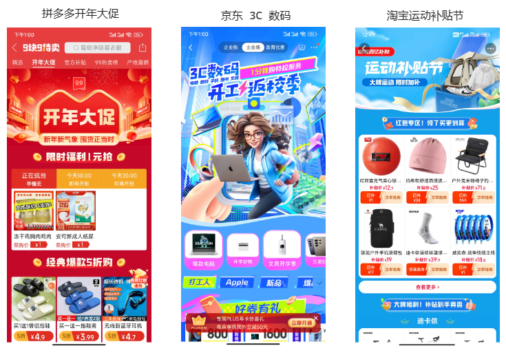

# 拼多多市值超阿里背景下，电商活动 H5 会如何发展

电商活动 H5 的一个典型例子——百亿补贴拼多多。

发展趋势——模仿拼多多、超越拼多多。

我们从拉新、留存两个方向，来谈谈百亿补贴拼多多的技术特点。

## 拉新的技术特点

拉新有很多方法，包括：

- 策划活动，从时间维度，比如三八妇女节；从用户身份维度，比如新客 9.9；从品牌维度，比如专门为六神打造了一个 H5。

- 媒体运营、付费广告等。

1. 多活动。

## 促活的特点

1. 强调自身 IP

本身就是一个可以让用户重复使用的产品

强调自身 ip 属性

