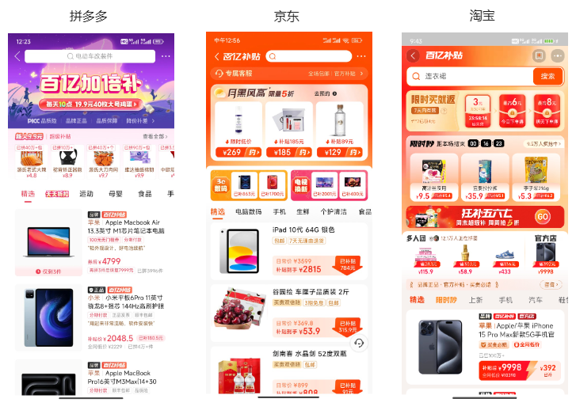
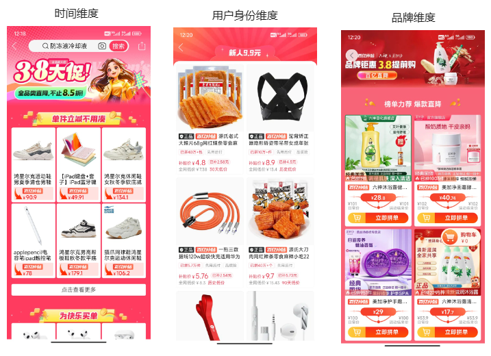
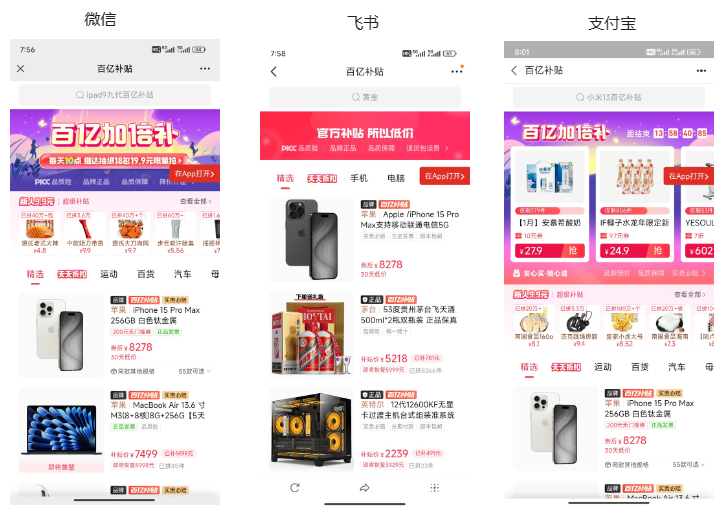
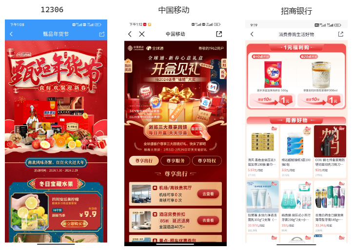
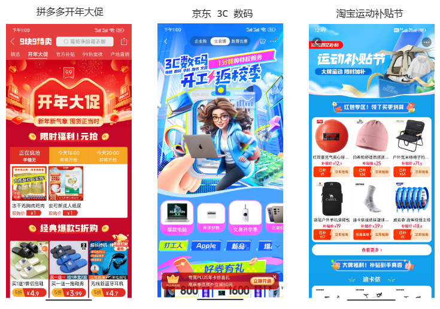

# 百亿补贴为什么用 H5？H5 未来会如何发展？

23 年 11 月末，拼多多市值超过了阿里。我想蹭热度写一篇文章《百亿补贴为什么用 H5》，没有动笔；24 年新年，我想趁热度写一篇《新的一年，H5 会如何发展》，也没有动笔。

眼看着灵感就要烂在手里，我决定把两篇文章合为一篇，与大家分享。当然，这些分析预测只是个人观点，如果你有不同的意见，欢迎在评论区讨论交流。

## 百亿补贴为什么用 H5

我们首先看一张控制台的图，可以确认，拼多多的「百亿补贴」技术栈是 H5，大概率是 React 写的 H5。

不只是拼多多，我特地确认了，京东、淘宝的的「百亿补贴」技术栈也是 H5 (点击它们右上角三个点，拷贝分享链接，然后用浏览器打开)。

那么，为什么电商巨头会在「百亿补贴」这种重要活动上选择 H5 呢？用 H5 有什么好处呢？

### H5 技术已经成熟

第一个原因，也是最基础的原因，就是 H5 技术已经成熟，能够完整地实现功能。具体来说：

#### 浏览器兼容性不断提高

自 2008 年 HTML5 草案发布以来，截止 2014 年，HTML5 已有 18 年历史。18 年间，主流浏览器对 HTML5、CSS3 和 JavaScript 的标准语法兼容性一直持续改进，22 年微软更是亲手盖上了 IE 棺材板。虽然 Safari（iOS 浏览器）的兼容性仍然备受诟病，但总体来说兼容成本已经变得可以接受。

#### 主流框架已经成熟

前端最主流的两大框架 Vue 和 React 已经成熟。它们的成熟体现在多个方面：

- 从时间的角度看，截止 2024 年，React 已经发布了 11 年，而 Vue 已经发布了 10 年。经过多年的发展，前端开发者已经非常熟悉 React 和 Vue，能熟练地应用它们进行开发。
- 从语法的角度看，自 React16.8 发布 Hooks，以及 Vue3 发布 Composition API 以来，两大框架语法基本稳定，不再有大的变化。前端开发者可以更加专注于业务逻辑，无需过多担心框架语法的变动。
- 从未来发展方向看，React 目前致力于推广 React Server Component [^1]；Vue 则在尝试着无 VDom 的 Vapor 方向，并计划利用 Rust 重写 Vite [^2]。这表明旧领域不再有大的颠覆，两大框架已经正寻求新的发展领域。

#### 混合开发已经成熟

混合开发是指将原生开发（Android 和 iOS）和 Web 开发结合起来的一种技术。简而言之，它将 H5 嵌入到移动应用内部运行。近些年，业界对混合开发的优势和缺陷已经有清晰的认识，并针对其缺陷进行了相应的优化。具体来说：

- 混合开发的优势包括开发速度快、一套代码适配 Android 和 iOS，以及实现代码的热更新。这意味着程序员能更快地编写跨平台应用，及时更新应用、修复缺陷；
- 混合开发的缺陷则是性能较差、加载受限于网络。针对这个缺陷，各大 App、以及云服务商如阿里云 [^3] 和腾讯云 [^4] 都推出了自己的离线包方案。离线包方案可以将网页的静态资源（如 HTML、CSS、JS、图片等）缓存到本地，用户访问 H5 页面时，可以直接读取本地的离线资源，从而提升页面的加载速度。可以说，接入离线包后，H5 不再有致命缺陷。

#### 前端基建工具已经成熟

近些年来，业界最火的技术话题之一，就是用 Rust 替代前端基建，包括：用 Rust 替代 Webpack 的 Rspack；用 Rust 替代 Babel 的 SWC；用 Rust 替代 Eslint 的 OxcLint 等等。

前端开发者对基建工具抱怨，已经从「这工具能不能用」，转变为「这工具好不好用」。这种「甜蜜的烦恼」，只有基建工具成熟后才会出现。

**综上所述，浏览器的兼容性提升、主流框架的成熟、混合开发的发展和前端基建工具的完善，使 H5 完全有能力承载「百亿补贴」业务。**

### H5 开发成本低

前文我们已经了解到，成熟的技术让 H5 可以实现「百亿补贴」的功能。现在我们介绍另一个原因——H5 开发成本低。

#### 「百亿补贴」需要多个 H5

「百亿补贴」的方式，是一个常住的 H5，搭配上多个流动的 H5。（「常住」和「流动」是我借鉴「常住人口」和「流动人口」造的词）

- 常住 H5 链接保持不变。站外投放的链接基本都是常住 H5 的，站内首页入口链接也是常住 H5 的，这样方便用户二次访问。
- 流动 H5 链接位于常住 H5 的不同位置，比如头图、侧边栏等。时间不同、用户不同、算法不同，流动 H5 的链接都会不同，流动 H5 可以区分用户，方便分发流量。
  
  具体来看，拼多多至少有三个流量的分发点，第一个是可点击的头图，第二个是列表上方的活动模块，第三个是右侧浮动的侧边栏，三者可以投放不同的链接。最近就分别投放 3.8 女神节链接、新人链接和品牌链接：

#### 「百亿补贴」需要及时更新

不难想到，每到一个节日、每换一个品牌，「百亿补贴」就需要更新一次。

有时还需要为一些品牌定制化 H5 代码。如果使用其他技术栈，排期跟进通常会比较困难，但是使用 H5 就能够快速迭代并上线。

### H5 投放成本低

我们已经「百亿补贴」使用 H5 技术栈的两个原因，现在来看第三个原因——H5 适合投放。

拼多多的崛起过程中，投放到其他 App 的链接功不可没。早期它通过微信等社交平台「砍一刀」的模式，低成本地吸引了大量用户。如今，它通过投放「百亿补贴」策略留住用户。

H5 的独特之处，在于它能够灵活地在多个平台上进行投放，其他技术栈很难有这样的灵活性。即使是今天，抖音、Bilibili 和小红书等其他 App 中，「百亿补贴」的 H5 链接也随处可见。

拼多多更是将 H5 这种灵活性发挥到极致，只要你有「百亿补贴」的链接，你甚至可以在微信、飞书、支付宝等地方直接查看「百亿补贴」 H5 页面。

**综上所述，能开发、能快速开发、且开发完成后能大量投放，是「百亿补贴」青睐 H5 的原因。**

## H5 未来会如何发展

了解「百亿补贴」选择 H5 的原因后，我们来看看电商巨头对 H5 未来发展的影响。我认为有三个影响：

### H5 数量膨胀，定制化要求苛刻

C 端用户黏性相对较低，换一个 App 的成本微不足道。近年 C 端市场增长缓慢，企业重点从获取更多的新客变成留住更多的老客，很难容忍用户丢失。因此其他企业投放活动 H5 时，企业必须也投放活动 H5，电商活动 H5 就变得越来越多。

这个膨胀的趋势不仅仅存在于互联网巨头的 App 中，中小型应用也不例外，甚至像 12306、中国移动、招商银行这种工具性极强的应用也无法幸免。

随着市场的竞争加剧，定制化要求也变得越来越苛刻，目的是让消费者区分各种活动。用互联网黑话来说，就是「建立用户心智」。在可预见的未来，尽管电商活动 H5 结构基本相同，但是它们的外观将变得千差万别、极具个性。

### SSR 比例增加，CSR 占据主流

在各家 H5 数量膨胀、竞争激烈的情况下，一定会有企业为提升 H5 的秒开率接入 SSR，因此 SSR 的比例会增加。

但我认为 CSR 依然会是主流，主要是因为两个原因：

1. SSR 需要额外的服务器费用，包括服务器的维护、扩容等。这对于中小型公司来说是一个负担。
2. SSR 对程序员技术水平要求比 CSR 更高。SSR 需要程序员考虑更多的问题，例如内存泄露。使用 CSR 在用户设备上发生内存泄露，影响有限；但是如果在服务器上发生内存泄露，则是会占用公司的服务器内存，增加额外的成本和风险。

因此，收益丰厚、技术雄厚的公司更愿意使用 SSR。没有金刚钻别揽瓷器活，总不能向老板汇报结果时，告诉老板「虽然您亏钱了，但是 SSR 真的很酷」。

### Monorepo 比例会上升，类 Shadcn UI 组件库也许会兴起

如前所述，H5 的数量膨胀，代码复用就会被着重关注。我猜测更多企业会选择 Monorepo 管理方式。所谓 Monorepo，简单来说，就是将原本应该放到多个仓库的代码放入一个仓库，让它们共享相同的版本控制。这样可以降低代码复用成本。

定制化要求苛刻，我猜测社区中类似 Shadcn UI 的 H5 组件库或许会兴起。现有的 H5 组件库样式太单一，即使是 Shadcn UI，也很难满足国内 H5 的定制化需求。然而，Shadcn UI 的基本思路——「把源码下载到项目」，是解决定制化组件难复用的问题的好思路。因此，我认为类似 Shadcn 的 H5 组件库可能会逐渐兴起。

## 总结

本文介绍了我认为「百亿补贴」会选用 H5 的三大原因：

- H5 技术已经成熟
- H5 开发成本低
- H5 投放成本低

以及电商巨头对 H5 产生的三个影响：

- 数量膨胀，定制化要求苛刻
- SSR 比例增加，CSR 占据主流
- Monorepo 比例增加，类 Shadcn UI 组件库也许会兴起

总而言之，H5 开发会越来越专业，对程序员要求会越来越高。至于这种情况是好是坏，仁者见仁智者见智，欢迎大家在评论区沟通交流。

[^1]: [11 岁的 React 正迎来自己口碑的拐点](https://juejin.cn/post/7340926094614511626)
[^2]: [Rust! 无VDom! 尤雨溪解析 Vue.js 2024 新特性](https://juejin.cn/post/7342384485696520246)
[^3]: [离线包 | 阿里云](https://help.aliyun.com/document_detail/178947.html)
[^4]: [离线包 | 腾讯云](https://cloud.tencent.com/document/product/1034/64737)
