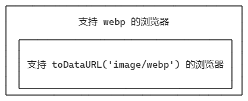

# H5 如何判断浏览器是否支持 webp

https://www.cnblogs.com/cr330326/p/12809418.html

https://blog.michealwayne.cn/2021/02/06/notes/%E3%80%90%E7%AC%94%E8%AE%B0%E3%80%91webp%E9%9A%8F%E6%89%8B%E8%AE%B0/

https://blog.csdn.net/weixin_42213796/article/details/116697413

判断浏览器是否支持 webp，已经是老生常谈的话题，但我翻看社区文章，讲解得并不是很详细，于是觉得有必要写一篇文章说道说道。

## 什么是 webp

### 什么是有损

### 什么是无损

### 什么是透明度

### 什么是动画

webp 是谷歌 2010 年整出来的, 是 jpeg, png 经过 webp 压缩算法后得到的, 它的压缩算法有 1. 无损 2. 有损 两种，无损肯定是质量牛一点比较贴近 jpeg, png 原来的画质, 有损讲体积压缩得狠一点，关于具体压缩的体积比

https://www.zhihu.com/question/27201061/answer/260228870

https://www.zhihu.com/question/24405222/answer/2324014798

## toDataURL('image/webp') 误伤


也就是说，toDataURL('image/webp') 支持的浏览器，其实是支持查看 webp 浏览器的子集。



## 先加载图片，再判断是否支持 webp

webp 有四个特性，无损、有损、透明度和动画，[Google 官方文档](https://developers.google.com/speed/webp/faq?hl=zh-cn#in_your_own_javascript) 中列出了四种判断方法

```js
// check_webp_feature:
//   'feature' can be one of 'lossy', 'lossless', 'alpha' or 'animation'.
//   'callback(feature, result)' will be passed back the detection result (in an asynchronous way!)
function check_webp_feature(feature, callback) {
  var kTestImages = {
    lossy: "UklGRiIAAABXRUJQVlA4IBYAAAAwAQCdASoBAAEADsD+JaQAA3AAAAAA",
    lossless: "UklGRhoAAABXRUJQVlA4TA0AAAAvAAAAEAcQERGIiP4HAA==",
    alpha: "UklGRkoAAABXRUJQVlA4WAoAAAAQAAAAAAAAAAAAQUxQSAwAAAARBxAR/Q9ERP8DAABWUDggGAAAABQBAJ0BKgEAAQAAAP4AAA3AAP7mtQAAAA==",
    animation: "UklGRlIAAABXRUJQVlA4WAoAAAASAAAAAAAAAAAAQU5JTQYAAAD/////AABBTk1GJgAAAAAAAAAAAAAAAAAAAGQAAABWUDhMDQAAAC8AAAAQBxAREYiI/gcA"
  };
  var img = new Image();
  img.onload = function () {
    var result = (img.width > 0) && (img.height > 0);
    callback(feature, result);
  };
  img.onerror = function () {
    callback(feature, false);
  };
  img.src = "data:image/webp;base64," + kTestImages[feature];
}
```

当然，经过我们在 Can I use 的查询，基本上我们会选择一个判断一个浏览器是否支持有损，这也是为什么有些代码是这样写的原因。

