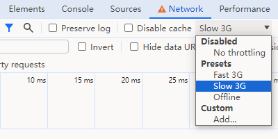
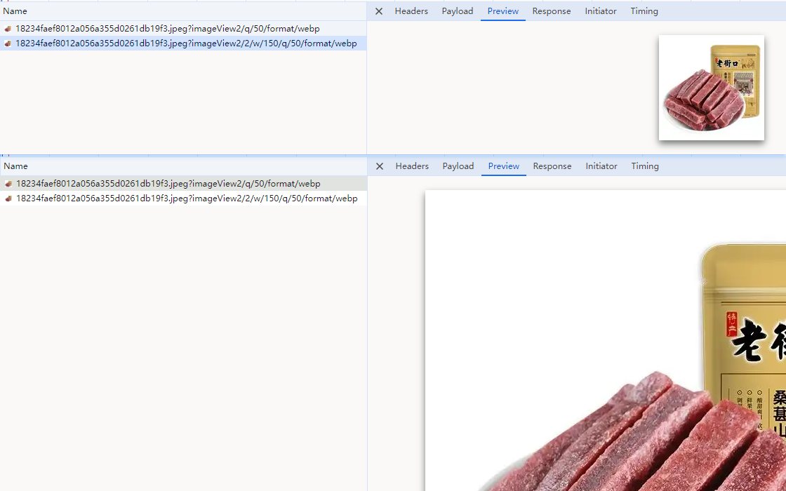
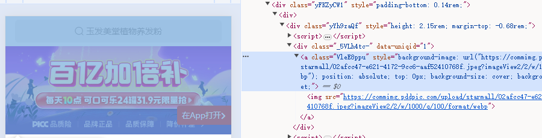

# 仿百亿补贴，H5 中图片先模糊后清晰的效果如何实现

逛过拼多多百亿补贴的同学，可能有一个体会，那就是图片加载非常快，很多图片瞬间就出现了，这是为什么呢？

答案是：**百亿补贴先加载了一张模糊小图、再加载了一张清晰大图**。用户很难感知到模糊到清晰的过程，误以为图片加载很快。

接下来我会先给出证据、再分析原理、提供关键代码，之后给百亿补贴的方法做扩展、补充，最后做一个简单总结。

当然，图片优化是涉及知识很琐碎、广泛，**先模糊小图后清晰大图只是其中一种手段，百亿补贴肯定还使用了其他技术。** 如果朋友你想了解更多相关手段，可以点赞关注我。

拳打 H5，脚踢小程序。我是「小霖家的混江龙」，关注我，带你了解更多实用的 H5、小程序武学。

## 证据

我们可以有三个证据，可以证明：百亿补贴是先加载模糊小图，再加载清晰大图。

第一个证据：我们可以在控制台把网络调整成 Slow 3G，然后强制刷新浏览器，可以看到拼多多的图片，存在一个模糊到清晰的过程。




第二个证据：我们在控制台查看网络请求，可以看到请求中有一张小商品图、一张大商品图。



第三个证据：我们在控制台找到图片元素，可以看到图片元素是一个 a 标签包裹着一个 img 标签。其中 a 标签的 background-image 是模糊小图链接，img 标签的 src 是清晰大图链接。



## 原理及代码

要想知道先模糊、后清晰的原理，我们得先看一张 img 标签是如何加载图片的，如下所示：开始时 img 占据的区域为空白，随着图片的逐步加载，空白部分被慢慢填充。


准确地说，**img 标签占据的区域，不是「空白」而是「透明」**。这意味着，我们只需要给 img 标签设置一张模糊小图链接，给 img 标签的 src 设置清晰大图链接，当大图慢慢加载时，清晰图片会一步步遮挡住模糊图片，从而实现模糊到清晰的效果。


关键代码如下，非常简单：

```html
<div class="box">
  <a class="small-img">
    
  </a>
</div>
```

```css
.box {
  position: relative;
}
.small-img {
  position: absolute;
  background-image: url("小图链接");
  background-size: cover;
  background-position: unset;
}
.large-img {
  width: ...;
  height: ...;
}
```

获取小图链接也很简单，现在各大云服务商基本都提供了方法。比如 [阿里云](https://help.aliyun.com/zh/oss/user-guide/resize-images-4?spm=a2c4g.11186623.0.0.1acf21edXNFC2F) 只需要在图片 CDN 链接后面拼接一些参数，就可以得到图片缩放的小图。

- 缩放前：https://oss-console-img-demo-cn-hangzhou.oss-cn-hangzhou.aliyuncs.com/example.jpg
- 缩放后：https://oss-console-img-demo-cn-hangzhou.oss-cn-hangzhou.aliyuncs.com/example.jpg?x-oss-process=image/resize,w_100,m_lfit

## 更进一步，加模糊滤镜

百亿补贴的做法，对于电商活动 H5 已经足够。但更讲究氛围感的 H5，也许会觉得百亿补贴的效果很粗糙。针对这种 H5，我们可以更进一步，给小图加上模糊滤镜，等到大图加载完成时再去除模糊滤镜，并增加 transition 的过渡效果，就得到如下效果：


关键代码为：

```css
.small-img {
  ...
  filter: blur(20px);
  transition: all .5s ease-in-out;
}
.loaded {
  filter: blur(0);
}
```

```js
const small = document.querySelector('.small-img')
const large = document.querySelector('.large-img')

large.onload = function () {
  small.classList.add('loaded')
}
```

## 总结

本文分析了百亿补贴图片加载非常快的主要原因：先加载模糊小图，再加载清晰大图。并给出了关键证据，以及实现原理和代码。最后在百亿补贴方法的基础上，增加模糊滤镜，实现了更有氛围感的效果。

拳打 H5，脚踢小程序。我是「小霖家的混江龙」，关注我，带你了解更多实用的 H5、小程序武学。
