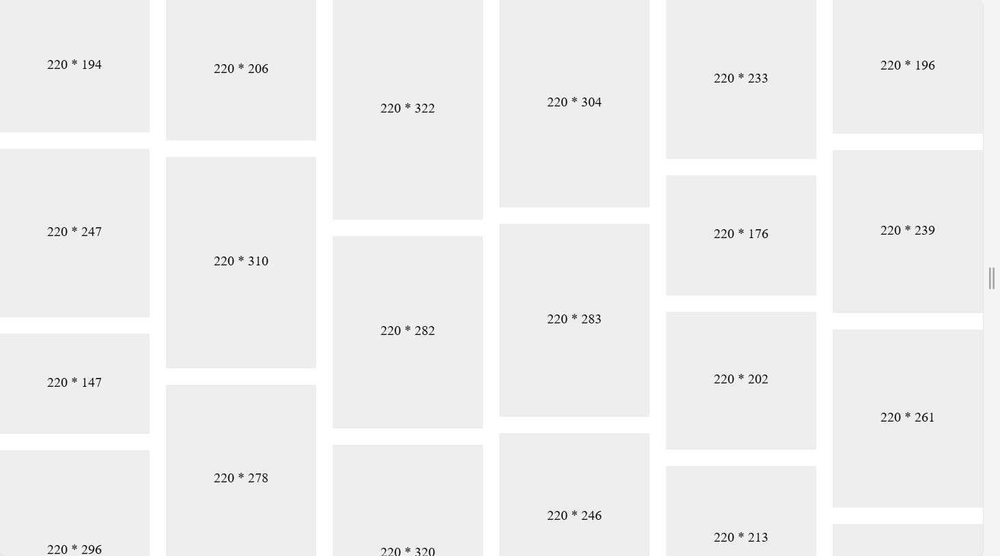

# 对比小红书与电商三巨头的瀑布流，H5 瀑布流实现方案应该如何选择？

瀑布流布局，我们既能在小红书这类图文网站看到，也能在拼多多、京东和淘宝这类电商网站看到。小红书的瀑布流，是利用绝对定位 + JavaScript 计算高度实现。而电商三巨头的瀑布流，则是利用 Flex 双列布局实现。

那么，同样是瀑布流，两种实现方式的优点、缺点是什么呢？如果想用 H5 实现瀑布流，应该用哪一种方案呢？


首先，我会先介绍瀑布流的实现原理，接着我会介绍小红书瀑布流实现方式，并给出示例代码；然后，我会给出电商三巨头瀑布流实现方式，并给出示例代码；最后，我会做一个两种方案的对比总结。

拳打 H5，脚踢小程序。我是「小霖家的混江龙」，关注我，带你了解更多实用的 H5、小程序武学。

## 瀑布流的实现原理

瀑布流是一种宽度相同，高度不同的卡片布局方式。

传统布局，当卡片高度不同对齐时，往往会出现大量空白。瀑布流让每一个卡片的间隙都变得很小，但总体又不至于留出太多的空白。

使用绝对定位 + JavaScript 计算高度的方法，可以认为是哪里短就补哪里。

小红书的网络请求如下图：


```js
// 随机生成宽在 300~400，高在 250~500 的图片
function getItems(len) {
  const items = []
  for (let i = 0; i < len; i++) {
    const width = Math.floor(Math.random() * (400 - 300 + 1) + 300)
    const height = Math.floor(Math.random() * (500 - 250 + 1) + 250)
    let url = `
      data:image/svg+xml;charset=utf-8,
      <svg
        xmlns="http://www.w3.org/2000/svg"
        width="${width}"
        height="${height}"
        viewBox="0 0 ${width} ${height}"
      >
        <text
          x="50%"
          y="50%"
          dominant-baseline="middle"
          text-anchor="middle"
          font-size="20"
          fill="black"
        >
          ${width} * ${height}
        </text>
      </svg>
    `
    url = url.replace(/[\r\n]+/g, '').replace(/\s+/g, ' ').trim()
    items.push({ width, height, url })
  }
  return items
}
```


## 小红书的瀑布流


```js
// 加入图片元素
function createImgs(items, imgWidth) {
  for (let i = 0; i < items.length; i++) {
    const { url, width: w, height: h } = items[i]
    const img = document.createElement('img')
    const ratio = imgWidth / w
    const imgHeight = Math.floor(h * ratio)

    img.width = imgWidth
    img.height = imgHeight
    img.src = url

    box.appendChild(img)
  }
}
```

```js
// 计算会有多少列，以及每列的间隙
function getColumnInfo(imgWidth) {
  const boxWidth = box.clientWidth
  const colNumber = Math.floor(boxWidth / imgWidth) // 列的数量

  const spaceNumber = colNumber - 1
  const leftSpace = boxWidth - colNumber * imgWidth
  const colSpace = parseFloat((leftSpace / spaceNumber).toFixed(2), 10)

  return {
    colSpace,
    colNumber
  }
}
```

```js
// 设置每张图片的位置
function setPosition(items, colNumber, colSpace, rowSpace) {
  // 数组长度为列数，每一项代表下一项的图片的 top 值
  const nextTops = new Array(colNumber).fill(0)

  for (let i = 0; i < items.length; i++) {
    const img = box.children[i]
    const top = Math.min.apply(null, nextTops)
    img.style.top = top + 'px'
    const index = nextTops.indexOf(top)
    nextTops[index] = nextTops[index] + img.height + rowSpace
    const left = index * colSpace + index * img.width
    img.style.left = left + 'px'
  }

  const max = Math.max.apply(null, nextTops)
  box.style.height = max + 'px'
}
```

我实现的瀑布流效果如下：



## 电商三巨头的瀑布流


```js
// 加入图片元素
function createImgs(items, imgWidth) {
  let leftHeight = 0,
    rightHeight = 0
  for (let i = 0; i < items.length; i++) {
    const { width: w, height: h, url } = items[i]
    const img = document.createElement('img')
    const ratio = imgWidth / w
    const imgHeight = Math.floor(h * ratio)
    img.width = imgWidth
    img.height = imgHeight
    img.src = url

    if (leftHeight <= rightHeight) {
      leftHeight = leftHeight + imgHeight
      leftBox.appendChild(img)
    } else {
      rightHeight = rightHeight + imgHeight
      rightBox.appendChild(img)
    }
  }
}
```
