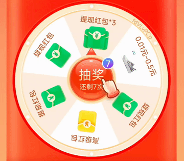
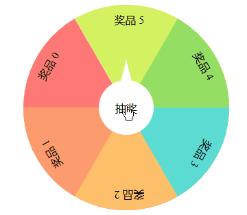
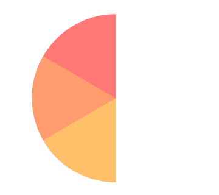
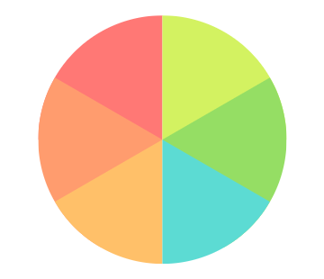
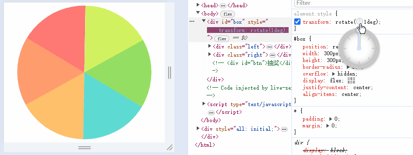

# 仿拼多多现金大转盘，H5 抽奖转盘如何实现？

电商应用中，我们常常看到抽奖转盘活动，比如拼多多的「抽奖大转盘」，点击抽奖按钮后转盘开始旋转，过一段时间后再停止、并停止在奖品上。这个效果如果用 H5，应该怎么实现呢？



在本文中，我会先说明转盘的布局方式，再给出介绍转盘旋转原理，接着解释如何控制转盘的中奖概率，最后给出完整的代码并做一个总结。代码示例效果如下：



拳打 H5，脚踢小程序。我是「小霖家的混江龙」，关注我，带你了解更多实用的 H5、小程序武学。

## 转盘的布局

```html
<style>
  .box {
    display: flex;
    justify-content: center;
    align-items: center;
    width: 300px;
    height: 300px;
  }
  .item {
    ...
    width: 150px;
    height: 150px;
    background-color: var(--clr);
    transform-origin: right bottom;
    transform: rotate(calc(60deg * var(--i)));
  }
</style>

<div id="box">
  <div class="item" style="--i:0;--clr:#ff7875;"></div>
  <div class="item" style="--i:-1;--clr:#ff9c6e;"></div>
  <div class="item" style="--i:-2;--clr:#ffc069;"></div>
</div>
```


```html
<style>
  #box {
    position: relative;
    width: 300px;
    height: 300px;
    border-radius: 50%;
    overflow: hidden;
    display: flex;
    justify-content: center;
    align-items: center;
  }
  .left {
    width: 150px;
    height: 300px;
    overflow: hidden;
    position: absolute;
    left: 0;
  }
  .left .item {
    position: absolute;
    width: 150px;
    height: 150px;
    background-color: var(--clr);
    transform-origin: right bottom;
    transform: rotate(calc(60deg * var(--i)));
  }
</style>

<div id="box">
  <div class="left">
    <div class="item" style="--i:0;--clr:#ff7875;"></div>
    <div class="item" style="--i:-1;--clr:#ff9c6e;"></div>
    <div class="item" style="--i:-2;--clr:#ffc069;"></div>
  </div>
</div>
```





## 转盘的旋转



## 中奖的概率

## 完整代码

[turntable | codepen](https://codepen.io/lijunlin2022/pen/YzMdvEL)

## 总结
