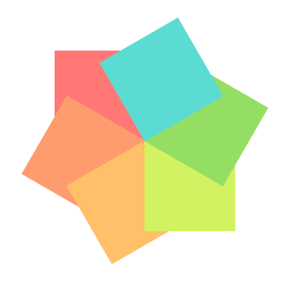

# 仿拼多多现金大转盘，H5 抽奖转盘如何实现？

电商应用中，我们常常看到抽奖转盘活动，比如拼多多的「抽奖大转盘」：我们点击中央的抽奖按钮，转盘开始旋转，一段时间后指针停止在奖品上。这个效果如果用 H5 应该怎么实现呢？


在本文中，我会先说明如何实现转盘布局，再介绍如何让转盘旋转、控制旋转速度，接着解释如何控制中奖概率，最后给出完整的代码，并做一个总结。最终代码效果如下：


拳打 H5，脚踢小程序。我是「小霖家的混江龙」，关注我，带你了解更多实用的 H5、小程序武学。

## CSS 旋转相关的语法

实现转盘布局之前，我们先来复习 CSS 旋转的语法。

- 利用 `transform` 的 `rotate()` 函数，我们可以控制旋转角度。比如 `transform: rotate(60deg);` 是顺时针旋转 60 度，`transform: rotate(-60deg);` 是逆时针旋转 60 度。
- 利用 `transform-origin`，我们可以控制旋转的中心。比如 `transform-origin: right bottom;` 是以右下角为旋转中心。 

下面的代码，实现了 item0 和 item1 两个矩形，以自己的右下角为中心旋转。

```html
<style>
  #box { ... }
  .item0 {
    ...
    transform-origin: right bottom;
    transform: rotate(-0deg);
  }
  .item1 {
    ...
    transform-origin: right bottom;
    transform: rotate(-60deg);
  }
</style>
<div id="box">
  <div class="item0"></div>
  <div class="item1"></div>
</div>
```


## 转盘的布局

### 错误的思路

复习完 CSS 旋转相关的语法，你可能会想，6 个矩形围着右下角旋转，再给 box 加上 `border-radius: 50%;` 和 `overflow: hidden;`，就能实现转盘布局了。

关键代码如下，其中 `--i` 和 `--clr` 是 CSS 的变量，方便我们计算角度、获取颜色。

```html
<style>
  ...
  .item {
    ...
    background-color: var(--clr);
    transform-origin: right bottom;
    transform: rotate(calc(60deg * var(--i)));
  }
</style>
<div id="box">
  <div class="item" style="--i:0;--clr:#ff7875;"></div>
  <div class="item" style="--i:-1;--clr:#ff9c6e;"></div>
  <div class="item" style="--i:-2;--clr:#ffc069;"></div>
  <div class="item" style="--i:-3;--clr:#d3f261;"></div>
  <div class="item" style="--i:-4;--clr:#95de64;"></div>
  <div class="item" style="--i:-5;--clr:#5cdbd3;"></div>
</div>
```

但这种思路是错误的，如图所示，6 个矩形依次逆时针旋转，会导致第 5 个矩形覆盖在第 0 个矩形上。



### 正确的思路

6 个矩形依次逆时针旋转的思路，虽然是错误的，但也能给我们一些启发。

我们可以把 6 个矩形拆成左、右两部分：

- 左边是 3 个矩形，以矩形右下角为中心依次逆时针旋转。我们给它添加上 `overflow: hidden;` 得到一个半圆。
- 右边是 3 个矩形，以矩形左下角为中心依次顺时针旋转。我们给它添加上 `overflow: hidden;` 得到另一个半圆。
- 拼接两个半圆，就得到一个完整的转盘。


关键代码如下：

```html
<style>
  .left .item {
    ...
    background-color: var(--clr);
    transform-origin: right bottom;
    transform: rotate(calc(60deg * var(--i)));
  }
  .right .item {
    ...
    background-color: var(--clr);
    transform-origin: left bottom;
    transform: rotate(calc(60deg * var(--i)));
  }
</style>
<div id="box">
  <div class="left">
    <div class="item" style="--i:0;--clr:#ff7875;"></div>
    <div class="item" style="--i:-1;--clr:#ff9c6e;"></div>
    <div class="item" style="--i:-2;--clr:#ffc069;"></div>
  </div>
  <div class="right">
    <div class="item" style="--i:0;--clr:#d3f261;"></div>
    <div class="item" style="--i:1;--clr:#95de64;"></div>
    <div class="item" style="--i:2;--clr:#5cdbd3;"></div>
  </div>
</div>
```

## 转盘的旋转

### 旋转的原理

我们已经知道最重要的转盘如何布局，剩下的的中央按钮、以及转盘上的文字，我们都可以用绝对定位实现。这里我就不再赘述，我们来看看如何控制转盘的旋转。

控制转盘旋转很简单，我们只旋转外层的容器 box 即可。如下图所示，在 Chrome 元素控制台中，我们逐渐增加 `transform: rotate(0deg)` 的取值，就实现了转盘的顺时针旋转。


需要注意的是，当容器 box 旋转时，会带动着中央按钮 btn 一起旋转。为了实现 box 旋转而 btn 保持不变的效果，box 顺时针旋转多少度，我们就需要让中央按钮逆时针旋转多少度。因此后续旋转的 js 代码中，我们会有如下代码：

```js
box.style.transform = `rotate(${begin}deg)`
btn.style.transform = `translate(-50%, -50%) rotate(${-begin}deg)`
```

### 基础代码

现在我们来看下基础的旋转代码：

```js
const box = document.getElementById('box'),
  btn = document.getElementById('btn')

btn.addEventListener('click', () => {
  const randomIndex = parseInt(Math.random() * 6)
  run(randomIndex * 60 + 30)
})

let timer = null
function run(angle) {
  let begin = 0
  let base = 1800
  timer = setInterval(function () {
    const finalAngle = base + angle
    if (begin >= finalAngle) {
      clearInterval(timer)
    }
    box.style.transform = `rotate(${begin}deg)`
    btn.style.transform = `translate(-50%, -50%) rotate(${-begin}deg)`
    begin += 30
  }, 10)
}
```

代码主要分为三部分，第一部分获取 box 和 btn 元素，第二部分给 btn 绑定点击事件，第三部分是控制旋转的函数。

我们先看第二部分，这部分我们会先获取一个 0 ~ 5 的下标 randomIndex，并利用 randomIndex 来计算旋转的角度。之所以要再加上 30 度，是因为我们希望旋转结束之后，指针刚好能够指向中奖区域的中央。

再看第三部分，这里我们设置了 1800 度的基础角度，因为 1800 = 360 * 5，也就是至少要旋转 5 圈后才会停止。我们设置了一个计时器，每过 10 秒就旋转 30 度，直到超过目标度数后，才停止旋转。

代码的效果如下：


### 改善体验

基础旋转代码虽然实现了效果，但体验还有待改善。主要有两点需要优化。

#### 旋转时，按钮不能被再次点击

第一点时，当开始旋转时，此时按钮应该不能被再次点击。只有旋转结束后，按钮才能被再次点击，因此我们需要增加一个点击锁 clickLock。关键代码如下：

```js
...
let clickLock = false

btn.addEventListener('click', () => {
  if (clickLock) {
    return
  }
  ...
})

let timer = null
function run(angle) {
  ...
  clickLock = true
  timer = setInterval(function () {
    ...
    if (begin >= finalAngle) {
      clickLock = false
      clearInterval(timer)
    }
    ...
  }, 10)
}
```

可以看到，一开始时 clickLock 为 false，转盘旋转时，clickLock 会被设置为 true；停止旋转时，clickLock 会被设置为 false；而在旋转期间，如果继续点击按钮，则会被拦截，不会继续触发旋转函数 run。

#### 旋转时，速度需要先快后慢

## 中奖的概率

## 完整代码

[turntable | codepen](https://codepen.io/lijunlin2022/pen/YzMdvEL)

## 总结
