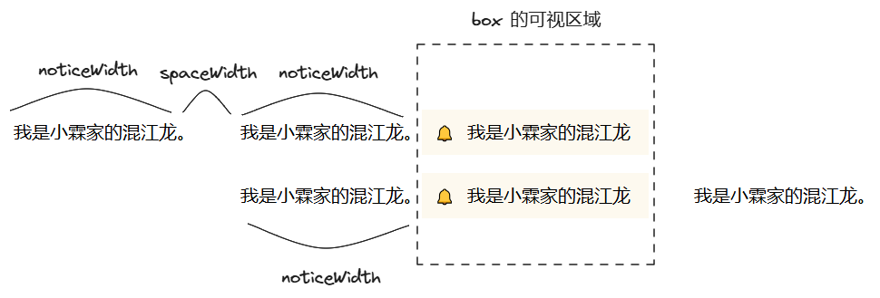

# 仿今日头条，H5 循环播放的通知栏如何实现？

各大 App 活动页面，当需要用户特意注意某些信息时，往往会设计一个循环播放的通知栏。

比如春节期间，今日头条 App 就有如下效果：


这个循环播放的通知栏该如何实现呢？本文我会先介绍相关的布局、循环播放的逻辑，最后给出完整的代码。

效果如下：


拳打 H5，脚踢小程序。我是「小霖家的混江龙」，关注我，带你了解更多实用的 H5、小程序武学。

## 布局代码

```html
<div class="box">
  <div class="content">
    <!-- ... 省略 -->
  </div>
  <div class="left">🔔</div>
  <div class="right"></div>
</div>
```

因为文字移动时，我们需要让左半部分的 Icon 和右半部分留白挡住文字，所以 Icon 和留白我们都采取绝对定位的方式。


```css
.box {
  position: relative;
  overflow: hidden;
  /* ... 省略 */
}
.left {
  position: absolute;
  left: 0;
  /* ... 省略 */
}
.right {
  position: absolute;
  right: 0;
  /* ... 省略 */
}
```

```html
<!-- ... 省略 -->
<div id="content">
  <div class="notice">我是小霖家的混江龙。</div>
  <div class="space"></div>
  <div class="notice">我是小霖家的混江龙。</div>
  <div class="space"></div>
  <div class="notice">我是小霖家的混江龙。</div>
</div>
<!-- ... 省略 -->
```



当通知向左移动 `2 * noticeWidth + spaceWidth` 的距离后，我们让通知栏变为向左移动了 `noticeWidth`，这样从视觉上，看不出来有什么破绽。

## 逻辑代码

```js
const content = document.getElementById("content");
const notice = document.getElementsByClassName("notice");
const space = document.getElementsByClassName("space");
const noticeWidth = notice[0].offsetWidth;
const spaceWidth = space[0].offsetWidth;

let translateX = 0;
function move() {
  translateX += 1.5;
  if (translateX >= noticeWidth * 2 + spaceWidth) {
    translateX = noticeWidth;
  }
  content.style.transform = `translateX(${-translateX}px)`;
  requestAnimationFrame(move);
}

move();
```

## 完整代码

完整代码如下，你可以在 codepen 或者码上掘金上查看。

- codepen: [https://codepen.io/lijunlin2022/pen/rNgMrwg](https://codepen.io/lijunlin2022/pen/rNgMrwg)
- 码上掘金：[https://code.juejin.cn/pen/7373131233506623538](https://code.juejin.cn/pen/7373131233506623538)

## 总结

拳打 H5，脚踢小程序。我是「小霖家的混江龙」，关注我，带你了解更多实用的 H5、小程序武学。