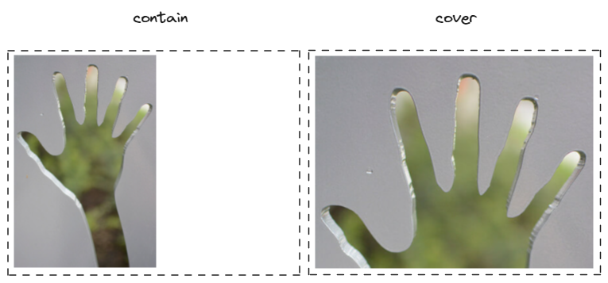

# 仿拼多多分享商品，canvas 绘制图片时如何实现 contain 和 cover 效果？

我们偶尔会在一些 H5、小程序中，看到分享商品的功能。比如拼多多小程序中，用户可以把商品分享给自己的好友。分享图有三个主要组成部分，一张背景图、一张商品图和一串价格。其中背景图通常保持不变，商品图、价格则随着商品的改变而改变。


这类分享图一般由前端使用 canvas 动态绘制，canvas 也提供了 [drawImage()](https://developer.mozilla.org/zh-CN/docs/Web/API/CanvasRenderingContext2D/drawImage) API 绘制图片。不过，相比 css 实现样式，canvas 实现样式并不方便。

在 css 中，我们可以给 `background-size` 设置 `contain`，实现「缩放背景图片以**完全装入**容器」效果；可以给 `background-size` 设置 `cover`，实现「缩放背景图片以**完全覆盖**容器」效果。



但在 canvas 中，并没有原生 API 帮助我们绘制缩放图片，于是我实现了 drawContainImage 和 drawCoverImage 两个工具函数。

本文我会先分析 contain 效果的`图片宽高比`和`容器宽高比`关系，并给出 drawContainImage 工具函数；再分析 cover 效果的`图片宽高比`和`容器宽高比`关系，并给出 drawCoverImage 工具函数；最后我会用两个工具函数，绘制如下分享图（背景图效果是 cover，商品图效果是 contain）：


拳打 H5，脚踢小程序。我是「小霖家的混江龙」，关注我，带你了解更多实用的 H5、小程序武学。

## contain 效果

先来看 contain 效果。contain 效果是「缩放背景图片以**完全装入**容器」，它会有两种情况：

- 图片宽高比 < 容器宽高比，缩放后图片宽度 < 容器宽度，图片高度 = 容器高度。
- 图片宽高比 > 容器宽高比，缩放后图片宽度 = 容器宽度，图片高度 < 容器高度。


不难看出，contain 效果下，图片总是完整展示的，因此我们不必考虑裁剪图片。[drawImage](https://developer.mozilla.org/zh-CN/docs/Web/API/CanvasRenderingContext2D/drawImage) 的 9 个参数中，我们只需要考虑 5 个参数：

> - `image`，画布图像源。
> - `dx`，image 的左上角在目标画布上 X 轴坐标。
> - `dy`，image 的左上角在目标画布上 Y 轴坐标。
> - `dw`，image 在目标画布上绘制的宽度。
> - `dh`，image 在目标画布上绘制的高度。

### 图片宽高比 < 容器宽高比

图片宽高比 < 容器宽高比时，dy，dw 和 dh 可以直观看出来，而 dx 还需要单独计算。如下图所示：


- dx 是 image 的左上角在目标画布上 X 轴坐标，需要按 `dx = (width - dw) / 2` 公式计算；
- dy 是 image 的左上角在目标画布上 Y 轴坐标，`dy = 0`；
- dw 是 image 在目标画布上绘制的宽度，知道图片宽高比、容器宽度，可以按 `dw = imgRatio * width` 公式计算；
- dh 是 image 在目标画布上绘制的高度，直接等于容器高度，`dh = height`。

### 图片宽高比 > 容器宽高比

图片宽高比 > 容器宽高比时，dx，dw 和 dh 可以直观看出来，而 dy 还需要单独计算。如下图所示：


- dx 是 image 的左上角在目标画布上 X 轴坐标，`dx = 0`；
- dy 是 image 的左上角在目标画布上 Y 轴坐标，需要按 `dy = (height - dh) / 2` 公式计算；
- dw 是 image 在目标画布上绘制的宽度，直接等于容器宽度，`dw = width`；
- dh 是 image 在目标画布上绘制的高度，知道图片宽高比，容器高度，可以按 `dh = dw / imgRatio` 公式计算。

### drawContainImage 代码

下面是 drawContainImage 的代码，因为 contain 效果一般会留有空白，所以我增加了一个 fillStyle 参数，用来设置空白部分的颜色。

```js
function drawContainImage({
  ctx, img, x, y, width, height, fillStyle
}) {
  if (fillStyle) {
    ctx.fillStyle = fillStyle
    ctx.fillRect(x, y, width, height)
  }
  const boxRatio = width / height
  const imgRatio = img.width / img.height

  let dx = 0, dy = 0, dw = 0, dh = 0
  if (imgRatio <= boxRatio) {
    dw = imgRatio * width
    dh = height
    dx = (width - dw) / 2
    dy = 0
  } else {
    dw = width
    dh = dw / imgRatio
    dx = 0
    dy = (height - dh) / 2
  }
  ctx.drawImage(img, x + dx, y + dy, dw, dh)
}
```

## cover 效果

再看 cover 效果，cover 效果是「缩放背景图片以**完全覆盖**容器」。如下示意图所示，缩放后图片（红色部分）比容器（绿色部分）大。它会有两种情况：

- 图片宽高比 > 容器宽高比，缩放后图片宽度 = 容器宽度，图片高度 > 容器高度。
- 图片宽高比 < 容器宽高比，缩放后图片宽度 < 容器宽度，图片高度 = 容器高度。


不难看出，contain 效果下，图片总是需要裁剪图片，所以 [drawImage](https://developer.mozilla.org/zh-CN/docs/Web/API/CanvasRenderingContext2D/drawImage) 的 9 个参数我们都需要使用：

> - `image`，画布图像源。
> - `sx`，image 的矩形（裁剪）选择框的左上角 X 轴坐标。
> - `sy`，image 的矩形（裁剪）选择框的左上角 Y 轴坐标。
> - `sw`，image 的矩形（裁剪）选择框的宽度。
> - `sh`，image的矩形（裁剪）选择框的高度。
> - `dx`，image 的左上角在目标画布上 X 轴坐标。
> - `dy`，image 的左上角在目标画布上 Y 轴坐标。
> - `dw`，image 在目标画布上绘制的宽度。
> - `dh`，image 在目标画布上绘制的高度。

幸运的是，contain 效果下，dx, dy, dw 和 dh 的取值都是固定的，所以我们需要着重考虑的只有 sx, sy, sw 和 sh 这 4 个参数。

### 图片宽高比 > 容器宽高比

图片宽高比 > 容器宽高比时，sy，sw 和 sh 可以直观看出来，而 sx 还需要单独计算。如下图所示：


- sx 是 image 的矩形（裁剪）选择框的左上角 X 轴坐标，可以按 `sx = (img.width - sw) / 2` 公式计算；
- sy 是 image 的矩形（裁剪）选择框的左上角 Y 轴坐标，`sy = 0`；
- sw 是 image 的矩形（裁剪）选择框的宽度，可以按 `sw = sh * boxRatio` 公式计算；
- sh 是 image的矩形（裁剪）选择框的高度，直接等于图片高度，`sh = img.height`。

### 图片宽高比 < 容器宽高比

图片宽高比 < 容器宽高比时，sx, sw 和 sh 可以直观看出来，而 sy 还需要单独计算。如下图所示：


- sx 是 image 的矩形（裁剪）选择框的左上角 X 轴坐标，`sx = 0`；
- sy 是 image 的矩形（裁剪）选择框的左上角 Y 轴坐标，可以按 `sy = (img.height - sh) / 2` 公式计算；
- sw 是 image 的矩形（裁剪）选择框的宽度，直接等于图片宽度，`sw = img.width`；
- sh 是 image的矩形（裁剪）选择框的高度，可以按 `sh = sw / boxRatio` 公式计算。

### drawCoverImage 代码

下面是 drawCoverImage 的代码，因为 cover 效果不会留空白，所以不需要 fillStyle 参数。

```js
function drawCoverImage({
  ctx, img, x, y, width, height
}) {
  const boxRatio = width / height
  const imgRatio = img.width / img.height

  let sx = 0, sy = 0, sw = 0, sh = 0
  if (imgRatio <= boxRatio) {
    sw = img.width
    sh = sw / boxRatio
    sx = 0
    sy = (img.height - sh) / 2
  } else {
    sh = img.height
    sw = sh * boxRatio
    sx = (img.width - sw) / 2
    sy = 0
  }

  ctx.drawImage(img, sx, sy, sw, sh, x, y, width, height)
}
```

## 完整代码

完整代码如下，你可以在 codepen 或者码上掘金上查看：

- 码上掘金: https://code.juejin.cn/pen/7388885726391992371

## 总结

## 参考文章

- [canvas drawImage 绘图实现 contain 和 cover 的效果](https://www.cnblogs.com/AIonTheRoad/p/14063041.html)
- [在容器内显示图片的五种方案：contain、cover、fill、none、scale-down](https://developer.aliyun.com/article/916087)
