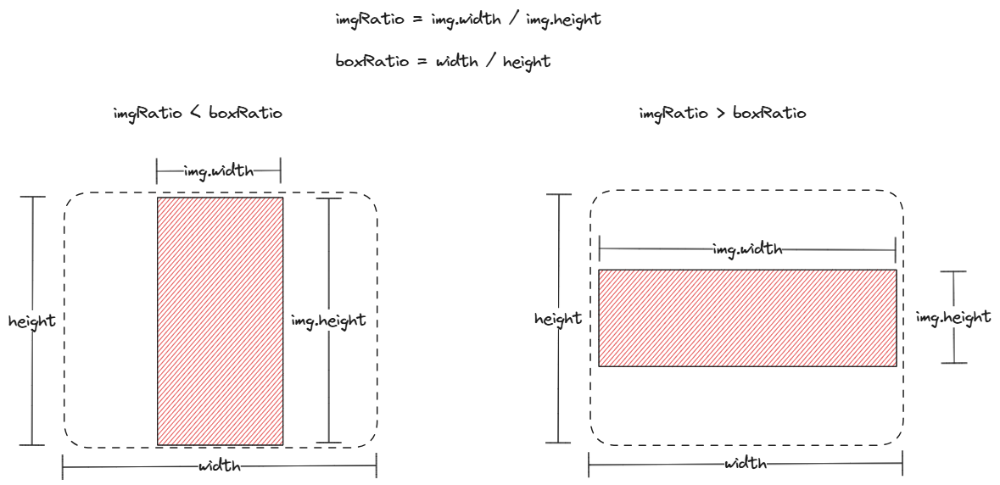

# 仿拼多多分享商品，canvas 绘制图片时如何实现 contain 和 cover 效果？

我们在拼多多、京东小程序里，分享特定商品时，往往能看到如下效果：分享图是一张商品图盖在一张背景图上，且商品图附近还附带相关价格。


因为不同商品的分享图不一致，所以分享图实际是由 canvas 绘制的。

熟悉 CSS 的朋友都知道，CSS 背景设置背景图片 background-size 时，最常用的两种取值分别是 contain 和 cover。

但 Canvas 2D API 中的 [CanvasRenderingContext2D.drawImage()](https://developer.mozilla.org/zh-CN/docs/Web/API/CanvasRenderingContext2D/drawImage) 方法，并没有提供 contain 和 cover 的绘制模式，所以我们需要自己实现 drawContainImage 和 drawCoverImage。

我实现了 drawContainImage 和 drawCoverImage，并用它们绘制了一个分享图，效果如下，其中背景图使用 drawCoverImage 绘制，而商品图则使用 drawCotainImage 绘制：


拳打 H5，脚踢小程序。我是「小霖家的混江龙」，关注我，带你了解更多实用的 H5、小程序武学。

## contain 效果



### 图片宽高比 < 容器宽高比


### 图片宽高比 > 容器宽高比


### drawContainImage 代码

```js
function drawContainImage({
  ctx, img, x, y, width, height, fillStyle
}) {
  if (fillStyle) {
    ctx.fillStyle = fillStyle
    ctx.fillRect(x, y, width, height)
  }
  const canvasRatio = width / height
  const imgRatio = img.width / img.height

  let dx = 0, dy = 0, dw = 0, dh = 0
  if (imgRatio <= canvasRatio) {
    dw = imgRatio * width
    dh = height
    dx = (width - dw) / 2
    dy = 0
  } else {
    dw = width
    dh = dw / imgRatio
    dx = 0
    dy = (height - dh) / 2
  }
  ctx.drawImage(img, x + dx, y + dy, dw, dh)
}
```

## cover 效果


### 图片宽高比 > 容器宽高比


### 图片宽高比 < 容器宽高比


### drawCoverImage 代码

```js
function drawCoverImage({
  ctx, img, x, y, width, height, fillStyle
}) {
  if (fillStyle) {
    ctx.fillStyle = fillStyle
    ctx.fillRect(x, y, width, height)
  }
  const canvasRatio = width / height
  const imgRatio = img.width / img.height

  let sx = 0, sy = 0, sw = 0, sh = 0
  if (imgRatio <= canvasRatio) {
    sw = img.width
    sh = sw / canvasRatio
    sx = 0
    sy = (img.height - sh) / 2
  } else {
    sh = img.height
    sw = sh * canvasRatio
    sx = (img.width - sw) / 2
    sy = 0
  }

  ctx.drawImage(img, sx, sy, sw, sh, x, y, width, height)
}
```

## 完整代码

完整代码如下，你可以在 codepen 或者码上掘金上查看：

- 码上掘金: https://code.juejin.cn/pen/7388885726391992371

## 总结

## 参考文章

- [canvas drawImage 绘图实现 contain 和 cover 的效果](https://www.cnblogs.com/AIonTheRoad/p/14063041.html)
- [在容器内显示图片的五种方案：contain、cover、fill、none、scale-down](https://developer.aliyun.com/article/916087)
