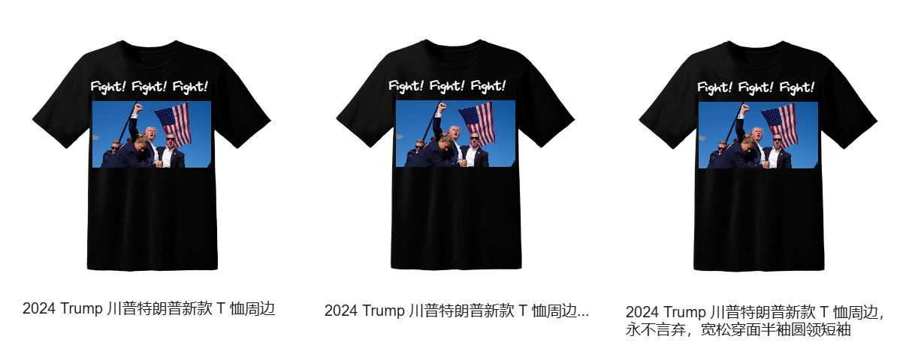
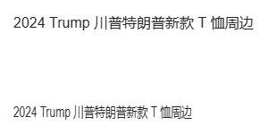

# 从商品海报说起，canvas 文本如何实现溢出截断、溢出显示省略号和自动换行？

几乎所有电商 App 都有分享商品功能，功能包括分享 H5、小程序、朋友圈，还有一些 App 能生成海报。例如盒马、得物和唯品会：


现在我们有一件新款爆款 T 恤，需要生成带商品名的海报，你会怎么做呢？

前端同学一般会用 canvas 绘制海报图片、文字，但 canvas 处理文本的能力非常弱，没有原生 API 直接实现溢出截断、溢出显示省略号和自动换行。



本文我会先介绍 canvas 原生处理文本的 API，然后给出函数 `fillTruncateText`，`fillEllipsisText` 和 `fillWrapText`，分别实现 canvas 文本溢出截断、溢出显示省略号和自动换行。

拳打 H5，脚踢小程序。我是「小霖家的混江龙」，关注我，带你了解更多实用的 H5、小程序武学。

## fillText

canvas 填充文字的 API 为 [fillText](https://developer.mozilla.org/zh-CN/docs/Web/API/CanvasRenderingContext2D/fillText)，它有 4 个参数：

> - text，需要渲染的文本字符串。
> - x，填充文本的 x 坐标，单位为像素。
> - y，填充文本基线的 y 坐标，单位为像素。
> - maxWidth，填充文本的最大宽度，如果未指定，则文本宽度没有限制。

其中，maxWidth 基本没啥用处，设置它既不能实现溢出截断，也不能实现溢出显示省略号。它会压缩文字，在指定 maxWidth 显示文本。

举例如下，第一行文本未指定 maxWidth，第二行文本指定了 maxWidth：

```js
const canvas = document.getElementById("canvas")
const ctx = canvas.getContext('2d')

ctx.font = '16px Arial'
ctx.fillStyle = '#222426'
const text = '2024 Trump 川普特朗普新款 T 恤周边'
ctx.fillText(text, 0, 20)
ctx.fillText(text, 0, 120, 200)
```



可以看到 maxWidth 难堪大用。

既然原生的 fillText 作用有限，我们便需要自己编写一些函数，实现文本溢出截断、溢出显示省略号和自动换行。

## fillTruncateText

我们先看溢出截断。

要实现溢出截断功能，我们需要用到 canvas 的一个 API [measureText](https://developer.mozilla.org/zh-CN/docs/Web/API/CanvasRenderingContext2D/measureText)，它可以测量文本并返回一个对象（对象中包含了文本宽度）。

我们可以用 `measureText` 测量要填充的文本，如果文本宽度小于等于 maxWidth，便正常用 fillText 填充文本；如果文本宽度大于 maxWidth，我们便从文本后方一点一点往前缩短文本，直到文本宽度小于等于 maxWidth。

按此思路实现的 `fillTruncateText` 函数如下：

```js
function fillTruncateText ({
  ctx,
  text,
  x,
  y,
  maxWidth,
  font,
  fillStyle
}) {
  ctx.font = font
  ctx.fillStyle = fillStyle
  const textWidth = ctx.measureText(text).width
  if (textWidth <= maxWidth) {
    ctx.fillText(text, x, y)
    return
  }
  let len = text.length
  let sliceText = text
  let width = textWidth
  while (width > maxWidth && len > 0) {
    len -= 1
    sliceText = text.slice(0, len)
    width = ctx.measureText(sliceText).width
  }
  ctx.fillText(sliceText, x, y)
}
```

## fillEllipsisText

再看溢出显示省略号。

溢出显示省略号的思路和截断基本一致，如果文本宽度小于等于 maxWidth，便正常用 fillText 填充文本；如果文本宽度大于 maxWidth，我们便从文本后方一点一点往前缩短文本，直到`文本宽度 + 省略号宽度 <= maxWidth`。

按此思路实现的 `fillEllipsisText` 如下：

```js
function fillEllipsisText ({
  ctx,
  text,
  x, 
  y,
  maxWidth,
  font,
  fillStyle
}) {
  ctx.font = font
  ctx.fillStyle = fillStyle
  const ellipsis = '...'
  const ellipsisWidth = ctx.measureText(ellipsis).width
  const textWidth = ctx.measureText(text).width
  if (ellipsisWidth + textWidth <= maxWidth) {
    ctx.fillText(text, x, y)
    return
  }
  let len = text.length
  let sliceText = text
  let width = textWidth
  while (width + ellipsisWidth > maxWidth && len > 0) {
    len -= 1
    sliceText = text.slice(0, len)
    width = ctx.measureText(sliceText).width
  }
  ctx.fillText(`${sliceText}${ellipsis}`, x, y)
}
```

## fillWrapText

最后看文本自动换行。

和溢出截断、溢出显示省略号从后往前缩短文本的思路不同，文本自动换行的思路是从前往后慢慢增加文本，如果文本宽度超过 maxWidth，则开始填充下一行文本。

具体来说：

- 初始时，文本自动换行会先把文本拆分为一个数组 arrText，然后从下标 0 开始，逐个取出数组中的文字，慢慢拼接新的字符串。如果到下标 i 时字符串的宽度已经大于 maxWidth，则先绘制 i 以前的字符。
- 然后另起一行，这一行的初始字符为 `arrText[i]`，基线 y 的坐标则为 `y + lineHeight`。此后又开始逐个从数组中取出文本。直到发现这一行宽度又大于了 maxWidth。
- 另起一行，如此循环，直到数组 arrText 中的字符已经全部用光。

按此思路实现的 `fillWrapText` 代码如下：

```js
function fillWrapText ({
  ctx,
  text,
  x,
  y,
  maxWidth,
  lineHeight,
  font,
  fillStyle
}) {
  ctx.font = font
  ctx.fillStyle = fillStyle
  const arrText = text.split('')
  let line = ''

  for (let i = 0; i < arrText.length; i++) {
    let testLine = line + arrText[i]
    let testWidth = ctx.measureText(testLine).width
    if (testWidth > maxWidth) {
      ctx.fillText(line, x, y)
      line = arrText[i]
      y += lineHeight
    } else {
      line = testLine
    }
  }
  ctx.fillText(line, x, y)
}
```

## 示例代码

光靠文章比较枯燥，我给三个工具写了示例，你可以在 codepen 或者码上掘金上查看：

- codepen: https://codepen.io/lijunlin2022/pen/xxoxVaK
- 码上掘金: https://code.juejin.cn/pen/7391408282185531419

## 总结

本文我会先介绍 canvas 原生处理文本的 API，然后给出函数 `fillTruncateText`，`fillEllipsisText` 和 `fillWrapText`，分别实现 canvas 文本溢出截断、溢出显示省略号和自动换行。

拳打 H5，脚踢小程序。我是「小霖家的混江龙」，关注我，带你了解更多实用的 H5、小程序武学。

## 参考文章

- [canvas文本绘制自动换行、字间距、竖排等实现 | 张鑫旭](https://www.zhangxinxu.com/wordpress/2018/02/canvas-text-break-line-letter-spacing-vertical/)
