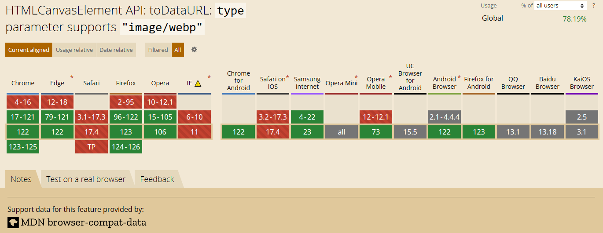
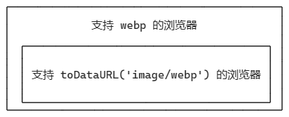
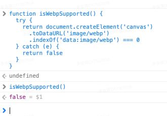
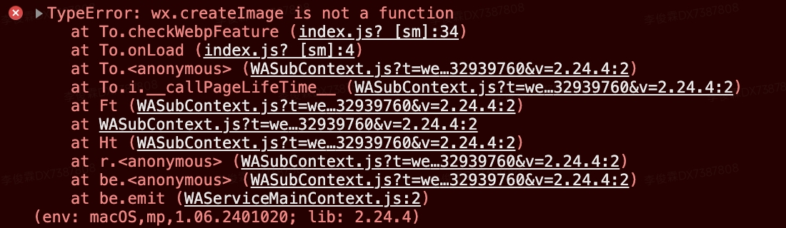

# H5、小程序能用 webp 图片吗？如何判断环境是否支持？

最近我在做 H5、小程序的性能优化，其中一项优化是把 H5、小程序的 jpg、png 图片转换为 webp 图片，这是因为相比 jpg、png，webp 体积更小、传输速度更快。

转换方法很简单，现在各大云服务商基本都提供了方法。比如 [腾讯云](https://cloud.tencent.com/document/product/436/60453) 只需要在图片 CDN 链接后面拼接一些参数：

- 转换前：https://example-1258125638.cos.ap-shanghai.myqcloud.com/sample.png
- 转换后：http://example-1258125638.cos.ap-shanghai.myqcloud.com/sample.png?imageMogr2/format/webp

不过我还是遇到了些小麻烦，从 [can I use](https://caniuse.com/?search=webp) 查询发现，目前还有少部分浏览器不支持 webp。所以在 H5、小程序使用 webp 格式图片时，我需要做一些兼容。


一番研究后，我知道了判断环境是否支持 webp 的几种办法。对这些办法的优劣，我也有自己的观点，于是我便整理了这篇文章。

我是羊肚JUN，一位前端程序员，关注我，了解更多有温度的轻知识，有深度的硬内容。

## toDataURL('image/webp')

### 代码

第一种 H5 的判断方法，其实是判断 H5 能不能利用 canvas 的 `toDataURL()` API 得到一张 webp 图片。

```js
function isWebpSupported() {
  try {
    return document.createElement('canvas')
      .toDataURL('image/webp')
      .indexOf('data:image/webp') === 0
  } catch (e) {
    return false
  }
}
```

### 原理

这种方法原理是啥呢？我们可以继续在 [Can I use](https://caniuse.com/?search=webp) 查询 `toDataURL('image/webp')` 的兼容性。



可以看到，**兼容 `toDataURL('image/webp')` 的浏览器、是兼容 webp 浏览器的子集。**



换句话说，这是一种「宁杀错一百，也不放过一个」的方法。举 Safari 浏览器为例子，它其实是可以展示 webp 图片的，但它会被这种 `toDataURL('image/webp')` 方法误伤。



### 优缺点

这种方法的优缺点如下:

- 优点：代码短小，且方法是同步的，不影响首屏性能。
- 缺点：误伤性太高，iOS 的 Safari 浏览器被全部误伤。

### 微信小程序能用吗

这种判断方法微信小程序可以使用吗？很遗憾不可以。

我们之所以用 `toDataURL('image/webp')` 判断 H5 能不能使用 webp，前提是我们知道 **兼容 `toDataURL('image/webp')` 的浏览器、是兼容 webp 浏览器的子集**。

但我在微信官方文档中，没有看到类似 canvas 的 [toDataURL('image/webp')](https://developers.weixin.qq.com/miniprogram/dev/api/canvas/Canvas.toDataURL.html) 是 webp 子集的描述。基于此，我判断微信小程序不能用这个方法。

## 加载一张 webp 图片试试，看会不会出错

### 代码

第二种 H5 的判断方法，是直接异步加载一张 webp 格式的图片。如果加载成功，证明环境能支持 webp；如果加载失败，证明环境不支持 webp。

```js
function isWebpSupported() {
  if (!Image) {
    return Promise.resolve(false)
  }

  return new Promise((resolve) => {
    const img = new Image()
    img.onload = function () {
      resolve((img.width > 0) && (img.height > 0))
    }
    img.onerror = function () {
      resolve(false)
    }
    img.src = 'data:image/webp;base64,UklGRlIAAABXRUJQVlA4WAoAAAASAAAAAAAAAAAAQU5JTQYAAAD/////AABBTk1GJgAAAAAAAAAAAAAAAAAAAGQAAABWUDhMDQAAAC8AAAAQBxAREYiI/gcA';
  })
}
```

### 原理

这种方法来源于 [Google 官方文档](https://developers.google.com/speed/webp/faq?hl=zh-cn#in_your_own_javascript)，webp 其实支持四个功能，无损压缩、有损压缩、透明度和动画，每个功能对应了一张 webp 图片：

```js
function checkWebpFeature(feature, callback) {
  const kTestImages = {
    lossy: "UklGRiIAAABXRUJQVlA4IBYAAAAwAQCdASoBAAEADsD+JaQAA3AAAAAA",
    lossless: "UklGRhoAAABXRUJQVlA4TA0AAAAvAAAAEAcQERGIiP4HAA==",
    alpha: "UklGRkoAAABXRUJQVlA4WAoAAAAQAAAAAAAAAAAAQUxQSAwAAAARBxAR/Q9ERP8DAABWUDggGAAAABQBAJ0BKgEAAQAAAP4AAA3AAP7mtQAAAA==",
    animation: "UklGRlIAAABXRUJQVlA4WAoAAAASAAAAAAAAAAAAQU5JTQYAAAD/////AABBTk1GJgAAAAAAAAAAAAAAAAAAAGQAAABWUDhMDQAAAC8AAAAQBxAREYiI/gcA"
  }
  const img = new Image()
  img.onload = function () {
    const result = (img.width > 0) && (img.height > 0)
    callback(feature, result)
  }
  img.onerror = function () {
    callback(feature, false)
  }
  img.src = "data:image/webp;base64," + kTestImages[feature]
}
```

如果对四种功能都进行判断的话，代码会变得很臃肿。所以实际开发中，基本只选择一张 webp 的图片。

从 [Can I use](https://caniuse.com/?search=webp) 查询结果来看，浏览器要么是先支持 webp 的有损压缩，再支持 webp 的无损压缩、透明度和动画；要么是有损压缩、无损压缩、透明度和动画一起支持。因此，我们往往选择一张支持动画的 webp 图片，用它去试探浏览器是否支持 webp 格式。

### 优缺点

- 优点：基本不会误伤；
- 缺点：异步加载，可能无法及时转换图片链接、影响首屏性能。如果 H5 不选择 CSR，而选择 SSR，则无法使用此方法。

### 微信小程序能用吗

这种方法小程序可以用吗？理论上可以，但不推荐使用。

微信官方文档上虽然提到了 [createImage](https://developers.weixin.qq.com/minigame/dev/api/render/image/wx.createImage.html) 方法，但我实际测试发现，这个方法竟然没了 (* ￣︿￣)。



我们使用此方法，就必须在 wxml 中手动写一个 `image` 标签，再给它绑定 `onload` 和 `onerror` 事件。这意味着：

- 如果我们把这个标签放到自己封装的 WebpImage 组件中，WebpImage 被多次使用后，小程序页面会多出很多额外的节点。
- 如果我们把这个标签放到页面上（比如 index 页面），就需要给每一个用户可能直接访问的页面都加上这个标签。也会出现很多额外的节点。

因此不推荐使用。

## 直接判断版本

### 代码

第三种方法，就是直接判断版本号，Android 版本大于 4.2.0，iOS 大于 14.0.0 时，认为 webp 可用。

H5 通过 ua 获取系统版本号的文章很多，我们这里给出小程序的代码。

```js
function isWebpSuported() {
  try {
    const { system, SDKVersion } = wx.getSystemInfoSync()
    const [sysName, sysVersion] = (system || '').split(' ')
    if (compareVersion(SDKVersion, '2.9.0') < 0) {
      return false
    }

    if (
      sysName.toUpperCase() === 'ANDROID' &&
      compareVersion(sysVersion, '4.2.0') >= 0
    ) {
      return true
    }

    if (
      sysName.toUpperCase() === 'IOS' &&
      compareVersion(sysVersion, '14.0.0') >= 0
    ) {
      return true
    }

    return false
  } catch (e) {
    return false
  }
}
```

### 原理

我们已经通过 [Can I use](https://caniuse.com/?search=webp) 知道：

- Android 4.2.0 以下，iOS 14 以下的浏览器不支持 webp。

又从 [微信小程序 image 组件文档](https://developers.weixin.qq.com/miniprogram/dev/component/image.html#WebView-%E7%89%B9%E6%9C%89%E5%B1%9E%E6%80%A7) 里知道：

- 基础库版本 >= 2.9.0 支持 webp。

那么干脆把所有条件都做一个组合，就得到了上述代码，其中 `compareVersion()` 是 [微信官方文档](https://developers.weixin.qq.com/ebook?action=get_post_info&volumn=1&lang=zh_CN&book=miniprogram&docid=000288319f40c0eb00860cd135100a) 中比较版本号的代码。

### 优缺点

- 优点：同步判断、不影响首屏性能；误伤范围小；且 CSR 和 SSR 可用。
- 缺点：无明显缺点。

## 总结

本文介绍了 H5、小程序使用 webp 格式图片时，判断环境是否支持的方法。

- 方法一：利用 `toDataURL('image/webp')` 判断。H5 支持，但是会误伤大部分浏览器；小程序不支持。
- 方法二：利用一张小体积的 webp 图片试探。H5 CSR 时支持，但因为方法是异步的、可能影响首屏性能；H5 SSR 时不支持；小程序支持，但实现不优雅。
- 方法三：**利用版本号判断。H5 和浏览器均支持，是最佳实现方案。**

我是羊肚JUN，一位前端程序员，关注我，了解更多有温度的轻知识，有深度的硬内容。
