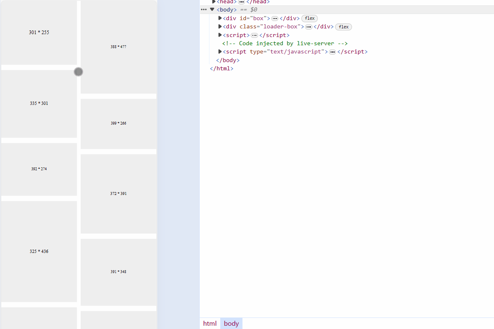

# 对比小红书与电商三巨头的瀑布流，H5 瀑布流实现方案应该如何选择？

瀑布流布局，我们既能在小红书这类图文网站看到，也能在拼多多、京东和淘宝这类电商网站看到。小红书的瀑布流，是利用绝对定位计算高度实现。而电商三巨头的瀑布流，则是利用 Flex 布局实现。

那么，同样是瀑布流，两种实现方式的优点、缺点是什么呢？如果想用 H5 实现瀑布流，应该用哪一种方案呢？


本文中，我会首先介绍瀑布流是什么，接着我会介绍小红书瀑布流实现方式，并给出示例代码；然后，我会给出电商三巨头瀑布流实现方式，并给出示例代码；最后，我会做一个两种方案的对比总结。

我是「小霖家的小龙虾」，关注我，为你端上有料、有温度的前端技术菜肴。

## 瀑布流是什么

瀑布流是一种宽度相同，高度不同的卡片布局方式。

如下图所示，传统布局中宽度相同、高度不同的卡片排列在一起时，会出现大量空白。这样既浪费了空间、又不美观。


而瀑布流布局，则可以有效利用空白的空间，实现美观的效果。


在开始介绍瀑布流如何实现之前，我们先给出一个工具函数，这个工具函数可以生成长度为 len 的图片数组，且每张图片都是 svg，宽度范围在 300px 到 400px，高度在 250px 到 500px。我们会使用数组中的图片实现瀑布流布局。

```js
// 随机生成宽度在 300~400，高度在 250~500 的图片
function getItems(len) {
  const items = []
  for (let i = 0; i < len; i++) {
    const width = Math.floor(Math.random() * (400 - 300 + 1) + 300)
    const height = Math.floor(Math.random() * (500 - 250 + 1) + 250)
    let url = `
      data:image/svg+xml;charset=utf-8,
      <svg
        xmlns="http://www.w3.org/2000/svg"
        width="${width}"
        height="${height}"
        viewBox="0 0 ${width} ${height}"
      >
        <text
          x="50%"
          y="50%"
          dominant-baseline="middle"
          text-anchor="middle"
          font-size="20"
          fill="black"
        >
          ${width} * ${height}
        </text>
      </svg>
    `
    url = url.replace(/[\r\n]+/g, '').replace(/\s+/g, ' ').trim()
    items.push({ width, height, url })
  }
  return items
}
```


## 小红书的瀑布流

### 原理

假如小红书需要实现左、中、右三列的瀑布流，它会先找高度最低的列放置图片，如果相同高度的列，则按照从左到右的顺序放置。

如下图所示，初始时每一列初始高度都为 0，所以图片应该先放最左侧的列。


放完第 0 张图片后，此时中、右两列高度为 0，所以第 1 张图放在中列。


放完第 1 张图片后，此时右列高度为 0，是最低的列，所以第 2 张图放在右列。


放完第 2 张图片后，此时右列高度最低，所以第 3 张图放在右列。


放完第 3 张图片后，此时中、右两列高度相同，所以第 4 张图放在中列。


放完第 4 张图片后，此时右列高度最低，所以第 5 张图片放在右列。


我们可以打开小红书网页版的控制台，在控制台可以检查元素，可以看到它的布局完全符合这个规律。


### 关键代码解释

说完原理，我们现在来看下关键代码，代码整体思路，可以理解为先插入图片，再设置图片位置。

#### 插入图片

先看基础布局，布局非常简单，就是一个定位为 relative 的盒子元素。之后我们会在盒子中元素中一张张插入图片，每一个图片的定位都是 absolute。

```html
<style>
  ...
  #box {
    position: relative;
  }
  #box img {
    position: absolute;
    object-fit: cover;
    background-color: #eee;
  }
  ...
</style>
...
<div id="box"></div>
```

插入图片的 JavaScript 代码如下，入参 items 可以前文提到的工具函数 `getItems()` 生成。至于 imgWidth 则是每一列的宽度，我们可以自行指定。

我们在 `getItems()` 中生成了宽高不一的图片，当图片实际显示在屏幕上时，它们的宽度都会缩写为 imgWidth，因此我们也要将它们的高度等比例缩放。

我们的做法就是计算出 imgWidth 与每一张图片 width 的比例 ratio，然后用每一张图片的 height * ratio 获得等比例缩放的高度。 

```js
// 加入图片元素
function createImgs(items, imgWidth) {
  for (let i = 0; i < items.length; i++) {
    const { url, width: w, height: h } = items[i]
    const img = document.createElement('img')
    const ratio = imgWidth / w
    const imgHeight = Math.floor(h * ratio)

    img.width = imgWidth
    img.height = imgHeight
    img.src = url

    box.appendChild(img)
  }
}
```

#### 设置图片位置

设置图片位置之前，我们需要知道瀑布流被分为几列，以及每一列的间隙。

如下图所示，瀑布流的列数 `colNumber = Math.floor(boxWidth / imgWidth)`，间隙的列数则是 `colNumber - 1`。


```js
// 计算会有多少列，以及每列的间隙
function getColumnInfo(imgWidth) {
  const boxWidth = box.clientWidth
  const colNumber = Math.floor(boxWidth / imgWidth) // 列的数量

  const spaceNumber = colNumber - 1
  const leftSpace = boxWidth - colNumber * imgWidth
  const colSpace = parseFloat((leftSpace / spaceNumber).toFixed(2), 10)

  return {
    colSpace,
    colNumber
  }
}
```

接下来，我们需要设置每一张图片的位置。因为图片定位是 absolute，所以如果要设置位置，我们需要知道每一张图片到顶部的距离 top，以及到左侧的距离 left。

`setPosition()` 函数有四个入参：

- `items` 代表图片数组，也就是之前提到的工具函数 `getItems()` 的结果。
- `colNumber` 代表瀑布流有几列，之前 `getColumnsInfo()` 结果中包含这个结果。
- `colSpace` 代表瀑布流列与列之间的间隙，之前的 `getColumnsInfo()` 结果中也包含这个结果。
- `rolSpace` 代表瀑布流行与行之间的间隙，这个间隙我们可以自行设置，我们也设置 `rolSpace` 等于 `colSpace`。

我们在瀑布流原理一节已经知道，设置瀑布流图片时，要找到瀑布流高度最低的列放置图片，如果相同高度的列，则按照从左到右的顺序放置。为此，在 `setPosition()` 函数中，我们设置了一个长度为 colNumber 的数组，数组保留了一行瀑布流图片的 top 的数组。

需要注意的是，我们这里用 `Math.min.apply(null, nextTops)` 找出最低 top 的下标。

每摆放一个图片，nextTops 都会更新对应下标的 top 值。下一行图片的 top 值，就是本行图片的 top + 本行图片的高度 + 行之间的间隙。至于 left 值，则是（图片本身的宽度 + 列之间的间隙）* 下标。

```js
// 设置每张图片的位置
function setPosition(items, colNumber, colSpace, rowSpace) {
  // 数组长度为列数，每一项代表下一行的图片的 top 值
  const nextTops = new Array(colNumber).fill(0)

  for (let i = 0; i < items.length; i++) {
    const img = box.children[i]
    const top = Math.min.apply(null, nextTops)
    img.style.top = top + 'px'
    const index = nextTops.indexOf(top)
    nextTops[index] = nextTops[index] + img.height + rowSpace
    const left = index * colSpace + index * img.width
    img.style.left = left + 'px'
  }

  const max = Math.max.apply(null, nextTops)
  box.style.height = max + 'px'
}
```

#### 重新设置位置

我们可以把设置位置的函数封装为 `init()` 函数，并给页面宽高变化的事件绑定上 `init()` 函数，这样就能实现当窗口变化时，瀑布流也重新改变的效果。

我们实现的瀑布流效果如下：


### 完整代码

[absolute-waterfall | codepen](https://codepen.io/lijunlin2022/pen/ZEZjrza)

## 电商三巨头的瀑布流

### 原理

电商三巨头中，我们以京东首页为例。我们也是需要找到瀑布流中高度最低的一例，然后把图片放置到这一列中。不同的是，小红书的绝对定位布局中，瀑布流的列只是一个概念，并没有实际的 Dom 元素；而京东的瀑布流的列，则是一个实际的 Dom 元素。

当列变为 Dom 元素之后，我们便不再需要计算 top 和 left 值，只需要知道目前那一列比较低，就把图片元素插入到哪一列中。

我们可以打开京东网站的控制台，并检查它瀑布流的元素：


### 关键代码解释

之前我们提到，小红书的关键代码可以认为是「为先插入图片，再设置图片位置」。而京东的关键代码则可以理解为「先算出图片要插入的列，再插入图片」。

和小红书的关键代码类似，我们先是让图片的高度做了一个等比例的缩放。

为了确认图片应该插入到左右哪一列中，我们分别设置了 leftHeight、rightHeight。如果左列较低，就把图片插入到左列，并更新左列的高度；如果右列较低，就把图片插入到右列，并更新右列的高度。如此循环往复，就实现了双列的瀑布流。

```js
function createImgs(items, imgWidth, rowSpace) {
  let leftHeight = 0,
    rightHeight = 0
  for (let i = 0; i < items.length; i++) {
    const { width: w, height: h, url } = items[i]
    const img = document.createElement('img')
    const ratio = imgWidth / w
    const imgHeight = Math.floor(h * ratio)
    img.width = imgWidth
    img.height = imgHeight
    img.src = url

    if (leftHeight <= rightHeight) {
      leftHeight = leftHeight + imgHeight + rowSpace
      leftBox.appendChild(img)
    } else {
      rightHeight = rightHeight + imgHeight + rowSpace
      rightBox.appendChild(img)
    }
  }
}
```

双列瀑布流可以结合我之前的文章 [H5 上滑加载（触底加载）如何实现](https://juejin.cn/post/7341329626357973029)，得到如下效果。



### 完整代码

[flex-waterfall | codepen](https://codepen.io/lijunlin2022/pen/vYMadxY)

## 对比总结

现在我们对小红书的瀑布流和电商三巨头的瀑布流做一个对比总结：

|    | 小红书 | 拼多多、京东、淘宝 |
| -- | -- | -- |
| 实现方式 | 绝对定位 | Flex 布局 |
| 计算量 | 大 | 小 |
| 复杂程度 | 高 | 低 |
| 列数是否可以改变 | 是 | 否 |

如果瀑布流的列数不会改变，那么推荐使用 Flex 布局，它的计算量更小、复杂程度更低；如果瀑布流的列数需要改变，那么推荐使用绝对定位实现。

通常来说，C 端 H5 总是会保留两列，用 Flex 布局更合适。但是有部分产品会推出单双列切换的功能，此时用绝对定位方式会更好。

## 总结

本文我们介绍了小红书和电商三巨头（拼多多、京东、淘宝）的瀑布流实现方案，并给出了两种实现瀑布流的代码，最后我们做了一个对比，无论是实现计算量还是难度，Flex 布局均比较简单。但是 Flex 布局无法实现列数切换的情况。

我是「小霖家的小龙虾」，关注我，为你端上有料、有温度的前端技术菜肴。
