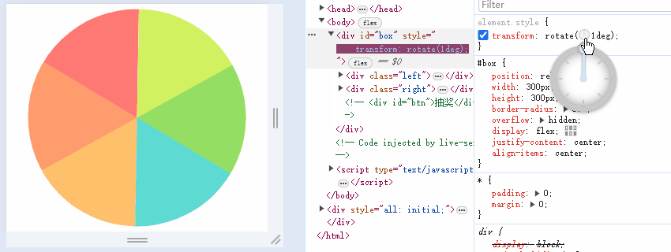
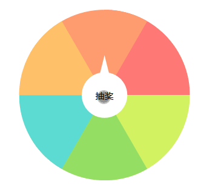

# 仿拼多多现金大转盘，H5 抽奖转盘如何实现？

电商应用中我们常常看到抽奖转盘活动，比如拼多多的「抽奖大转盘」：点击中央的抽奖按钮，转盘开始旋转，一段时间后指针停止在奖品上。


这个效果如果用 H5 应该怎么实现呢？

本文我会先说明如何实现转盘布局，再介绍如何让转盘旋转，接着解释如何控制中奖概率，最后给出完整的代码，并做一个总结。最终效果如下：


我是羊肚JUN，一位前端程序员，关注我，了解更多有温度的轻知识，有深度的硬内容。

## CSS 旋转相关的语法

实现转盘布局之前，我们先来复习 CSS 与旋转有关的语法。

- `transform` 的 `rotate()` 函数可以控制旋转角度。比如 `transform: rotate(60deg);` 是顺时针旋转 60 度，`transform: rotate(-60deg);` 是逆时针旋转 60 度。
- `transform-origin` 可以控制旋转中心。比如 `transform-origin: right bottom;` 是以元素右下角为旋转中心。

举个例子，下面代码中 item0 和 item1 两个矩形以自己的右下角为中心，逆时针旋转了 0 度和 60 度。

```html
<style>
  .item0 {
    ...
    transform-origin: right bottom;
    transform: rotate(-0deg);
  }
  .item1 {
    ...
    transform-origin: right bottom;
    transform: rotate(-60deg);
  }
</style>
<div id="box">
  <div class="item0"></div>
  <div class="item1"></div>
</div>
```


## 转盘的布局

### 有问题的思路

复习完语法，你可能会想 6 个矩形围着自己右下角旋转，似乎能实现转盘布局。

代码如下，其中 `--i` 和 `--clr` 是 CSS 的变量，方便我们计算角度、获取颜色。

```html
<style>
  ...
  .item {
    ...
    background-color: var(--clr);
    transform-origin: right bottom;
    transform: rotate(calc(60deg * var(--i)));
  }
</style>
<div id="box">
  <div class="item" style="--i:0;--clr:#ff7875;"></div>
  <div class="item" style="--i:-1;--clr:#ff9c6e;"></div>
  <div class="item" style="--i:-2;--clr:#ffc069;"></div>
  <div class="item" style="--i:-3;--clr:#d3f261;"></div>
  <div class="item" style="--i:-4;--clr:#95de64;"></div>
  <div class="item" style="--i:-5;--clr:#5cdbd3;"></div>
</div>
```

但这种思路是有问题的，如图所示，6 个矩形依次逆时针旋转，会导致第 5 个矩形覆盖在第 0 个矩形上，无法实现转盘布局。


### 正确的思路

6 个矩形依次逆时针旋转的思路虽然有问题，但也能给我们一些启发。

我们把 6 个矩形拆成左、右两部分：

- 左边是 3 个矩形，以矩形右下角为中心逆时针旋转 0 度、60 度和 120 度，再加上 `overflow: hidden;` 就得到左半圆。
- 右边是 3 个矩形，以矩形左下角为中心顺时针旋转 0 度、60 度和 120 度，再加上 `overflow: hidden;` 就得到右半圆。
- 拼接左右两个半圆，就得到一个完整的转盘。


关键代码如下：

```html
<style>
  .left .item {
    ...
    background-color: var(--clr);
    transform-origin: right bottom;
    transform: rotate(calc(60deg * var(--i)));
  }
  .right .item {
    ...
    background-color: var(--clr);
    transform-origin: left bottom;
    transform: rotate(calc(60deg * var(--i)));
  }
</style>
<div id="box">
  <div class="left">
    <div class="item" style="--i:0;--clr:#ff7875;"></div>
    <div class="item" style="--i:-1;--clr:#ff9c6e;"></div>
    <div class="item" style="--i:-2;--clr:#ffc069;"></div>
  </div>
  <div class="right">
    <div class="item" style="--i:0;--clr:#d3f261;"></div>
    <div class="item" style="--i:1;--clr:#95de64;"></div>
    <div class="item" style="--i:2;--clr:#5cdbd3;"></div>
  </div>
</div>
```

## 转盘的旋转

我们已知晓转盘的布局如何实现，至于中央按钮和奖品都可以用绝对定位实现，这里我就不再详细说明。一起来看看如何控制转盘的旋转。

### 旋转的原理

控制转盘旋转很简单，我们只旋转外层的容器 box 即可。如下图所示，在 Chrome 元素控制台中，我们逐渐增加 `transform: rotate(0deg)` 的取值，就实现了转盘的顺时针旋转。



需要注意的是，当容器 box 旋转时，会带动着中央按钮 btn 一起旋转。为了实现 box 旋转而 btn 保持不变的效果，box 顺时针旋转多少度，我们就需要让中央按钮逆时针旋转多少度。因此后续旋转的 js 代码中，我们会有如下代码：

```js
box.style.transform = `rotate(${begin}deg)`
// translate(-50%, -50%) 是为了让绝对定位的中央按钮居中
btn.style.transform = `translate(-50%, -50%) rotate(${-begin}deg)`
```

### 基础代码

现在我给出基础的旋转代码：

```js
const box = document.getElementById('box'),
  btn = document.getElementById('btn')

btn.addEventListener('click', () => {
  const randomIndex = parseInt(Math.random() * 6)
  run(randomIndex * 60 + 30)
})

let timer = null
function run(angle) {
  let begin = 0
  let base = 1800
  timer = setInterval(function () {
    const finalAngle = base + angle
    if (begin >= finalAngle) {
      clearInterval(timer)
    }
    box.style.transform = `rotate(${begin}deg)`
    btn.style.transform = `translate(-50%, -50%) rotate(${-begin}deg)`
    begin += 30
  }, 16)
}
```

代码主要分为 2 部分，第 1 部分绑定 btn 点击事件，第 2 部分控制 box 和 btn 的旋转。

我们先看第 1 部分，这部分我们会先获取一个 0 ~ 5 的随机下标 randomIndex，利用 randomIndex * 60 来计算旋转的角度（一个奖品扇形区域是 60 度）。之所以要再加上 30 度，是因为我们希望旋转结束之后，指针指向中奖区域的中轴线。

再看第 2 部分，我们设置了 1800 度的基础角度 base（因为 1800 = 360 * 5，也就是至少要旋转 5 圈后才会停止）。又设置了一个计时器，每过 16 秒就旋转 30 度，直到超过目标度数后才停止旋转。

代码的效果如下：



### 改善体验

基础旋转代码虽然实现了效果，但体验还有待改善。主要有两点需要优化。

#### 旋转时，按钮不能被再次点击

开始旋转时，此时按钮应该不能被再次点击。只有旋转结束后，按钮才能被再次点击，因此我们需要增加一个点击锁 clickLock。关键代码如下：

```js
...
let clickLock = false

btn.addEventListener('click', () => {
  if (clickLock) {
    return
  }
  ...
})

let timer = null
function run(angle) {
  ...
  clickLock = true
  timer = setInterval(function () {
    ...
    if (begin >= finalAngle) {
      clickLock = false
      clearInterval(timer)
    }
    ...
  }, 10)
}
```

开始时 clickLock 为 false，转盘旋转时 clickLock 会被置为 true，停止旋转时 clickLock 会被置为 false。这样转盘旋转期间，如果用户继续点击按钮，点击事件会被拦截、不再触发旋转函数 run。

#### 旋转时，速度需要越来越慢

基础代码实现的转盘，转盘旋转的速度是恒定的。当旋转结束时，转盘会瞬间停止，这会让用户感觉很突兀。正常来说，转盘的旋转速度应该越来越慢。

旋转速度越来越慢，可以用旋转的角度越来越小简介实现，越来越小的旋转角度可以用下面的公式计算：

```
step = (final - current) * ratio
```

- current 是已经旋转的角度。
- step 是在 current 基础上，下一次转动需要增加的角度。
- ratio 是一个比例。

从公式中可以看出，随着 current 越来越大，step 会越来越小，也就是下一次转动的角度会越来越小。

我们把公式写成代码，假设每 16ms 需要旋转一定角度，最终要旋转 1800 度：

```js
let current = 0
const final = 1800
const ratio = 0.5
let timer = setInterval(function () {
  if (current >= final) {
    clearInterval(timer)
  }
  const step = (final - current) * ratio
  console.log(step)
  current +=  Math.ceil(step)
}, 16)
```

此段代码的打印的 step 如下，不难看出 step 变得越来越小了。


上述代码可以应用到基础代码中，从而让转盘的旋转速度越来越慢。

## 中奖的概率

之前旋转角度，我们是先获取了 0 ~ 5 之间的一个随机下标（此下标就是奖品的下标），然后计算了旋转角度。这时每个奖品的中奖概率都是 20%。

但抽奖一般都需要控制中奖的概率，这个该怎么实现呢？

在抽奖转盘中，我们可以利用权重的方式控制抽奖概率。

假设我们有 6 个奖项，需要控制奖品 0 ~ 奖品 4 的中奖概率都是 1%，而奖品 5 的中奖概率是 95%，我们应该如何做呢？

控制中奖概率的代码如下所示：

```js
function getRandomIndex() {
  const weights = [0, 1, 2, 3, 4, 100]
  const random = Math.floor(Math.random() * 100)
  const newWeights = weights.concat(random)
                      .sort((a, b) => a - b)
  const randomIndex = newWeights.indexOf(random)
  return randomIndex
}
```

我们先给出了一个 weights 数组，又获取了一个 100 以内的随机数 random，并对 random 向下取整

- random 为 0 的概率是 1%，因为小于 1 的数都被向下取整为 0；
- random 为 1 的概率是 1%，因为大于 1 小于 2 的数都被向下取整为 1；
- random 为 2 的概率是 1%，因为大于 2 小于 3 的数都被向下取整为 2；
- random 为 3 的概率是 1%，因为大于 3 小于 4 的数都被向下取整为 3；
- random 为 4 的概率是 1%，因为大于 4 小于 5 的数都被向下取整为 4；
- random 大于 5 小于 100 的概率则是 95%。

我们把 random 插入到 weights 数组中，再从小到大排序，此时 random 对应的下标就是奖品下标。

## 完整代码

[turntable | codepen](https://codepen.io/lijunlin2022/pen/YzMdvEL)

## 总结

本文说明了 H5 如何实现抽奖转盘：

- 转盘的布局：布局时要将转盘拆分为左、右两部分，最后合并为一个转盘。
- 转盘的旋转：改变转盘容器的旋转角度，可以实现转盘的旋转。加载锁，旋转速度越变越慢可以改善转盘的使用体验。
- 中奖的概率：权重数组可以控制中奖概率。

我是羊肚JUN，一位前端程序员，关注我，了解更多有温度的轻知识，有深度的硬内容。

## 参考资料

- [原生JS转盘抽奖 学到就是赚到 | 路克森](https://www.bilibili.com/video/BV11w411972W/?share_source=copy_web)
