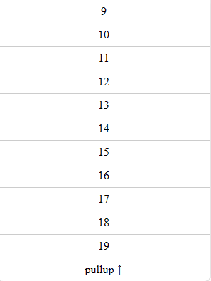
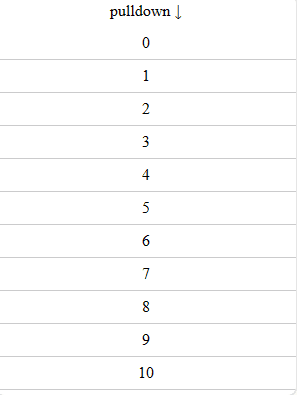
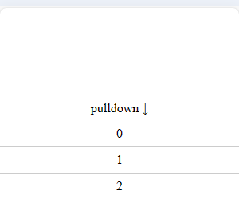
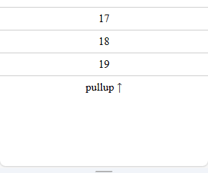
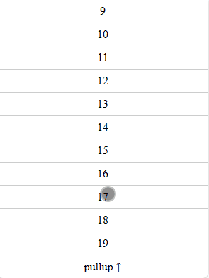

# 仿物美超市，H5 列表滚动回弹效果如何实现？

最近有朋友问我，多点 App（物美超市的 App）商品列表的上拉回弹效果，用 H5 怎么实现？他知道 iOS 的 H5 原生滚动有回弹效果，Android 的 H5 没有，希望 Android 能和 iOS 表现一致。


思索过后，我发现这已经不是普通的原生滚动了，必须要出重拳，得用 CSS 的 translate 模拟一套滚动。

我实现了下拉/上拉滚动回弹，效果如下：



本文我会先介绍基础的 translate 模拟滚动，再逐步完善代码，最后做一个总结、并推荐一个工具库。

我是羊肚JUN，一位前端程序员，关注我，了解更多有温度的轻知识，有深度的硬内容。

## 基础代码

我们不准备用原生滚动，那么就需要给能滚动的容器添加 `overflow: hidden;`，基础布局代码如下：

外层的 box 是容器，它被设置了 `overflow: hidden`。内层的 content 是需要滚动的内容，包裹着三部分：下拉提示（pulldown ↓）、列表和上拉提示（pullup ↑）。

```html
<style>
  #box {
    height: 100vh;
    overflow: hidden;
  }
</style>
<div id="box">
  <div id="content">
    <div class="tip">pulldown ↓</div>
    <ul>
      <li class="item">0</li>
      <li class="item">1</li>
      <!-- ...省略 -->
      <li class="item">19</li>
    </ul>
    <div class="tip">pullup ↑</div>
  </div>
</div>
```

基础逻辑代码如下：

- 我们在用户手指刚触摸屏幕时（touchstart），记住了手指的开始位置 startY；
- 用户手指移动时（touchmove），我们用手指当前的位置（currentY），减去手指开始的位置，得到手指移动的距离（diffY），并实时赋值给 content 的 translateY，这样就实现手指上滑/下滑多少距离，content 就上滑/下滑多少距离；
- 用户停止触摸屏幕时（touchend），我们记住 content 现在移动的位置（lastY）。用户下次滚动 content 时会在 lastY 的基础上继续滚动。

```js
const content = document.getElementById('content')

let startY = 0, lastY = 0, diffY = 0

content.addEventListener('touchstart', (e) => {
  startY = e.touches[0].clientY
})

content.addEventListener('touchmove', (e) => {
  const currentY = e.touches[0].clientY
  diffY = Math.floor(currentY - startY)

  content.style.transform = `translateY(${lastY + diffY}px)`
})

content.addEventListener('touchend', (e) => {
  lastY = lastY + diffY
  content.style.transform = `translateY(${lastY}px)`
})
```

效果如下：



可以看到，基础代码有个很明显的缺陷。content 很容易被完全移动到 box 外，box 内部便只能看到一片空白。

## 设置下拉/上拉的最终值

为了解决 content 可以移动到 box 之外的缺陷，我们可以在用户手指离开屏幕时，对 content 的最终值做一个判断。

改动代码如下：

- 我们计算了 content 能上拉的最大距离（maxTranslateY），它是 content 自身的高度减去 box 的高度。（如果 content 的高度小于等于 box 的高度，根本无法上拉滚动）。

- 用户下拉时（diffY > 0），如果最终 content 的位置（lastY + diffY）不是负数，说明 content 顶部已经离开了 box 的上边界。

  

  用户放手时，我们需要让 content 顶部重新贴着 box 的上边界，于是设置 lastY = 0，并设置了 content 的 translateY 为 0px。

- 用户上拉时（diffY < 0 时），如果 content 的位置（lastY + diffY） 超过了上拉的最大距离（lastY + diffY < -maxTranslateY），说明 content 的底部已经离开了 box 的下边界。
  
  

  用户放手时，我们需要让 content 底部重新贴着 box 的下边界，于是设置 lastY = -maxTranslateY，并设置了 content 的 translateY 为 `${-maxTranslateY}px`。

```js
const box = document.getElementById('box')
const content = document.getElementById('content')
let startY = 0, lastY = 0, diffY = 0

const maxTranslateY = content.clientHeight - box.clientHeight

// ... 省略
content.addEventListener('touchend', (e) => {
  if (diffY > 0) {
    if (lastY + diffY > 0) {
      lastY = 0
      content.style.transform = 'translateY(0px)'
      content.style.transition = 'all .3s ease-out'
      return
    }
  }

  if (diffY < 0) {
    if (lastY + diffY < -maxTranslateY) {
      lastY = -maxTranslateY
      content.style.transform = `translateY(${-maxTranslateY}px)`
      content.style.transition = 'all .3s ease-out'
      return
    }
  }

  lastY = lastY + diffY
  content.style.transform = `translateY(${lastY}px)`
  content.style.transition = 'all .3s ease-out'
})
```

效果如下：



## 设置下拉/上拉的限制

虽然现在我们下拉、上拉 content 时，最终 content 肯定不会再超出 box 边界。但这样的效果并不美观，一般来说，下拉、上拉的距离都会有一个限制，现在我们就来添加这个限制。

改动代码如下：

- 我们首先定义了下拉和上拉的限制距离 buffer，这个值可以按照个人喜好定，我这里把它定位 10vh （window.innerHeight / 10）只是觉得这个距离比较美观。

- 用户下拉时（diffY > 0），content 的顶部最多只能离开 box 的顶部 buffer 大小的距离，也就是 lastY 最大为 buffer，diffY 的值就变为了 buffer - lastY。

- 用户上拉时（diffY < 0），content 的位置最多为 -(maxTranslateY + buffer)，diffY 的值就变了 -(maxTranslateY + buffer) - lastY。

```js
// ...省略
const buffer = Math.floor(window.innerHeight / 10)
// ...省略
content.addEventListener('touchmove', (e) => {
  const currentY = e.touches[0].clientY
  diffY = Math.floor(currentY - startY)

  if (diffY > 0) {
    if (lastY + diffY > buffer) {
      diffY = buffer - lastY
    }
  }

  if (diffY < 0) {
    if (lastY + diffY < -(maxTranslateY + buffer)) {
      diffY = -(maxTranslateY + buffer) - lastY
    }
  }

  content.style.transform = `translateY(${lastY + diffY}px)`
  content.style.transition = ''
})
// ... 省略
```

有了限制后，效果美观多了：


## 完整代码

完整代码如下，你可以在 codepen 或者码上掘金上查看。**需要注意，代码只考虑了移动端场景，如果你是电脑访问，需要 F12 打开手机模拟器查看。**

- codepen: [https://codepen.io/lijunlin2022/pen/KKYYOdg](https://codepen.io/lijunlin2022/pen/KKYYOdg)

- 码上掘金：[https://code.juejin.cn/pen/7368096483704307738](https://code.juejin.cn/pen/7368096483704307738)

## 总结与推荐

本文我介绍了如何用 css 的 translate 模拟滚动，在基础代码上，我设置了下拉/上拉的最终值，下拉/上拉的限制，得到了一个可以回弹的滚动列表。

不过，自己用 css 的 translate 模拟滚动时，考虑各种距离实在繁琐。如果有朋友想在生产环境使用，推荐 [better-scroll](https://better-scroll.github.io/docs/zh-CN/guide/) 这个插件，它和本文原理类似，也是利用 translate 模拟了一套滚动。

我是羊肚JUN，一位前端程序员，关注我，了解更多有温度的轻知识，有深度的硬内容。
