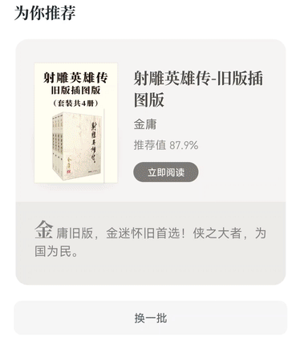
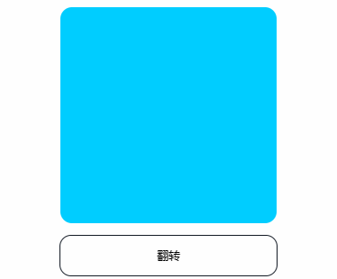

# 仿微信读书，H5 翻转卡片如何实现？

我最近刷微信读书时，留意到它的推荐卡片会翻转，这个效果该怎么做呢？



本文我会先介绍翻转卡片的布局、动画，再并给出完整代码，最后做一个总结。最终效果如下：



我是「小霖家的小龙虾」，关注我，为你端上有料、有温度的前端技术菜肴。

## 布局代码

我们先看布局，实现翻转卡片需要要把两个元素背靠背贴在一起，就像汉堡包的面饼中间不夹蔬菜、肉饼一样。

代码如下，有一个盒子 box 里面装着两个元素 front 的 back，front 用来做卡片的正面，back 用来做卡片的背面。

```html
<style>
  .box {
    position: relative;
    /* ... 省略 */
  }
  #front, #back {
    position: absolute;
    top: 0;
    bottom: 0;
    left: 0;
    right: 0;
    backface-visibility: hidden;
    /* ... 省略 */
  }
  #back {
    transform: rotateY(-180deg);
    /* ... 省略 */
  }
</style>
<div class="box">
  <div id="front"></div>
  <div id="back"></div>
</div>
<div id="btn">翻转</div>
```

box 是相对定位，而 front，back 则是绝对定位，这意味着 front 和 back 是重叠的。

我们让 back 绕着 Y 轴逆时针旋转了 180 度 —— `rotateY(-180deg)`，并给 front 和 back 都设置了背面不可见属性 —— `backface-visibility: hidden;` 属性，便实现了卡片的背靠背效果。

## 逻辑代码

当点击按钮旋转时，我们每次都让 front 和 back 旋转 180 度。

```js
const front = document.getElementById('front')
const back = document.getElementById('back')
const btn = document.getElementById('btn')
let frontRotateY = 0
let backRotateY = 180

btn.addEventListener('click', function () {
  frontRotateY -= 180
  backRotateY -= 180
  front.style.transform = `rotateY(${frontRotateY}deg)`
  back.style.transform = `rotateY(${backRotateY}deg)`
})
```

此外，我们还需要给 front 和 end 添加过渡效果：

```css
#front, #back {
  /* ... 省略 */
  transition: 0.5s;
}
```

这样当卡片每次旋转时，都能够有相关动画。

## 完整代码

完整代码如下，你可以在 codepen 或者码上掘金上查看。

codepen: https://codepen.io/lijunlin2022/pen/yLrJMZL

码上掘金: https://code.juejin.cn/pen/7370534206583898150

## 总结

本文首先介绍了翻转卡片的布局：两个元素 front、back 先通过绝对定位重叠，再让 back 绕 Y 轴旋转 180 度，实现 front 和 back 背对背的效果；

然后介绍了翻转卡片的动画：每次需要旋转时，都让 front 和 back 绕着 Y 轴旋转 180 度。

最终实现了类似微信读书推荐卡片的翻转效果。

我是「小霖家的小龙虾」，关注我，为你端上有料、有温度的前端技术菜肴。
