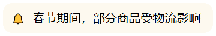
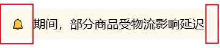
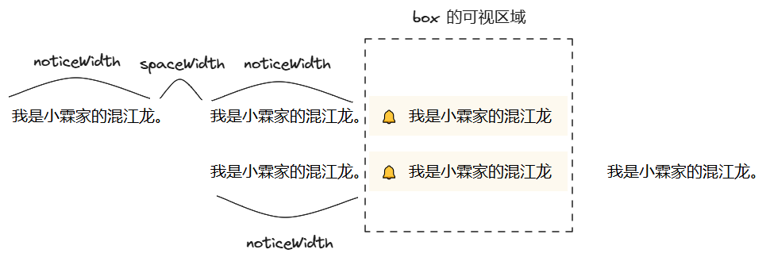

# 仿今日头条，H5 循环播放的通知栏如何实现？

我们在各大 App 活动页面，经常会看到循环播放的通知栏。比如春节期间，我就在今日头条 App 中看到了如下通知：「春节期间，部分商品受物流影响延迟发货，请耐心等待，祝你新春快乐！」。


那么，这种循环播放的通知栏如何实现呢？本文我会先介绍它的布局、再介绍它的逻辑，并给出完整的代码。最终我实现的效果如下：



我是「小霖家的小龙虾」，关注我，为你端上有料、有温度的前端技术菜肴。

## 布局代码

我们先看布局，如下图所示，循环播放的布局不是普通的左中右布局。可以看到，当文字向左移动时，左边的通知 Icon 和右边的留白会把文字挡住一部分。



为了实现这样的效果，我们给容器 box 设置一个相对定位，并把 box 中的 HTML 代码分为三部分：

- 第一部分是 content，它包裹着需要循环播放的文字；
- 第二部分是 left，它是左边的通知 Icon，我们给它设置绝对定位和 `left: 0;`；
- 第三部分是 right，它是右边的留白，我们给它设置绝对定位和 `right: 0;`。

```html
<div class="box">
  <div class="content">
    <!-- ... 省略 -->
  </div>
  <div class="left">🔔</div>
  <div class="right"></div>
</div>
```

```css
.box {
  position: relative;
  overflow: hidden;
  /* ... 省略 */
}
.left {
  position: absolute;
  left: 0;
  /* ... 省略 */
}
.right {
  position: absolute;
  right: 0;
  /* ... 省略 */
}
```

现在我们来看包裹文字的 content。content 内部包裹了三段一模一样的文字 notice，每段 notice 之间还有一个 space 元素作为间距。

```html
<!-- ... 省略 -->
<div id="content">
  <div class="notice">春节期间，部分商品...</div>
  <div class="space"></div>
  <div class="notice">春节期间，部分商品...</div>
  <div class="space"></div>
  <div class="notice">春节期间，部分商品...</div>
</div>
<!-- ... 省略 -->
```

为什么要放置三段一模一样的文字呢？这和循环播放的逻辑有关。

## 逻辑代码

我们并没有实现真正的循环播放，而是欺骗了用户的视觉。如下图所示：

- 播放通知时，content 从 0 开始向左移动。
- 向左移动 `2 * noticeWidth + spaceWidth` 时，继续向左移动便会露馅。因为第 3 段文字后不会有第 4 段文字。
  
  如果我们把 content 向左移动的距离强行从 `2 * noticeWidth + spaceWidth` 改为 `noticeWidth`，不难看出，用户在 box 可视区域内看到的情况基本一致的。

  然后 content 继续向左移动，向左移动的距离大于等于 `2 * noticeWidth + spaceWidth` 时，就把距离重新设为 `noticeWidth`。循环往复，就能欺骗用户视觉，让用户认为 content 能无休无止向左移动。



欺骗视觉的代码如下：

- 我们通过修改 translateX，让 content 不断地向左移动，每次向左移动 1.5px；
- 当 `translateX >= noticeWidth * 2 + spaceWidth` 时，我们又会把 translateX 强制设为 `noticeWidth`；
- 为了保证移动动画更丝滑，我们并没有采用 setInterval，而是使用 requestAnimationFrame。

```js
const content = document.getElementById("content");
const notice = document.getElementsByClassName("notice");
const space = document.getElementsByClassName("space");
const noticeWidth = notice[0].offsetWidth;
const spaceWidth = space[0].offsetWidth;

let translateX = 0;
function move() {
  translateX += 1.5;
  if (translateX >= noticeWidth * 2 + spaceWidth) {
    translateX = noticeWidth;
  }
  content.style.transform = `translateX(${-translateX}px)`;
  requestAnimationFrame(move);
}

move();
```

## 完整代码

完整代码如下，你可以在 codepen 或者码上掘金上查看。

- codepen: [https://codepen.io/lijunlin2022/pen/rNgMrwg](https://codepen.io/lijunlin2022/pen/rNgMrwg)
- 码上掘金: [https://code.juejin.cn/pen/7373131233506623538](https://code.juejin.cn/pen/7373131233506623538)

## 总结

本文我介绍了如何用 H5 实现循环播放的通知栏：

- 布局方面，我们需要用绝对定位的通知 Icon、留白挡住循环文字的左侧和右侧；此外，循环播放的文字我们额外复制 2 份。
- 逻辑方面，通知栏向左移动 `2 * noticeWidth + spaceWidth` 后，我们需要强制把通知栏向左移动的距离从 `2 * noticeWidth + spaceWidth` 变为 `noticeWidth`，以此来欺骗用户视觉。
  
我是「小霖家的小龙虾」，关注我，为你端上有料、有温度的前端技术菜肴。
