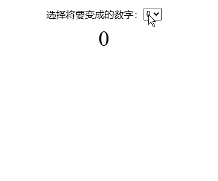
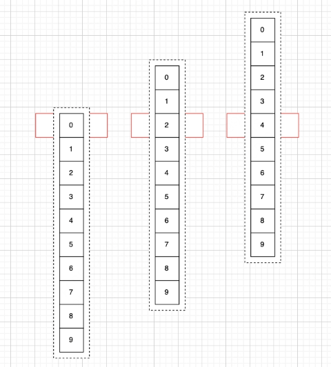
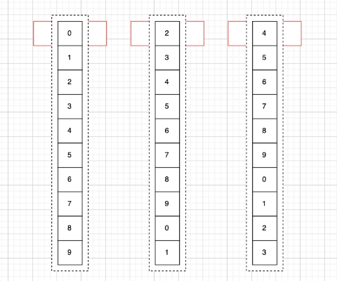
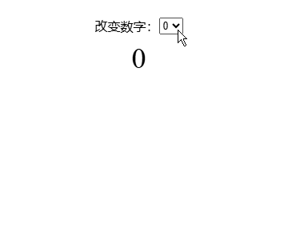

# 仿拼多多领红包、金额数字移动如何实现？

拼多多现金大转盘领取红包后，小数部分有一个数字移动的效果，这个效果怎么做呢？


本文我会告诉你数字移动的原理，并用 React 实现一个 Demo，效果如下：



我是羊肚JUN，一位前端程序员，做有温度的轻知识，有深度的硬内容。

## 滚动原理

不难想到，数字移动，实质是一串数字列表，在容器内部向上移动。下图就展示了数字从 0 变为 2，又从 2 变为 4 的过程：



但是，金额数字比较特殊，它是可以进位的。举例来说，39.5 变为 39.9 时，小数部分由 5 到 9 需要向上移动；39.9 变为 40.2 时，小数部分由 9 变到 2 时也需要向上移动。

为了做到这个效果，我们需要每次滚动结束之后，重新设置一整串数字。

同样是从 0 变为 2，又从 2 变为 4。下图不同的是，数字变为 2 时，它下方的数字变为了 3、4、5、6、7、8、9、0、1；数字变为 4 时，它下方的数字变为了 5、6、7、8、9、0、1、2、3。



## 关键布局

了解原理后，我们开始写元素布局。关键布局有 2 个元素：

- 选择框，它可以确认下一个将要变成的数字，我们用它来模拟领取红包之后、金额变化的情况。
- 数字盒子，它包括三部分，带 overflow: hidden 的外层盒子，包裹数字并向上滚动的内层盒子，以及一个个数字。

<details>
<summary>点击查看代码</summary>

```jsx
const App = function () {
  const [options] = useState([0, 1, 2, 3, 4, 5, 6, 7, 8, 9])
  const [nums, setNums] = useState([0, 1, 2, 3, 4, 5, 6, 7, 8, 9])

  return (
    <main>
      <div className="select-box">
        <span>改变数字：</span>
        <select>
          {
            options.map(v => (
              <option key={v}>{v}</option>
            ))
          }
        </select>
      </div>
      <div className="num-box">
        <div>
          {
            nums.map(v => (
              <div className="num" key={v}>{v}</div>
            ))
          }
        </div>
      </div>
    </main>
  )
};
```
</details>

## 关键逻辑

数字移动的关键逻辑有 3 个：

- 重置数字数组
- 计算移动距离
- 开启关闭动画

### 重置数字数组

你之前已经知道，如果数组首位是 2，它下面的数字就是 3、4、5、6、7、8、9、0、1。要获取完整的数组，我们可以分为两个步骤：

- 首先，数组首位背后的数字依次加 1，这样数字就变为了 3、4、5、6、7、8、9、10、11；
- 然后，所有大于 9 的数字都减去 10，这样数字就变为了 3、4、5、6、7、8、9、0、1。

<details>
<summary>点击查看代码</summary>

```js
const getNewNums = (next) => {
  const newNums = []
  for (let i = next; i < next + 10; i++) {
    const item = i > 9 ? (i - 10) : i
    newNums.push(item)
  }
  return newNums
}
```
</details>

### 计算移动距离

你可以用 current 表示当前的数字，next 表示需要变成的数字。计算移动距离时，需要分两种情况考虑：

- next 大于 current 时，只需要移动 `next - current` 个数字即可； 
- next 小于 current 时，需要先移动 `10 - next` 个数字，再移动 current 个数字即可。

<details>
<summary>点击查看代码</summary>

```js
const calculateDistance = (current, next) => {
  const height = 40
  let diff = next - current
  if (next < current) {
    diff = 10 - current + next
  }
  return -(diff * height)
}
```
</details>

### 开启关闭动画

不难想到，我们数字移动的动画是使用 translateY 和 transition 实现。当数字移动时，我们把 translateY 设置为 calculateDistance 的结果；当移动结束、重置数组时，我们需要把 translateY 设置为 0。

整个过程中，如果我们一直开启动画，效果会是数字先向上移动，再向下移动，这并不符合预期。



因此，我们需要在数字开始移动时开启动画，数字结束移动后、重置数组前关闭动画。

<details>
<summary>点击查看代码</summary>

```jsx
const App = function () {
  // ... 省略
  const numBoxRef = useRef()

  const onChange = (e) => {
    // 开启动画
    numBoxRef.current.style.transition = `all 1s`
    // ... 省略
  }

  const onTransitionEnd = () => {
    // 关闭动画
    numBoxRef.current.style.transition = ''
    // ... 省略
  }

  return (
    <main>{/* ... 省略 */}</main>
  )
};
```
</details>

## 完整代码

- codesandbox: https://codesandbox.io/p/sandbox/basic-scroll-number-4k65c7
- 码上掘金：https://code.juejin.cn/pen/7430439231253643273

## 总结

本文介绍了类似拼多多的金额数字滚动如何实现，其中有三个关键点，分别是重置数字数组、计算移动距离和开启关闭动画。

我是羊肚JUN，一位前端程序员，做有温度的轻知识，有深度的硬内容。
