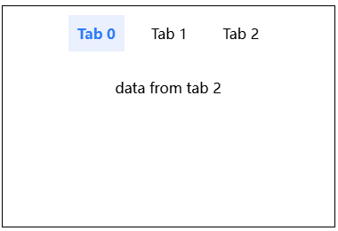

# H5 更早发出的请求、更晚被响应，应该怎么办？—— 请求竞态问题

H5 多个 Tab 单个 List 场景时，你也许会遇到请求竞态问题。

如动图所示，你从 Tab 0 切换到 Tab 1、Tab 2，又从 Tab 2 切换到 Tab 1、Tab 0。


最后你选择了 Tab 0，List 却是 Tab 2 的数据。



这是因为更早发出的 Tab2 请求，却更晚被响应，它覆盖了 Tab 0 和 Tab 1 的响应。

多个请求发出顺序和被响应顺序不同，导致共用的数据错乱，就是请求竞态问题。

怎么解决请求竞态问题呢？我将介绍 4 种办法，并给它们做一个对比。

我是「小霖家的小龙虾」，关注我，为你端上有料、有温度的前端技术菜肴。

## 模拟问题

要解决问题，需要先复现问题，你可以用 setTimeout 写一个随机延时的 Demo，模拟请求静态问题。

Demo 的 HTML 代码如下，它分为 tabs 和 list 两部分，每一个 tab 都绑定了切换 Tab 事件。

```html
<main>
  <div id="tabs">
    <div class="tab active" onclick="switchTab(0)">Tab 0</div>
    <div class="tab" onclick="switchTab(1)">Tab 1</div>
    <div class="tab" onclick="switchTab(2)">Tab 2</div>
  </div>
  <div id="list">
    data from tab 0
  </div>
</main>
```

Demo 的 JavaScript 代码如下，切换 Tab 时，会调用 switchTab 函数；switchTab 激活选中 Tab 的样式，并调用 fetchData；fetchData 模拟发出请求获取数据；之后调用 updateList；updateList 更新 list 的 UI。

```js
let currentIndex = 0;

function switchTab(tabIndex) {
  currentIndex = tabIndex;
  const tabs = document.querySelectorAll(".tab");
  tabs.forEach((tab) => {
    tab.classList.remove("active");
  });
  tabs[currentIndex].classList.add("active");
  fetchData(tabIndex);
}

function fetchData(tabIndex) {
  setTimeout(() => {
    const data = `data from tab ${tabIndex}`;
    updateList(data);
  }, Math.random() * 3000);
}

function updateList(data) {
  const list = document.getElementById("list");
  list.innerHTML = data;
}
```

关键代码在 fetchData 上，你用 setTimeout 加上随机数，实现响应随机返回，这样请求顺序和响应顺序大概率会不一致，就能模拟请求竞态问题。

代码我放在 codepen 和码上掘金，你可以点击体验。

- codepen: https://codepen.io/lijunlin2022/pen/eYqLjpo
- 码上掘金: https://code.juejin.cn/pen/7436416858615775266

## 方法一：加载中禁止切换

现在来看解决办法，第一种办法思路是，发出一个请求后，如果请求没有响应，那么就不允许用户切换 Tab，发出第二个请求。

关键代码如下，新增一个加载锁 loadLock，发出请求时将 loadLock 置为 true，请求响应后将 loadLock 置为 false。只有 loadLock 为 false 时才能切换 Tab。

```js
let currentIndex = 0;
let loadLock = false;

function switchTab(tabIndex) {
  if (loadLock) {
    return;
  }
  // ... 省略
}

function fetchData(tabIndex) {
  loadLock = true;
  setTimeout(() => {
    const data = `data from tab ${tabIndex}`;
    updateList(data);
    loadLock = false;
  }, Math.random() * 3000);
}

function updateList(data) {
  // ... 省略
}
```

这种办法，可以强制让请求顺序和响应顺序相同，规避掉竞态问题。

它的优点是简单，缺点是要求接口响应速度足够快。如果接口响应速度很慢，那么用户会被卡死在一个 Tab 上，体验很差。

## 方法二：取消请求

第二种方法是取消请求。它的思路是，多个请求时，只使用最后一次请求的响应，以前的响应都丢弃。

这里的取消请求，是指前端不再使用请求的响应，如果请求已经发到后端了，后端接收的请求量没有减少。

你可以用 clearTimeout 模拟取消请求：

关键代码如下：

```js
let currentIndex = 0;
let timer = null

// ... 省略

function fetchData(tabIndex) {
  clearTimeout(timer);
  timer = setTimeout(() => {
    const data = `data from tab ${tabIndex}`;
    updateList(data);
  }, Math.random() * 5000);
}

// ... 省略
```

所有的 setTimeout 共用了一个标识符，一旦有新的计时器，就清除掉旧的计时器。这样旧的计时器就不再调用 updateList。

真实网络请求中，XMLHttpRequest、fetch 本身有取消请求的方法，封装它们的 axios 和 useRequest 也有取消请求的方法。

它们取消请求的方式我折叠后放在了文章下方，你可以点击查看：

<details>
<summary>点击查看 XMLHttpRequest 取消请求</summary>

```js
const xhr= new XMLHttpRequest();

xhr.open('GET', 'https://xxx');
xhr.send();
    
xhr.abort(); // 取消请求
```
</details>


<details>
<summary>点击查看 fetch 取消请求</summary>

```js
const controller = new AbortController();
const signal = controller.signal;

fetch('/xxx', {
  signal,
}).then(function(response) {
  //...
});

controller.abort(); // 取消请求
```
</details>

<details>
<summary>点击查看 axios 取消请求</summary>

```js
const source = axios.CancelToken.source();

axios.get('/xxx', {
  cancelToken: source.token
}).then(function (response) {
  // ...
});

source.cancel() // 取消请求
```
</details>

<details>
<summary>点击查看 useRequest 取消请求</summary>

```js
const { result, loading, error, run, cancel } = useRequest(request);
// ...
const isCanceled = cancel();
```
</details>

取消请求的优点是使用简单，可以更精细地控制请求；缺点是依赖取消请求的 API，如果是不涉及请求的竞态问题，则无法使用取消请求的方法。

## 方法三：忽略请求（使用标志符）

第三种方法是忽略请求，它的原理是，先在全局维护一个标识，再给每一个请求都携带标识，如果请求被响应后，请求标识和维护的标识对不上，就忽略这次请求。

这么说比较抽象，我们看如下代码，全局标识就是 currentIndex，每次点击 Tab 时我们都会更新 currentIndex。给每一个请求携带的标识是 tabIndex，它代表时哪一个 Tab 发出的请求。

```js
let currentIndex = 0;

function switchTab(tabIndex) {
  currentIndex = tabIndex;
  // ... 省略
}

function fetchData(tabIndex) {
  setTimeout(() => {
    const data = `data from tab ${tabIndex}`;
    updateList(tabIndex, data);
  }, Math.random() * 5000);
}

function updateList(tabIndex, data) {
  const list = document.getElementById("list");
  if (tabIndex === currentIndex) {
    list.innerHTML = data;
  }
}
```

请求被响应后，我们对比 tabIndex 和 currentIndex，如果二者不匹配时，我们就忽略这次请求，不更新数据。

忽略请求的优点是实现简单，不依赖额外的 API。不过如果竞态问题更复杂，那么使用忽略请求编写的代码就会难以理解、维护。

## 方法四：映射请求

第四种办法是映射请求。

回忆请求竞态问题的条件，除了请求顺序和响应顺序不同外，还有一个条件，那就是多个请求共用一个数据。

如果一个请求一个数据，那么就不会有请求竞态问题。对应到 Tab List 场景，你可以让一个 Tab 一个 List。

修改 Demo，HTML 代码如下，lists 内部包含多个 list。

```html
<main>
  <div id="tabs">
    <div class="tab active" onclick="switchTab(0)">Tab 0</div>
    <div class="tab" onclick="switchTab(1)">Tab 1</div>
    <div class="tab" onclick="switchTab(2)">Tab 2</div>
  </div>
  <div id="lists">
    <div class="list active">data from tab 0</div>
    <div class="list"></div>
    <div class="list"></div>
  </div>
</main>
```

JavaScript 代码如下，某个 tab 发送请求后，它的响应数据只会更新到该 tab 对应的 list。

```js
let currentIndex = 0;

function switchTab(tabIndex) {
  // ... 省略
}

function fetchData(tabIndex) {
  setTimeout(() => {
    const data = `data from tab ${tabIndex}`;
    updateList(tabIndex, data);
  }, Math.random() * 5000);
}

function updateList(tabIndex, data) {
  const lists = document.getElementById("lists");
  Array.from(lists.children).forEach(l => {
    l.classList.remove("active")
  })
  lists.children[tabIndex].classList.add("active")
  lists.children[tabIndex].innerHTML = data
}
```

映射请求适合与缓存结合使用，用户点击过一个 Tab 后，就把 Tab 对应的 List 数据存下来，下次再点击同一个 Tab，就不需要再次请求数据，请求次数将大大减少。

不过结合缓存后，维护的数据会变多，程序变得更复杂。

## 总结

最后，我们来对比一下 4 种方案：

| 方法 | 优点 | 缺点 |
| -- | -- | -- |
| 加载中禁止切换 | 使用简单 | 要求接口响应足够快，否则用户体验很糟糕 |
| 取消请求 | 使用简单，可以更精细地控制请求 | 依赖请求 API，如果是不涉及请求的竞态问题，则无法使用 |
| 忽略请求（使用标志符） | 实现简单，不依赖额外的 API | 适用简单的竞态问题，不适合复杂的竞态问题 |
| 映射请求 | 可以配合缓存，减少请求次数 | 维护数据变多、程序变得更复杂 |

我是「小霖家的小龙虾」，关注我，为你端上有料、有温度的前端技术菜肴。
