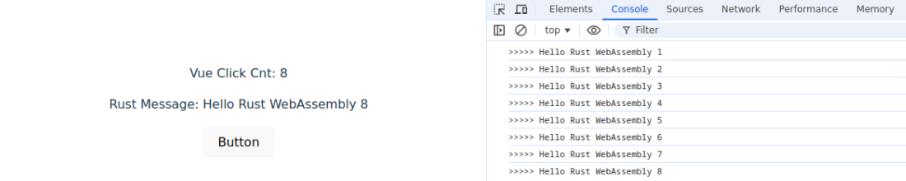
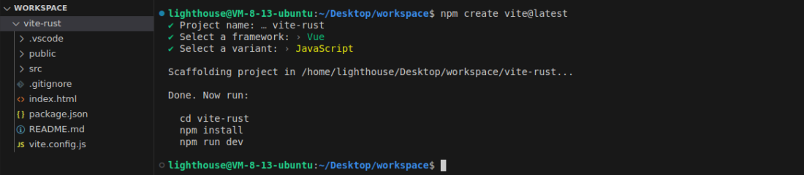
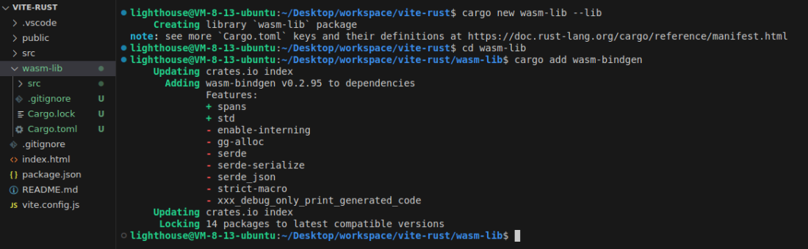
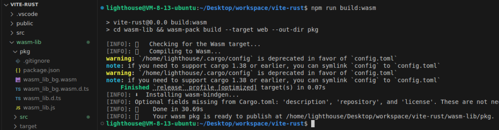
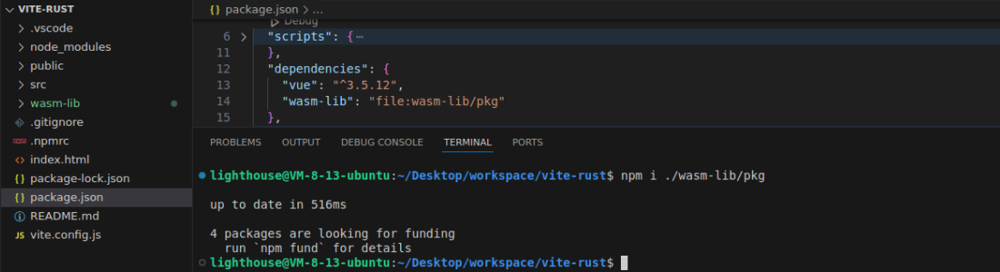

# 如何结合 Vite 和 Rust，在 Vue/React 中运行 WebAssembly 模块？

Rust 近年很火热，我跟风尝试入门 Rust 几次，都放弃了。其中一个原因是，Rust 和实际业务关联不强，我很难迁移知识。

怎样结合 Rust 和前端业务开发？我发现了一个办法，那就是结合 Vite 和 Rust，在 Vue/React 中运行 WebAssembly 模块。现在我把它分享给你。

本文我会实现一个 Demo，效果如下：



1. 点击按钮后，Vue/React 代码会调用 Rust 生成的 WebAssembly 代码;
2. WebAssembly 代码会生成一串字符串，再返回给 Vue/React 代码；
3. Vue/React 把字符串渲染到界面上。

我是「小霖家的小龙虾」，关注我，为你端上有料、有温度的前端技术菜肴。

## 五个步骤

要实现 Demo，你要经过 5 个步骤：

1. 用 Vite 创建 Vue/React 项目；
2. 用 cargo 创建一个 Rust 库；
3. 打包 Rust 代码；
4. 在 Vue/React 项目中安装依赖；
5. 在 Vue/React 项目中使用依赖。

## 步骤一：用 Vite 创建 Vue/React 项目

先看第一步，直接按 Vite 官网的步骤创建项目，我这里选择了 Vue，你也可以选择 React。

```shell
npm create vite@latest
```



## 步骤二：用 cargo 创建一个 Rust 项目

创建 Vue/React 项目后，你可以在 src 目录的同级，利用 Cargo 创建一个 Rust 项目。 

```shell
# 创建 wasm-lib 项目
cargo new wasm-lib --lib
```

之后你需要给这个 Rust 项目安装 wasm-bindgen 依赖，我们可以利用它把 Rust 代码打包为 WebAssembly 模块。

```shell
cd wasm-lib

# 安装 wasm-bindgen 依赖
cargo add wasm-bindgen
```



你新建的 wasm-lib 目录结构如下：

```
.
└── wasm-lib
  ├──src
  │ └──lib.rs
  ├──Cargo.lock
  └──Cargo.toml
```

你需要清空 lib.rs 的默认代码，改成为：

```rust
use wasm_bindgen::prelude::*;

#[wasm_bindgen]
pub fn get_rust_message(cnt: i32) -> String {
  format!("Hello Rust WebAssembly {}", cnt)
}
```

这段 Rust 代码的意思是，传入一个名叫 cnt 的正整数，函数会拼接一个字符串再返回。

其中，`#[wasm_bindgen]` 宏的作用是标记 get_rust_message 函数，有了这个宏，函数就可以被导出到 WebAssembly 模块中。这样 JavaScript 就能访问这个 Rust 函数。

然后，我们需要在 Cargo.toml 添加如下配置：

```
[lib]
crate-type = ["cdylib"]
```

它的作用是，告诉 Rust 编译器，构建这个库项目时，要生成 C 语言风格动态链接库。（C - style dynamic library，简称 cdylib）。

## 步骤三：打包 Rust 代码

写完 Rust 代码后，你需要在 wasm-lib 目录下，全局安装 wasm-pack 打包工具。

```shell
cargo install wasm-pack
```

之前的 wasm-bindgen 作用是确定 WebAssembly 和 JavaScript 的绑定关系，真正打包时还需要 wasm-pack 工具。

安转结束后，你需要输入如下命令，将 lib.rs 的代码打包成适合 web 环境使用的产物，产物的输出目录是 lib 同级的 pkg：

```shell
wasm-pack build --target web --out-dir pkg
```



打包成功后，你可以看到 pkg 的目录结构为：

```
.
└── wasm-lib
  └── pkg
    ├──package.json
    ├──wasm_lib_bg.wasm
    ├──wasm_lib_bg.d.ts
    ├──wasm_lib.d.ts
    └──wasm_lib.js
```

可以看出生成了个 npm 包，入口文件是 wasm_lib.js，类型文件是 wasm_lib.d.ts。

## 步骤四：在 Vue/React 项目中安装依赖

既然 Rust 打包得到的产物是 npm 包，你便可以在 Vue/React 项目中安转此 npm 包。

回到 Vue/React 项目目录，输入如下命令：

```shell
npm install ./wasm-lib/pkg
```

安装结束之后，你可以看到 package.json 的 dependencies 会多出一行配置：

```
"wasm-lib": "file:wasm-lib/pkg"
```

它表示 wasm-lib 这个依赖从本地的 `wasm-lib/pkg` 目录获取。



## 步骤五：在 Vue/React 项目中使用依赖

现在我们开始在 Vue/React 项目中引入之前打好的 npm 包。完整代码如下：

```html
<script setup>
import { ref, onMounted } from 'vue'
import init, { get_rust_message } from 'wasm-lib?init'

const cnt = ref(0)
const msg = ref('')

onMounted(() => {
  init()
})

const onClick = () => {
  cnt.value = cnt.value + 1
  msg.value = get_rust_message(cnt.value)
  console.log('>>>>>', msg.value)
}
</script>

<template>
  <p>Vue Click Cnt: {{ cnt }}</p>
  <p>Rust Message: {{ msg }}</p>
  <button @click="onClick">Button</button>
</template>
```

你需要注意的是，引入 wasm-lib 时，我们写的是 `wasm-lib?init`。这是因为按照 [vite 的文档](https://vitejs.cn/vite3-cn/guide/features.html#webassembly)，预编译的 WebAssembly 模块需要加上 `?init` 来导入。

最后结果如下：


## 总结

本文我们我通过 5 个步骤，告诉你如何在 Vue/React 项目中使用 Rust 打包的 WebAssembly 代码。

完整代码我放在 Gitee 上，感兴趣可以下载运行：https://gitee.com/lijunlin2022/vite-rust

我是「小霖家的小龙虾」，关注我，为你端上有料、有温度的前端技术菜肴。

## 参考资料

- [How to create a React app with Rust and WebAssembly](https://www.tkat0.dev/posts/how-to-create-a-react-app-with-rust-and-wasm/)
