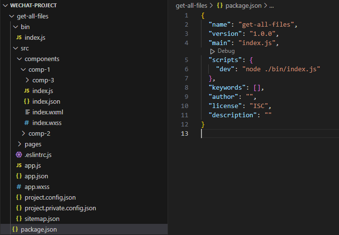
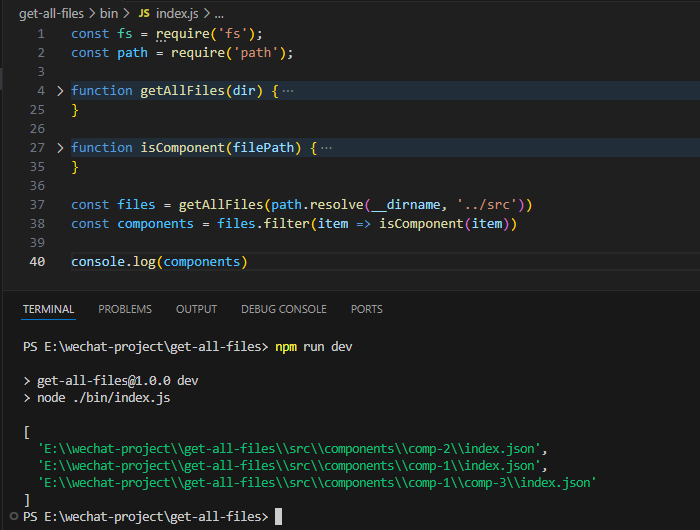
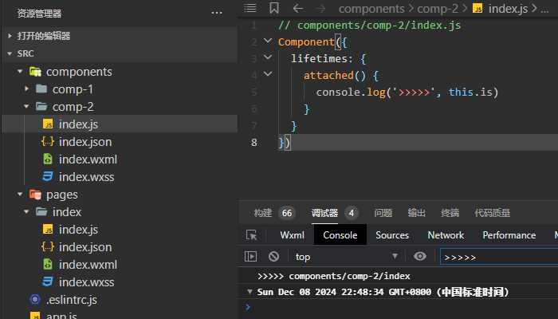

# 小程序如何检测无流量组件？分享一种打点检测方法

小程序项目经过长期迭代后，内部会有大量组件。其中有些组件，虽然在页面、组件的 json 中注册了，但实际不会用到，白白占用了小程序的包体积。这种无流量组件该如何检测呢？

本文我会分享一种打点检测方法，它可以较低成本地找出所有无流量的组件。

我是「小霖家的小龙虾」，关注我，为你端上有料、有温度的前端技术菜肴。

## 思路

我的整体思路分为三个步骤：

1. 遍历目录，获取全体组件的集合；
2. 给组件打点，获取有流量组件的集合；
3. 取全体组件和有流量组件的差集。

下面我会向你介绍三个步骤的细节。

## 步骤一：获取全体组件集合

小程序的组件由 wxml、wxss、js 和 json 等文件组成，其中 json 文件总是有 `"component": true` 这一项。根据这个特点，你可以分两步获取全体组件的集合。

第一步是获取所有文件，第二步则是找到满足特点的 json 文件，该 json 文件就代表了一个组件。

为了方便你理解，我现在新建一个项目，项目目录结构如下，src 中是一个小程序的项目代码，它的 components 中有 3 个组件 comp-1、comp-2、comp-3，其中 comp-1 和 comp-2 同级，comp-3 则是 comp-1 的子级。



bin 目录中，是我获取 src 全体组件的脚本，脚本的两个函数刚好对应之前说的 2 个步骤。

### 函数一：获取 src 目录的所有文件路径

第一个步骤对应 getAllFiles 函数。在函数中，我会利用栈来获取所有文件的路径。

我会给 getAllFiles() 传入 src 的路径，开始时，函数会读取 src 内的文件和文件夹。如果我发现读到了一个文件夹，就把它压入栈 stack 中；如果我发现读到了一个文件，就把文件路径记录到 result 中。

之后，我会从栈底部取出一个文件夹，继续重复读到文件夹就压入栈中，读到文件就记录到 result 的过程。直到栈内再也没有文件夹为止。

```js
const fs = require('fs');
const path = require('path');

function getAllFiles(dir) {
  const results = [];
  const stack = [dir];

  while (stack.length) {
    const currentDir = stack.pop();
    const list = fs.readdirSync(currentDir);

    list.forEach(file => {
      const filePath = path.resolve(currentDir, file);
      const stat = fs.statSync(filePath);

      if (stat && stat.isDirectory()) {
        stack.push(filePath);
      } else {
        results.push(filePath);
      }
    });
  }

  return results;
}
```

### 函数二：找到 json，判断 json 是否能代表组件

第二个步骤对应函数 isComponent。在第一步的基础上，我会先筛选出所有 json 文件，然后把每个 json 文件转变为 json 对象，看看它们内部是否有 一项是 component，且值为 true。

```js
function isComponent(filePath) {
  if (!filePath.endsWith('.json')) {
    return false
  }

  const jsonContent = fs.readFileSync(filePath, 'utf8');
  const jsonObj = JSON.parse(jsonContent);
  return jsonObj.component === true;
}
```

结合上述两段代码，就可以获得小程序组件的全集。



## 步骤二：获取有流量组件集合

获取有流量的组件，你可能想到的方式，就是在每一个组件的生命周期里打点——组件挂载在页面时，就把组件路径上报到后台，有记录的组件就是有流量的组件。

刚好，在组件运行时，可以直接在生命周期里用 `this.is` 获取组件路径。



不过，如果给所有组件直接插入代码打点，工作量会非常庞大。

### 初次改进：Behavior 插入打点

我想到的第一个优化方法是，小程序可以利用 Behavior 来给生命周期插入打点逻辑。

```js
const myBehavior = Behavior({
  lifetimes: {
    attached() {
      console.log('>>>>> my behavior')
    }
  }
})

Component({
  behaviors: [myBehavior],
  lifetimes: {
    attached() {
      console.log('>>>>> normal behavior')
    }
  }
})

// 输出
// >>>>> my behavior
// >>>>> normal behavior
```

不过这个思路有缺陷，如果有人新增组件，可能会忘记在 behaviors 中注册 myBehavior，为此，我需要改进这个方法。

### 再次改进：用 enhanceComponent 函数替换所有的 Component 函数

我改进的思路，是先编写一个 enhanceComponent 函数，它是一个构建组件的函数，且 behaviors 里面已经插入了打点。之后我在构建时，把每一个 Component 函数，替换为 enhanceComponent 函数。

这样就不需要新开发组件的同学，特意去记录加 behaviors 的逻辑。

我编写的 enhanceCompnent 如下，我会把这个函数放在 src 内的 utils 目录：

```js
const enhanceBehavior = Behavior({
  lifetimes: {
    attached: function () {
      console.log('enhance component >>>>>: ', this.is)
    }
  }
})

module.exports.enhanceComponent = function (config) {
  const { behaviors = [], ...params } = config || {}
  return Component({
    behaviors: [enhanceBehavior, ...behaviors],
    ...params,
  })
}
```

我构建时替换 Component 函数的关键代码如下，我会把 `Component(` 替换为 `require('@utils/enhance-component.js').enhanceComponent(`，其中 `@utils` 是在小程序 app.json 配置的[别名](https://developers.weixin.qq.com/miniprogram/dev/reference/configuration/app.html#resolveAlias )，方便小程序内部引用文件：

```js
function replaceComponentFunction(filePath) {
  const fileContent = fs.readFileSync(filePath, 'utf8');
  const newContent = fileContent.replace(
    /\bComponent\(/g,
    "require('@utils/enhance-component.js').enhanceComponent("
  );
  fs.writeFileSync(filePath, newContent, 'utf8');
}
```

## 步骤三：取全体组件和有流量组件差集

经过之前的处理，我们不难得到全体组件的数组，有流量组件的数组。接下来我们只需要获得它们的差集即可：

```js
const arr1 = ['a', 'b', 'c', 'd', 'e']
const arr2 = ['a', 'b', 'e']

const diff = arr1.filter(item => !arr2.includes(item))

console.log(diff) // ['c', 'd']
```

之后，我们就可以酌情删除这些无流量的组件，减少包体积了。

## 总结

本文我会分享一种打点检测方法，它可以较低成本地找出所有无流量的组件。

我的整体思路分为三个步骤：

1. 遍历目录，获取全体组件的集合；
2. 给组件打点，获取有流量组件的集合；
3. 取全体组件和有流量组件的差集。

我是「小霖家的小龙虾」，关注我，为你端上有料、有温度的前端技术菜肴。