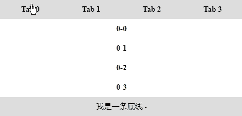
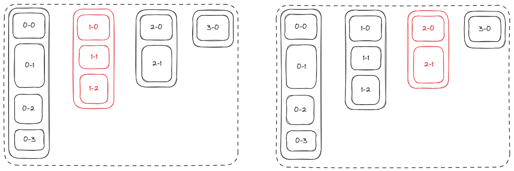
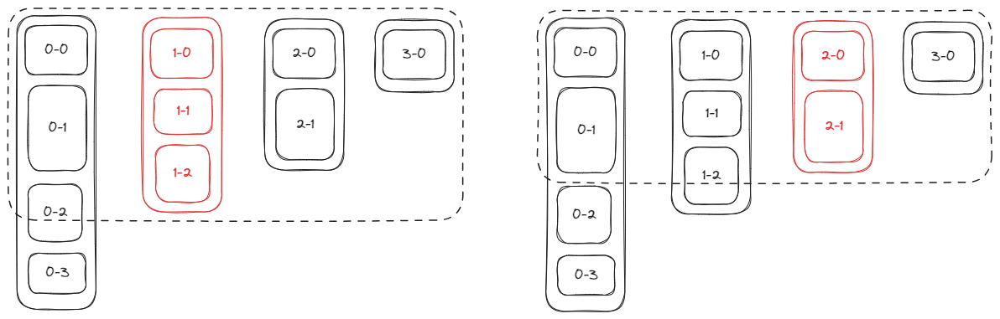

# H5、小程序高度变化的轮播图如何实现

高度固定的轮播图，你肯定经常看到、并知道怎么实现，但高度变化的轮播图呢？

其实高度变化的轮播图也很常见，只是你可能没有注意。拼多多、淘宝、京东的商品轮播高度都能够变化。它们的每一项轮播都是列表，列表与列表之间高度不尽相同，随着用户上拉屏幕，列表加载的数据还会变多。


如果你也想实现高度变化的轮播，看完这篇文章，你一定有所收获。我会先解释高度变化的原理，然后说明关键实现，最后再给出原生 H5 和小程序的示例代码。代码效果如下：



## 高度变化的原理

如果我们使用 flex 布局实现轮播图 Swiper，那么轮播图的整体高度，将会是最高一项的高度。

如下图，虚线框代表 Swiper，Swiper 的每项都是 List。如果播放到某个 List，这个 List 就是红色。可以看到，只要轮播图播放到较矮项，就会在较矮项底部留下大量空白。



要想实现高度变化、且不留下空白的轮播图，原理很简单。我们只需要在轮播切换时，先获取即将播放的 List 高度，再把它的高度设置给 Swiper。

如下图，播放到某个 List，Swiper 的高度就变为这个 List 的高度。我们还可以给 Swiper 设置 `overflow: hidden;`，把找出 Swiper 范围的元素都给隐藏掉。



## 关键代码实现

聊完原理，我们来看代码，代码非常简单粗暴。

我们为每个 List 都设置了一个 id，利用 id 获取 List 的高度再设置到 Swiper 元素的 style 上。

```js
function updateSwiperHeight (currentIndex) {
  const height = document.querySelector(`#item-box-${currentIndex}`).offsetHeight
  swiper.style.height = height + 'px'
  swiper.style.overflow = 'hidden'
}
```

## 代码示例

现在来看 H5 和小程序的代码示例：

### H5

[高度变化的轮播图 | codepen](https://codepen.io/lijunlin2022/pen/qBLxNzQ)

### 小程序

[高度变化的轮播图 | 小程序](https://developers.weixin.qq.com/s/ct5irIm37eOg)

:::info
- 小程序有原生的 swiper 组件，我们可以给 swiper 直接增加一个 style，在 style 中改变 swiper 的高度。
- 小程序没有 `querySelector()`，可以用 `createSelectorQuery()` 替代。
:::

## 总结

本文我们介绍了高度变化的轮播图实现原理——先获取对应轮播项的高度，再改变轮播图的整体高度，并给出了 H5 和小程序的代码示例。
