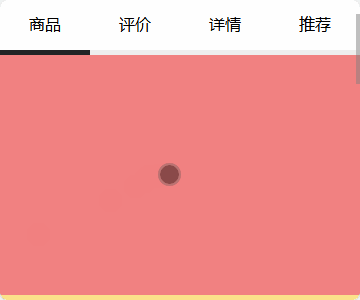
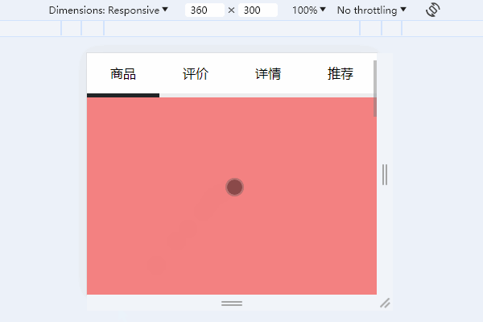

# 仿今日头条，H5 的垂直滚动、Tab 水平切换如何实现？

我们经常在 App 中，看到这样的交互：

- 用户纵向滚动页面时，横向的 Tab 会自动切换。
- 用户点击横向 Tab 时，纵向的页面会自动锚定。

比如今日头条的商品详情页中，四个 Tab 和页面滚动就有着上述联动关系：

那么，这种效果该如何实现呢？本文我会先介绍布局，然后介绍页面滚动如何影响 Tab 水平切换，之后介绍 Tab 水平切换如何影响页面滚动，最后给出完整的代码。最终我实现的效果如下：

拳打 H5，脚踢小程序。我是「小霖家的混江龙」，关注我，带你了解更多实用的 H5、小程序武学。

## 总结

拳打 H5，脚踢小程序。我是「小霖家的混江龙」，关注我，带你了解更多实用的 H5、小程序武学。
