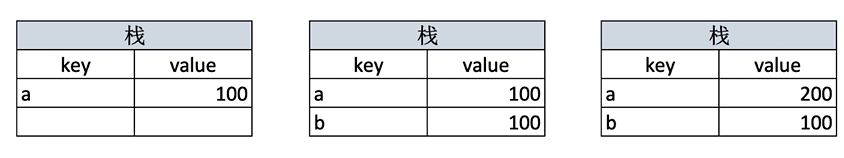
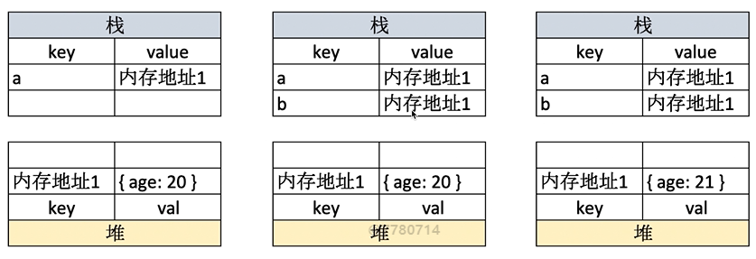
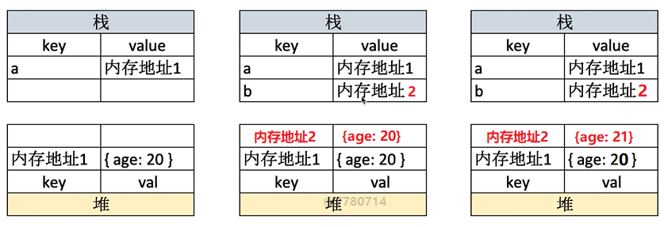

# 值类型和引用类型

- 值类型（原始值）：按值访问，操作的就是存储在变量中的实际值
- 引用类型（引用值）：在操作对象时，实际操作的是该对象的引用（reference）

对比：

1. 原始值不能有属性，引用值可以随时添加、修改和删除其属性和方法
2. 通过变量把一个原始值复制给另一个变量时，复制的是原始值；通过变量把一个引用值复制给另一个变量时，复制的实际上是一个指针
3. 函数传递参数时，都是值传递的，只是引用值传递的值是一个指针

下面用代码和堆栈图来解释原理：

## 值类型原理

```javascript
let a = 100
let b = a
a = 200
console.log(b) // 100
```

值类型保存在栈中，可以直接取到变量的值，堆栈图为：



## 引用类型原理

```javascript
let a = { age: 20 }
let b = a
b.age = 21
console.log(a.age) // 21
```

引用类型保存在堆中，栈中取到的只是堆的地址，堆栈图为：



## 深拷贝

普通的引用类型赋值只是浅拷贝，想要深拷贝需要我们自己手写深拷贝的代码：

```js
function deepClone(obj) {
  if (typeof obj !== "object" || obj == null) {
    return obj
  }

  let result = null
  if (obj instanceof Array) {
    result = []
  } else {
    result = {};
  }

  for (let key in obj) {
    // 保证 key 不是原型的属性
    if (obj.hasOwnProperty(key)) {
      result[key] = deepClone(obj[key]);
    }
  }

  return result;
}
```

## 使用深拷贝的原理

```js
let a = { age: 20 }
let b = deepClone(a)
b.age = 21
console.log(a.age) // 20
```

深拷贝的引用类型在堆中新分配了空间，堆栈图如下：



## 常见的值类型与引用类型

- 常见的值类型
  - Undefined
  - Boolean (它有包装的引用类型)
  - Number (它有包装的引用类型)
  - String (他有包装的引用类型)
  - Symbol
- 常见的引用类型
  - Date
  - RegExp
  - 包装的引用类型
  - Object
  - Array
  - Function (可以看作特殊的没有数据的引用类型)
  - Null

> Null 比较特殊，《JavaScript 高级程序设计》将它作为值类型，也有人将它作为引用类型

## typeof 操作符

typeof 操作符能识别的类型有：

- 所有的值类型
- 识别函数
- 判断是否是引用类型（不可再细分）

其中，所有的值类型为：

- "undefined"
- "boolean"
- "number"
- "string"
- "symbol" (ES6 新增)
- "bigint" (ES10 新增)

函数类型为：

- “function"

> 严格来说，函数再 ES 中被认为是对象，并不代表一种数据类型。可是，函数也有自己特殊的属性。为此，就有必要通过 typeof 操作符来区分函数和其他对象

引用类型为

- "object"

其中，`typeof null === "object"`，typeof 与 js 中的基本变量类型并不是一一对应的