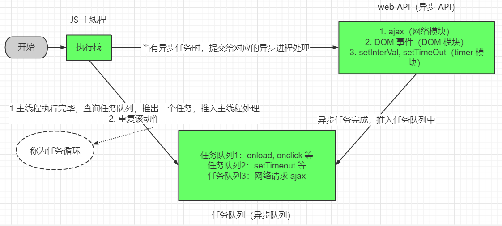
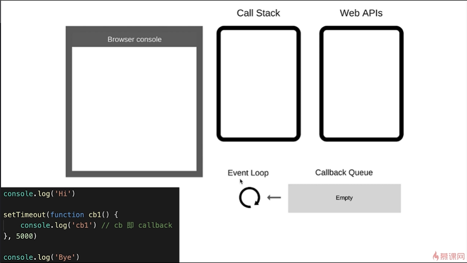
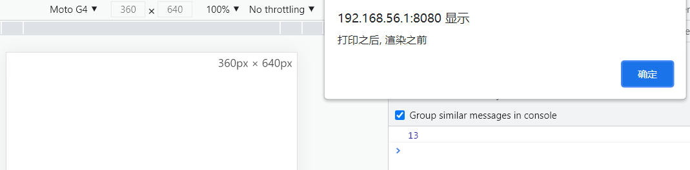
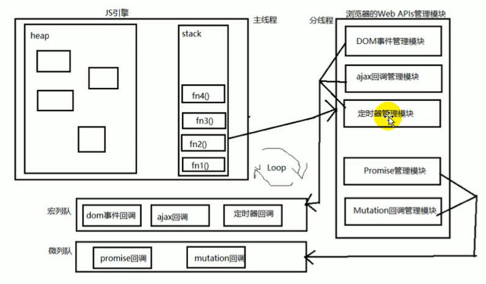

# 执行顺序

JavaScript 这门语言是单线程的，所有的任务需要排队，前一个任务结束，才会执行后一个任务。
JavaScript 和 DOM 渲染共用同一个线程。（因为 JS 可修改 DOM 结构），如果 Javascript 的一个任务执行时间过长，就会造成 DOM 渲染被阻塞

## 同步和异步

为了让 JS 在遇到等待（网络请求、定时任务）不能卡住，就出现了异步。

* 同步：前一个任务结束后再执行后一个任务，程序的执行顺序与任务的排列顺序是一致的，会阻塞代码执行
* 异步：不会阻塞代码执行，会将任务先放到一个任务队列中排队，当同步任务完成之后再执行

## 任务执行机制

同步任务都在主线程上执行，形成一个**执行栈**，JS 执行时

1. 先执行**执行栈中的同步任务**
2. 异步任务放入任务队列
3. 一旦执行栈中的所有同步任务执行完毕，系统会按次序读取**任务队列**中的异步任务，于是被读取的异步任务结束等待状态，进入执行栈并开始执行

由于主线程不断的重复获得任务、执行任务、再获取任务再执行，所以这种机制称为**事件循环**



> JS 的异步一般都是用回调函数实现, 这并不意味着回调函数就是异步

## 异步的典型代码

```javascript
console.log(1);

setTimeout(function() {
    console.log(3);
}, 1000);

console.log(2);

// 1
// 2
// 3
```

```javascript
console.log(1);

setTimeout(function() {
    console.log(3);
}, 0);

console.log(2);

// 1
// 2
// 3
```

```javascript
console.log(1);
setTimeout(function () {
    console.log(2);
}, 1000);
console.log(3);
setTimeout(function () {
    console.log(4);
}, 0);
console.log(5);
// 1
// 3
// 5
// 4
// 2
```

## 异步应用场景

前端：

* 网咯请求，比如 ajax 图片加载
* 定时任务，比如 setTimeout

后端：

* 文件读取
* 数据库读取

## event loop (事件循环/事件轮询)

JavaScript 是单线程执行的，它的异步要基于回调来实现，event loop 就是异步回调的实现原理

如下图所示：



1. 同步代码，一行一行放在 Call Stack 执行
2. 遇到异步，会先记录下，等待时机（定时、网络请求等）
3. 时机到了，异步任务就移动到 Callback Queue 中
4. 如果 Call Stack 为空（即同步代码执行完），Event Loop 开始工作
5. 轮询查找 Callback Queue，如果有任务则移动到 Call Stack 中执行
6. 然后继续轮询查找

## DOM 渲染和 event loop

先看一段代码：

```javascript
const htmlStr = "<p>这是一段文字</p>"
document.body.innerHTML = htmlStr;

console.log(htmlStr.length);
alert("打印之后, 渲染之前");
```

执行效果为：



这是因为，JavaScript 是单线程的，而且和 DOM 渲染共用一个线程。

* 每次 Call Stack 清空（即每次轮询结束），即同步任务执行完
* 都是 DOM 重新渲染的机会，DOM 结构如有改变则会重新渲染
* 然后再去触发下一次 event loop

## 宏任务与微任务的执行时间

* `宏任务`: DOM 渲染后触发，如 setTimeout
* `微任务`: DOM 渲染前触发，如 Promise

当`微任务`执行时，它不会经过 Web APIs，而是处于另外一个队列中，即 `微队列`，这也是我们之前就看过的图：



这是因为：

* 微任务是 ES6 语法规定的
* 宏任务是浏览器规定的

