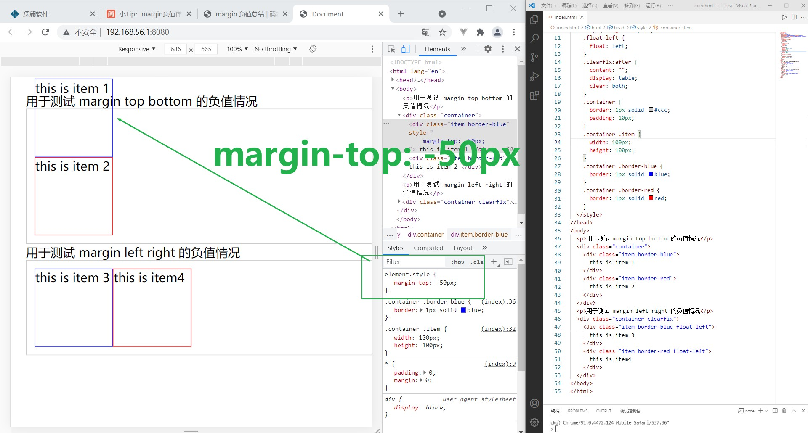
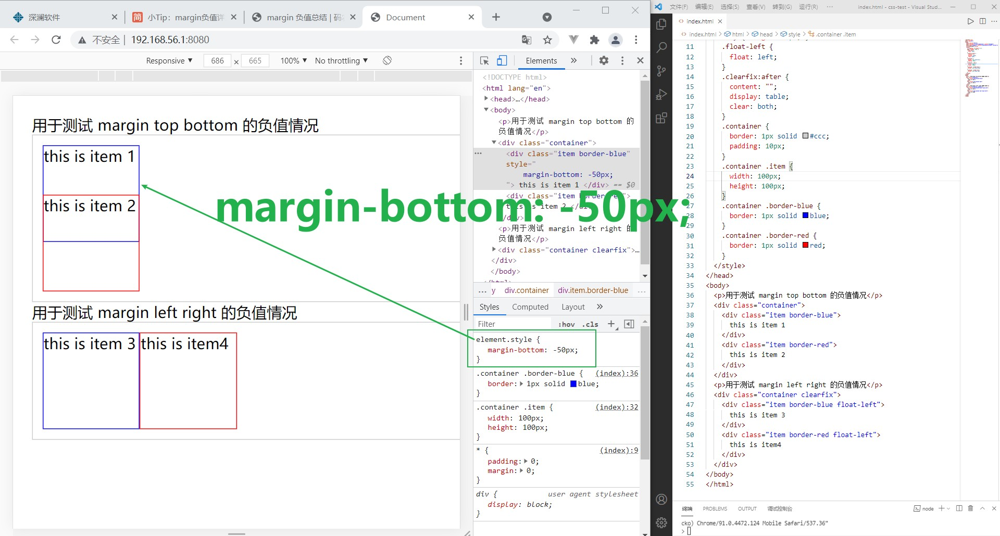
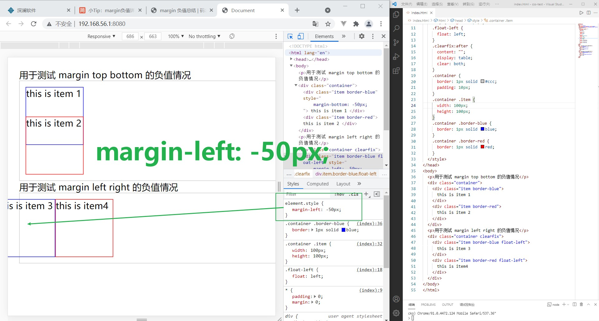
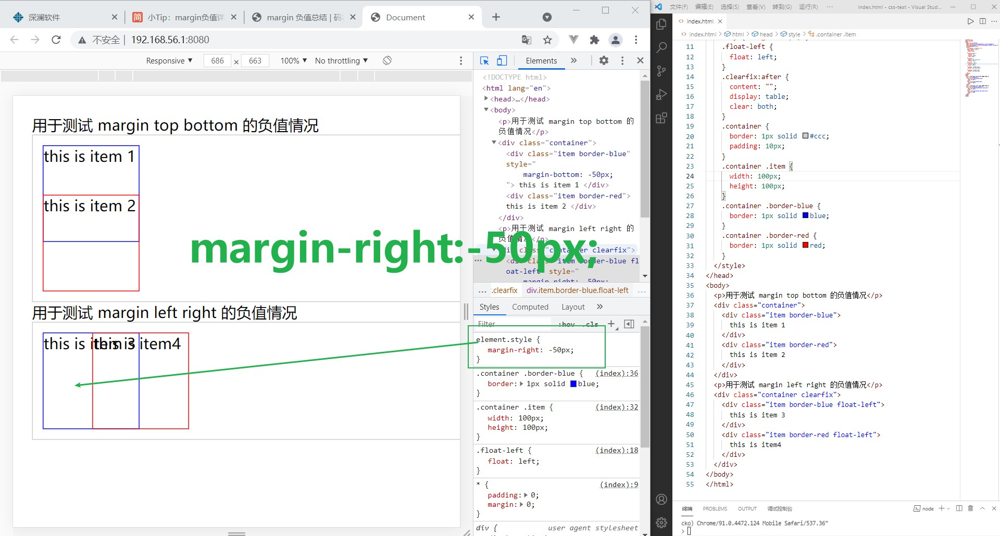
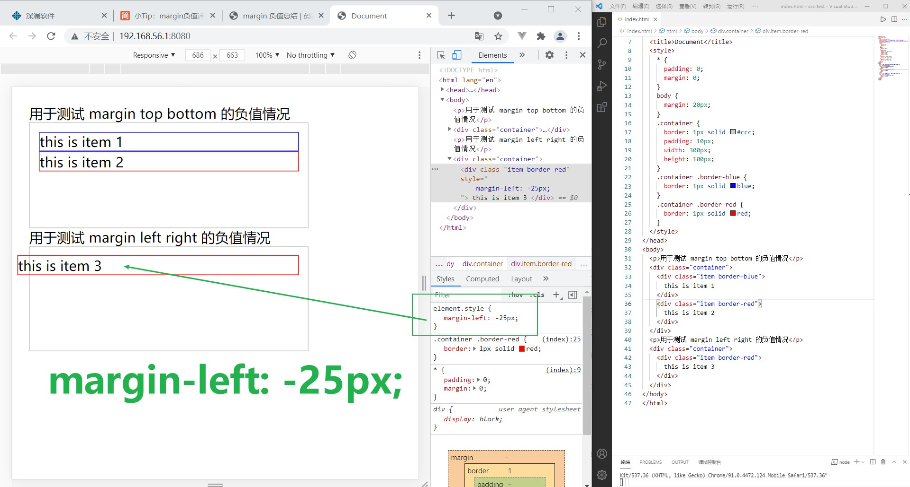
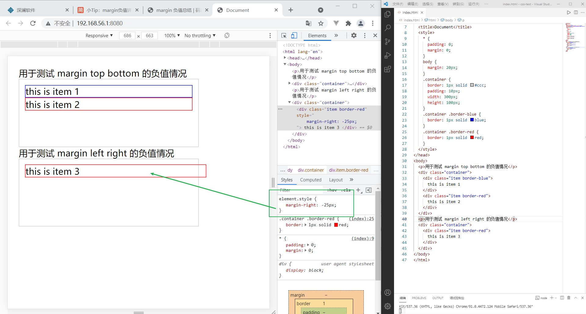
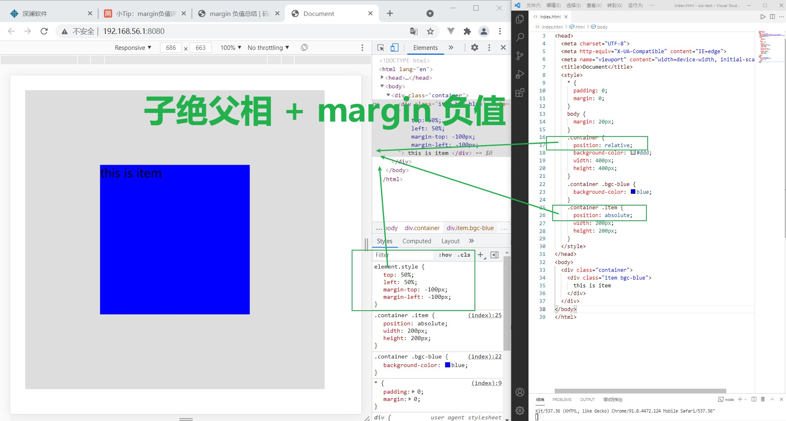

# margin 负值

## 规律总结

### 元素有自身宽度时

- `margin-top` 负值，元素向上移动
- `margin-bottom` 负值，元素自身不受影响，下方元素向上移动
- `margin-left` 负值，元素向左移动
- `marginright` 负值，元素自身不受影响，右侧元素向左移动

表现如下方的四幅图：

- `margin-top` 负值

  

- `margin-bottom` 负值

  

- `margin-left` 负值

  

- `margin-right` 负值

  

### 元素没有自身宽度, 即 `width:auto;` 时

- `margin-top` 负值，元素向上移动
- `margin-bottom` 负值，元素自身不受影响，下方元素向上移动
- `margin-left` 负值，元素宽度向左变宽
- `margin-right` 负值，元素宽度向右变宽

> 这是因为设置元素宽度为 auto 后
>
> `左右 margin + 左右 border + 左右 padding + width = 父元素 width`
>
> 当 `margin-left` 或 `margin-right` 取负值后，为了完成等式，width 会相应地向 left 或 right 方向增加

`margin-top` 和 `margin-bottom` 的表现和 1.1 一致，所以下面仅展示 `margin-left` 和 `margin-right` 的值

- `margin-left` 负值

  

- `margin-right` 负值

  

## margin 负值的应用

- 子绝父相 + margin 负值实现水平垂直居中

`子绝父相` 即子元素用绝对定位，父元素用相对定位。

如下图所示：

  

